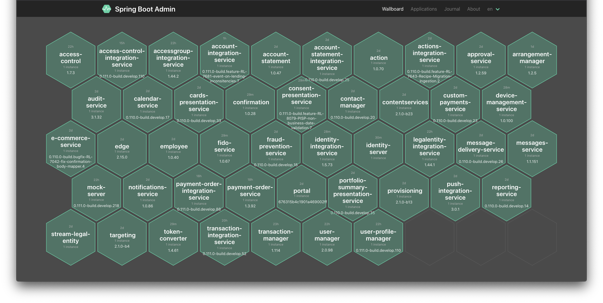
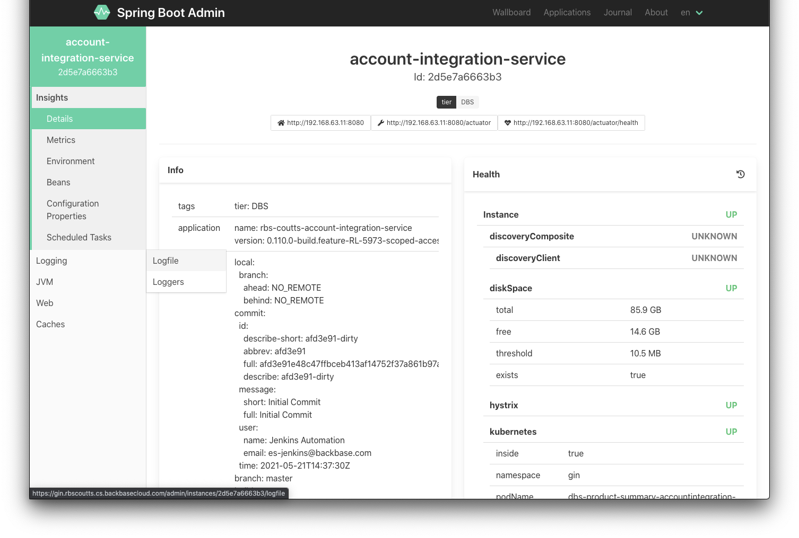

# How to configure Spring Boot Admin on Kubernetes
In this guide, we’ll cover a very simple way of configuring Spring Boot Admin by creating the Server and leveraging Kubernetes Service Discovery to manage the Backbase Stack.

>Bear in mind that in this tutorial we are not covering the security constraints required in a production environment.

## Instructions

1.  You can create a simple Spring Boot application using Spring initializr: [https://start.spring.io/](https://start.spring.io/ "https://start.spring.io/")
    
2.  Add the Spring Boot Admin Server and Spring Cloud Kubernetes dependencies:
    
```xml
         <properties>
             <spring-boot-admin.version>2.4.3</spring-boot-admin.version>
             <spring-cloud.version>2020.0.2</spring-cloud.version>
         </properties>
     <dependencies>
         <dependency>
             <groupId>de.codecentric</groupId>
             <artifactId>spring-boot-admin-starter-server</artifactId>
         </dependency>
         <dependency>
             <groupId>org.springframework.cloud</groupId>
             <artifactId>spring-cloud-starter-kubernetes-fabric8-all</artifactId>
         </dependency>
     </dependencies>
     <dependencyManagement>
         <dependencies>
             <dependency>
                 <groupId>de.codecentric</groupId>
                 <artifactId>spring-boot-admin-dependencies</artifactId>
                 <version>${spring-boot-admin.version}</version>
                 <type>pom</type>
                 <scope>import</scope>
             </dependency>
             <dependency>
                 <groupId>org.springframework.cloud</groupId>
                 <artifactId>spring-cloud-dependencies</artifactId>
                 <version>${spring-cloud.version}</version>
                 <type>pom</type>
                 <scope>import</scope>
             </dependency>
         </dependencies>
     </dependencyManagement>
     
```
     
    
3.  Configure the Spring main Application class:
    
```java
     @EnableScheduling
     @EnableAdminServer
     @EnableDiscoveryClient
     @SpringBootApplication
     public class SbaApplication {
         public static void main(String[] args) {
             SpringApplication.run(SbaApplication.class, args);
         }
     }
```
    
4.   Configure Jib plugin for simplified image building:
    
```xml
     <plugin>
         <groupId>com.google.cloud.tools</groupId>
         <artifactId>jib-maven-plugin</artifactId>
         <version>3.1.2</version>
         <configuration>
             <to>
                 <image>${docker.registry.url}/spring-boot-admin</image>
             </to>
         </configuration>
     </plugin>
```
    
5.  Spring Boot Admin Server is now ready to be built: `mvn clean package jib:build`
    
6.  Now you have to prepare the deployment of this new service in your Kubernetes cluster. We can use `backbase-app` helm chart for the generated image:
    
```yaml
       # Spring Boot Admin
       - name: spring-boot-admin
         chart: backbase-charts/backbase-app
         version: 0.18.4
         labels:
           tier: monitoring
           component: sba
         values:
           - app:
               name: spring-boot-admin-server
               image:
                 registry: <docker.registry.url>
                 repository: spring-boot-admin
                 pullPolicy: Always
             service:
               enabled: true
               nameOverride: spring-boot-admin
             env:
               # Configuration for non-spring boot health check (Identity)
               SPRING_CLOUD_KUBERNETES_DISCOVERY_FILTER: "metadata.labels != null && metadata.labels['app.backbase.com/tier'] != null && metadata.labels['app.kubernetes.io/name'] != 'backbaseidentity'"
               SPRING_CLOUD_DISCOVERY_CLIENT_SIMPLE_INSTANCES_IDENTITY-SERVER_0_URI: http://backbase-identity:8080
               SPRING_CLOUD_DISCOVERY_CLIENT_SIMPLE_INSTANCES_IDENTITY-SERVER_0_METADATA_MANAGEMENT_CONTEXT-PATH: /auth/health
               SPRING_CLOUD_DISCOVERY_CLIENT_SIMPLE_INSTANCES_IDENTITY-SERVER_0_METADATA_HEALTH_PATH: live
               SPRING_CLOUD_DISCOVERY_CLIENT_SIMPLE_INSTANCES_IDENTITY-SERVER_0_METADATA_TAGS_TIER: Identity
               # Pre-configuration for nginx-ingress
               SPRING_BOOT_ADMIN_UI_PUBLIC_URL: "https://{{ .Environment.Values.ingress.host }}/admin"
               SPRING_BOOT_ADMIN_CONTEXT_PATH: "/admin"
               SERVER_FORWARD_HEADERS_STRATEGY: "FRAMEWORK"
             ingress:
               enabled: true
               annotations:
                 "nginx.ingress.kubernetes.io/x-forwarded-prefix": "/admin"
               hosts:
                 - host: {{ .Environment.Values.ingress.host }}
                   paths:
                     - /admin
```
    
a.  We are using Ingress to expose the SBA Server through ingress at the `<hostname>/admin` address.
    
b.  We are also configuring the service discovery to filter only backbase resources - `metadata.labels != null && metadata.labels['app.backbase.com/tier'] != null` and skip Identity since we are configuring it manually later: `metadata.labels['app.kubernetes.io/name'] != 'backbaseidentity'`
    
c.  The environment variables in the example above will configure manually Identity Auth service as `identity-server`, which is not a Spring Boot service so we can at least fetch information from its health endpoint. If you keep it the same service name as the k8s service (e.g. backbase-identity) it won't work as expected.
        
7.  Before deploying the SBA Server make sure the actuator endpoints of all the managed services are properly exposed, here it follows some configuration **example** to expose all endpoints **publicly**:
    
```text
     MANAGEMENT_ENDPOINTS_WEB_EXPOSURE_INCLUDE: "*"
     MANAGEMENT_ENDPOINTS_ENABLED_BY_DEFAULT: "true"
     MANAGEMENT_ENDPOINT_HEALTH_SHOW_DETAILS: "always"
     MANAGEMENT_SECURITY_ROLES: "ANONYMOUS,ACTUATOR,ADMIN,USER,group_user(USER)"
     LOGGING_FILE_NAME: "/tmp/spring.log" # Enables access to logs via SBA
```
    
    1.  For **Edge** service some additional configuration needs to be placed: `gateway.actuator.security.enabled: "false"`
        
8.  You can deploy the Server now using helmfile: `helmfile -l component=sba sync`
    
9.  Voilà! you are good to go now, you should be able to your services in the admin panel. e.g. [https://gin-coutts.nwg.cs.backbasecloud.com/admin](https://gin-coutts.nwg.cs.backbasecloud.com/admin "https://gin-coutts.nwg.cs.backbasecloud.com/admin")
    
    
    
    
    

> Reference code: [GitHub - Backbase/spring-boot-admin-server](https://github.com/Backbase/spring-boot-admin-server)
> 
> Image available at: [Docker](https://hub.docker.com/r/backbasecs/spring-boot-admin-server)

## Related articles

  

*   [How to configure Spring Boot Admin on Kubernetes](/wiki/spaces/ES/pages/3114598666/How+to+configure+Spring+Boot+Admin+on+Kubernetes)
    
*   [Extending portal security](/wiki/spaces/ES/pages/282984805/Extending+portal+security)
    
*   [Restricting Concurrent User Sessions](/wiki/spaces/ES/pages/223739948/Restricting+Concurrent+User+Sessions)
    
*   [Security with LDAP and Kerberos](/wiki/spaces/ES/pages/285442406/Security+with+LDAP+and+Kerberos)
    
*   [HTML Integration or Sushi](/wiki/spaces/ES/pages/285442746/HTML+Integration+or+Sushi)