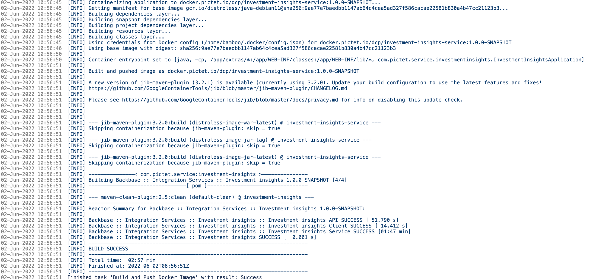

# Customer Implementation - Docker Images
During the course of a client project as SEs we deploy out of the box docker images as part of the product installation and build custom docker images for custom integration services build over the course of the project.

Out of the box docker images can be found under - [https://repo.backbase.com/backbase-docker-releases](https://repo.backbase.com/backbase-docker-releases "https://repo.backbase.com/backbase-docker-releases") for all of the capabilities provided by the R&D team.

Custom integration services use SSDK which includes [https://github.com/GoogleContainerTools/jib/blob/master/jib-maven-plugin](https://github.com/GoogleContainerTools/jib/blob/master/jib-maven-plugin) - Connect your Github account which allows for containerisation of these custom services. The way the jib-maven-plugin works is by adding a section to the pom.xml as part of the setup section mentioned here - [https://github.com/GoogleContainerTools/jib/blob/master/jib-maven-plugin/README.md#setup](https://github.com/GoogleContainerTools/jib/blob/master/jib-maven-plugin/README.md#setup). This is already included as part of the SSDK.

Then one goes on to configure certain properties in the pom.xml such as the following section to mention which base image to be used, which docker registry to be used, the docker repository to be used based on maybe the project’s artifactID and the tag of the docker image which can also be specified as an environment variable depending upon the release management set by the client. If it’s on develop branch maybe the docker image tag could be project’s version-${dev} and so on.

 ```
 <docker.repo.url>${docker.repo.url}</docker.repo.url>
 <docker.image.name>${docker.repo.url}/${project.artifactId}</docker.image.name>
 <jib.to.image>${docker.image.name}:${project.version}</jib.to.image>
 <docker.distroless.war.latest.skip>true</docker.distroless.war.latest.skip>
```

The jib-maven-plugin is invoked using a maven command as such which builds the java application and also in turn goes on to build the docker image. The authentication for the repository can be given as mentioned on the CLI as parameters/arguments -[https://github.com/GoogleContainerTools/jib/blob/master/jib-maven-plugin/README.md#setup](https://github.com/GoogleContainerTools/jib/blob/master/jib-maven-plugin/README.md#setup) as an example :

 ```
 mvn compile jib:build -Djib.to.auth.username=user -Djib.to.auth.password=pass
```

For other jib related configuration that can be set in the pom.xml can be viewed here in their documentation :

[Global configuration](https://github.com/GoogleContainerTools/jib/tree/master/jib-maven-plugin#global-jib-configuration "https://github.com/GoogleContainerTools/jib/tree/master/jib-maven-plugin#global-jib-configuration")

[Extended usage](https://github.com/GoogleContainerTools/jib/tree/master/jib-maven-plugin#extended-usage "https://github.com/GoogleContainerTools/jib/tree/master/jib-maven-plugin#extended-usage")

**Note** : With later versions of the jib-maven-plugin, probably from 3.2.0 ([https://github.com/GoogleContainerTools/jib/blob/master/jib-maven-plugin/CHANGELOG.md#320](https://github.com/GoogleContainerTools/jib/blob/master/jib-maven-plugin/CHANGELOG.md#320)) the way docker registry authentication happens was changed with precedence to using config.json files, therefore if you face this issue stated here even after proper configuration of jib-maven-plugin :

 ```
 Failed to execute goal com.google.cloud.tools:jib-maven-plugin:3.2.0:build (default-cli) on project account-integration-service: Build image failed, perhaps you should make sure your credentials for 'registry-1.docker.io/library/eclipse-temurin' are set up correctly. See https://github.com/GoogleContainerTools/jib/blob/master/docs/faq.md#what-should-i-do-when-the-registry-responds-with-unauthorized for help: Unauthorized for registry-1.docker.io/library/eclipse-temurin: 401 Unauthorized
 Error:  {"details":"incorrect username or password"}
```

Then please revert back the version of the plugin to be 2.5.2 in the pom.xml to continue using CLI based credentials as mentioned in the above example.

While building the custom docker image for the custom service, if you wish to not include spring cloud stream as part of the packages/dependencies, one can mention along with the maven command a profile called **no-scs** such as the following to not include spring cloud stream.

 ```
 mvn -s settings.xml --batch-mode --errors --fail-at-end --show-version -DinstallAtEnd=true -DdeployAtEnd=true clean package -Pdocker-image -Pno-scs
```

Notice having **\-Pno-scs** to invoke the maven profile to not include spring cloud stream as part of the dependencies and docker image.

The following screenshot is an example run with jib-maven-plugin for a client where a custom integration service was created.



**Note** : The jib-maven-plugin supports both JAR and WAR and the documentation for that can be found here : [WAR Projects](https://github.com/GoogleContainerTools/jib/tree/master/jib-maven-plugin#war-projects "https://github.com/GoogleContainerTools/jib/tree/master/jib-maven-plugin#war-projects")

The jib-maven-plugin can be used for multi-module projects which is mostly the case with custom services that we write for a client-project which may consist of API spec as a separate maven module and the actual service being a separate module. [Multi-Module Project](https://github.com/GoogleContainerTools/jib/tree/master/jib-maven-plugin#multi-module-projects "https://github.com/GoogleContainerTools/jib/tree/master/jib-maven-plugin#multi-module-projects")

**Note** : Using the jib-maven-plugin does not require writing Dockerfile’s or running docker as a daemon and in the pipeline does not require one to install docker as DIND and so on. Which is following a lot of security best practices. Using the jib-maven-plugin has been useful in client’s environments where Openshift was running.

**We use Jib to create our Docker images** allowing us to work without Dockerfiles or even the Docker daemon, on top of that our SSDK core starter provides some useful profiles with common use cases, you can append one or more of the following profiles to the main `docker-image` profile:

*   `no-latest-tag`: Disables pushing the `:latest` tag. Use this to prevent overriding the tag every time the same image name is built with different parameters.
    
*   `trim-snapshot`: Removes the `-SNAPSHOT` suffix from the default image tag derived from the project version.
    
*   `no-jdbc`: Excludes the database drivers JAR files.
    
*   `no-scs`: Excludes the cloud stream binders JAR files.
    
*   `no-runtime`: Excludes the embedded tomcat JAR files.
    
*   `distroless-skip`: Skips the plugin execution.
    
*   `local-client`: Builds the image to a local Docker daemon without pushing it to the repository.
    

### Openshift Web Base Docker Modifications

In openshift environments an arbitrary userID is assigned based on the project namespace min and max range for userIDs in restricted SCC. Therefore for the web-base image used to run FE angular apps where some directories are owned by the nonroot user and nonroot group, it creates a problem because the arbitrary userID that openshift assigns during runtime to the pod will not have access to those underlying directories such as “`/html`” or “`/etc/nginx/conf.d`" or “`/etc/nginx`" to read files as well as write log files and so on during runtime. To solve this we need to modify the FE angular app Dockerfile which is based on the web-base docker image to provide root group permissions to those directories because the arbitrary user assigned by Openshift will be part of the root group. Here is an example of the Dockerfile for employee-web-app which has these modifications in place.

 ```
 FROM alpine AS os-tools
 FROM repo.backbase.com/backbase-docker-releases/web-base:1.1.0
 
 COPY ./dist/employee-app /statics
 
 COPY --from=os-tools /bin/sh /bin/chown /bin/rm /bin/chmod /bin/chgrp /bin/touch /bin/
 
 ENV USER=root
 USER $USER
 RUN chgrp -R 0 /html && \
     chmod -R g=u /html
 RUN chgrp -R 0 /etc/nginx/conf.d && \
     chmod -R g=u /etc/nginx/conf.d
 RUN chgrp -R 0 /etc/nginx && \
     chmod -R g=u /etc/nginx
 RUN rm -rf /bin 
``` 

Doing the above modifications helps change the group permissions of these directories from nonroot to the group root where the arbitrary user is part of to make the application run even in the restricted SCC in Openshift.

The same can be adopted for other FE angular apps such as wealth, business banking, retail and remote-config.  
**Remote Config Web App** : This web app dockerised image is already available in [repo.backbase.com/backbase-docker-releases](http://repo.backbase.com/backbase-docker-releases "http://repo.backbase.com/backbase-docker-releases") compared to the other web apps which needs to be built based on web-base docker image provided by the foundation angular team. In the case of remote-config-web-app, one can use the following Dockerfile on openshift to modify the permissions for the above issue :

 ```
 FROM alpine AS os-tools
 FROM repo.backbase.com/backbase-docker-releases/remote-config-web-app:2022.05.2
 
 
 COPY --from=os-tools /bin/sh /bin/chown /bin/rm /bin/chmod /bin/chgrp /bin/touch /bin/
 
 ENV USER=root
 USER $USER
 RUN chgrp -R 0 /html && \
     chmod -R g=u /html
 RUN chgrp -R 0 /etc/nginx/conf.d && \
     chmod -R g=u /etc/nginx/conf.d
 RUN chgrp -R 0 /etc/nginx && \
     chmod -R g=u /etc/nginx
 RUN rm -rf /bin
```