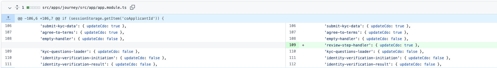

# How to: Add edit button in review screen
## Instructions

This feature is a joint effort of backend and front end. The backend introduces a new flag `isReviewReached` in Customer Data Object. Once the user is on review page, the front end is supposed to immediately trigger action `review-step-handler` which notifies the backend that the user has already on the review page and the backend would turn the `isReviewReached` flag to `true`. The front end can go to any previous step by calling methods in `FlowInteraction`. When the user is on one of the previous step, and click continue, the backend would send `review` as next step to go to as the backend knows that `isReviewReached` is `true`.

### Step 1: Register `review-step-handler` action

This is a new action that we need to whitelist in the action registry.

### Call action `review-step-handler` in `ngOnInit` of review page

By calling `review-step-hanlder` the backend would set `isReviewReached` of data store to true, so that the backend would direct the user back to review page once the user finish editing and click continue.

`ngOnInit() { this._flowInteraction.call({ action: 'review-step-handler', body: {payload: {}} }).subscribe(); }`

### Add edit button to the html file and add click handler

`<button bbButton type="button" [circle]="true" [color]="'link'" buttonSize="sm" class="edit" (click)="goToStep('address')"> <bb-icon-ui name="edit"></bb-icon-ui> </button>`

`goToStep(stepName: string) { this._flowInteraction.navigate(stepName).subscribe(() => { this._flowInteraction.nav.next(); }); }`

The code inside `goToStep` would navigate user to the page of step specified in `stepName`

### Modify submit handler

`submitAction() { this._flowInteraction.nav.next(); }`

Simply go to next step when the user clicks continue on review page.