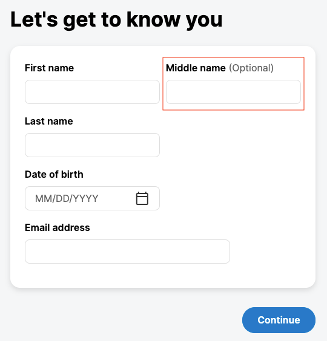

# How to: add a new field to the onboarding flow
This guide aims to describe the process of adding a new field to a journey based on the US Onboarding flow. The implementation has been done using Flow 1.5.5 (2021.06), which the FE journey uses Formly to generate the forms.



## Instructions

### Preparing your local environment

#### Backend

The first step to run the flow end-to-end is starting up an instance of IPS and Edge. You can get the latest version of them downloading a project in [start.backbase.com](http://start.backbase.com "http://start.backbase.com").  
Once you downloaded and extracted the files from the package, find the "platform" folder and execute the following commands in separate terminals or tabs:

 ```
 docker-compose up
```

 ```
 mvn blade:run
```

 ```
 mvn -pl edge package -Prun-edge
```

Now it's time to run the actual Flow service. Clone the us-onboarding-service repository. Then compile the sources with the following commands:

 ```
 mvn clean install
```

 ```
 mvn clean -Pclean-database
```

Once everything is compiled and installed, start up the service:

 ```
 mvn spring-boot:run -Dspring-boot.run.profiles=eureka,local-mysql
```

#### Frontend

You have the backend service up and running, now you want to consume the service in the frontend app. Clone the web-us-onboarding-app repository and in “src” folder execute the following commands:

 ```
 npm install
```

 ```
 npm run start:prospect
```

Everything is now up and running and you can access the app in [http://localhost:4201](http://localhost:4201 "http://localhost:4201") (double check the port in the output of the Angular server) and go through the flow entering some dummy data.

### Adding the new field

#### Backend

To add the field to the model in the backend, you need to add the new attribute to the interaction class and to the case definition:

src/main/java/com/backbase/flow/onboarding/us/interaction/dto/AnchorDataDto.java:

     ```java
     @Size(max = 50, message = FIELD_LENGTH_MESSAGE)
     private String firstName;
 
     // New field //
   
     @Size(max = 20, message = FIELD_LENGTH_MESSAGE)
     private String middleName;
   
     // -- //
 
     @NotBlank
     @Size(max = 50, message = FIELD_LENGTH_MESSAGE)
     private String lastName;
```

src/main/resources/case-definitions/onboarding.json:

   ```json
   "$id": "onboarding",
   "$schema": "http://json-schema.org/draft-07/schema#",
   "title": "onboarding",
   "version": 2,
   "type": "object",
   "properties": {
     "isJointAccount": {
         ...
         "firstName": {
           "type": "string"
         },
         "middleName": {
           "type": "string"
         },
         "lastName": {
           "type": "string"
         },
         ...
```

src/main/java/com/backbase/flow/onboarding/us/interaction/dto/OnboardingDto.java:

 ```java
 public class OnboardingDto {
 
     private String firstName;
     
     // New field //
     private String middleName;
     // -- //
 
     private String lastName;
     private String dateOfBirth;
     private String phoneNumber;
```

src/main/java/com/backbase/flow/onboarding/us/interaction/handler/AnchorDataHandler.java:

         ```java
         Applicant coApplicant = ObjectUtils.defaultIfNull(onboarding.getCoApplicant(), new Applicant());
 
         coApplicant.setFirstName(anchorData.getFirstName());
 
         // New field //
         coApplicant.setMiddleName(anchorData.getMiddleName());
         // -- //
 
         coApplicant.setLastName(anchorData.getLastName());
         coApplicant.setDateOfBirth(anchorData.getDateOfBirth());
         coApplicant.setEmail(anchorData.getEmail());
 
         Applicant mainApplicant = onboarding.getMainApplicant();
 
         mainApplicant.setFirstName(anchorData.getFirstName());
         
         // New field //
         mainApplicant.setMiddleName(anchorData.getMiddleName());
         // -- //
 
         mainApplicant.setLastName(anchorData.getLastName());
         mainApplicant.setDateOfBirth(anchorData.getDateOfBirth());
         mainApplicant.setEmail(anchorData.getEmail());
```

Recompile and restart the service as described before.

#### Frontend

Once you have the backend ready to receive and store the data of your flow, you can just add the new field to the form. Since we’re working with Formly, the following item has been added to the Formly Field Config array:

   ```json
   {
     type: InputType.Text,
     key: 'middleName',
     className: 'col-md-6',
     templateOptions: {
       label: 'Middle name',
       required: false,
       maxLength: 20,
     },
   }
```

Where we specified the type of the input, a key, the CSS classes and its options.

Also, it’s important to add the new field to Flow interaction service, so it is added to the payload of the request.

 ```
 combineLatest([
         this._flowInteraction.cdo.get<string>('firstName').pipe(take(1)),
 
         // New field //
         this._flowInteraction.cdo.get<string>('middleName').pipe(take(1)),
         // -- //
 
         this._flowInteraction.cdo.get<string>('lastName').pipe(take(1)),
         this._flowInteraction.cdo.get<string>('dateOfBirth').pipe(take(1)),
         this._flowInteraction.cdo.get<string>('email').pipe(take(1)),
       ])
         .pipe(take(1))
         .subscribe(([firstName, /* New field */ middleName /* -- */, lastName, dateOfBirth, email]) => {
           const dob = dateOfBirth ? new Date(dateOfBirth).toJSON() : '';
           this.helper.setModel({ firstName, /* New field */ middleName /* -- */, lastName, dateOfBirth: dob, email });
         });
```

For the validations, you can configure FormlyModule, which in our project is located in ‘onb-reference-formly-ang/src/onb-reference-formly-ang.module.ts’. As an example, to implement the requirement to display “Middle name is too long” when the user enters a name longer than 20 characters, the following function was added to the config:

 ```typescript
 export function maxLengthValidationMessage(_: any, field: FormlyFieldConfig) {
   return `${field.templateOptions?.label} is too long`;
 }
```

Then added to validationMessages as:

 ```
 { name: 'maxlength', message: maxLengthValidationMessage },
```

##### See the new field in Case Manager

The data is now part of the flow and getting stored in the case, so it is also important that managers have the ability to see it. We need to add the field to Case Manager’s model, so the user details will be displayed on the UI.

In the SDLC model, find the content JSON file for the field sets of the flow. Add the new object with title, viewHint and pointer like in the following example:

 ```
 {
   "title":"Middle name",
   "viewHint":"string",
   "pointer":"/mainApplicant/middleName"
 }
```

##### Show “(Optional)” in the label

As agreed with the UX team, since the field isn’t required, we should display “(Optional)” with a lighter weight in the label of the input. However, the UI component available in the Design System doesn’t offer this option, nor isn’t flexible enough to set an HTML markup to the label attribute.

A solution for this problem is extracting the label of the field to your wrapping component, linking it to the input field using “for” and “id”:

 ```
 <label [for]="field.id">{{ to.label }}</label><span class="bb-text-support" *ngIf="!to.required"> (Optional)</span>
 <bb-input-text-ui [className]="to.className" [readonly]="to.readonly" [placeholder]="to.placeholder" [formControl]="formControl" [id]="field.id"></bb-input-text-ui>
```

## References

Frontend source code:

[https://github.com/baas-devops-cse/web-us-onboarding-app/commit/305183e48a6d0f886eb8361ea7c009b4fbd4d532](https://github.com/baas-devops-cse/web-us-onboarding-app/commit/305183e48a6d0f886eb8361ea7c009b4fbd4d532) - Connect your Github account

Backend source code:

[https://github.com/baas-devops-cse/us-onboarding-service/commit/c70f6a4938023f9cc929bb73612ad385f4d40a61](https://github.com/baas-devops-cse/us-onboarding-service/commit/c70f6a4938023f9cc929bb73612ad385f4d40a61) - Connect your Github account