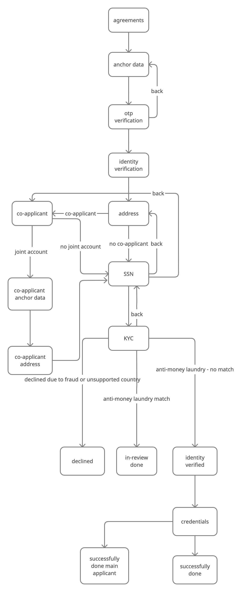
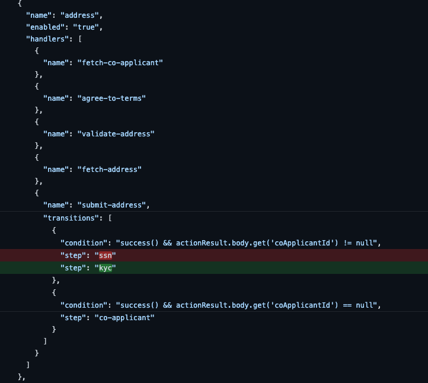
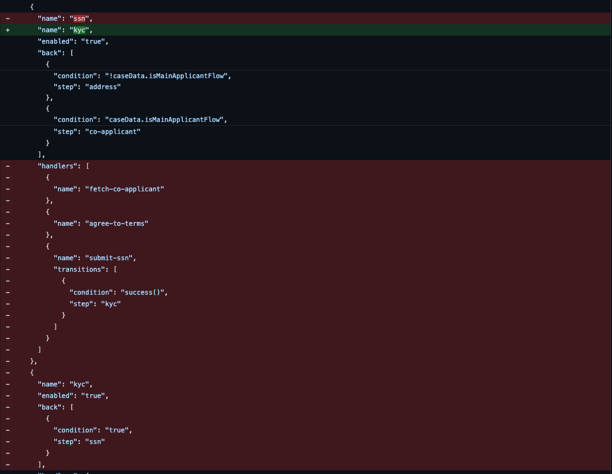
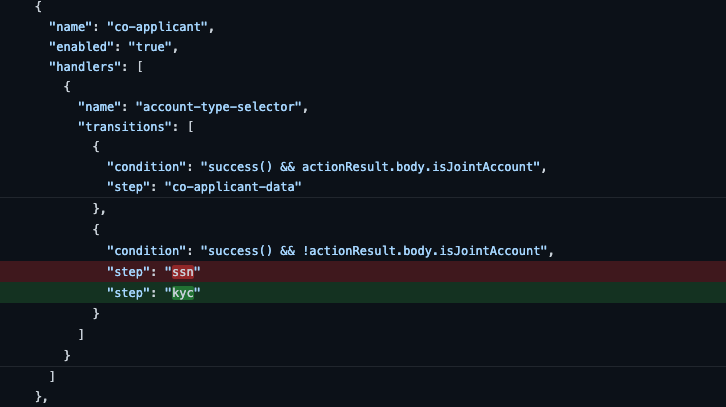
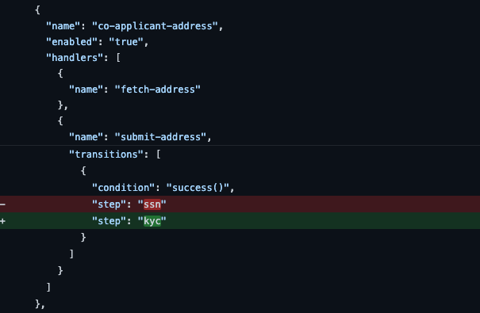
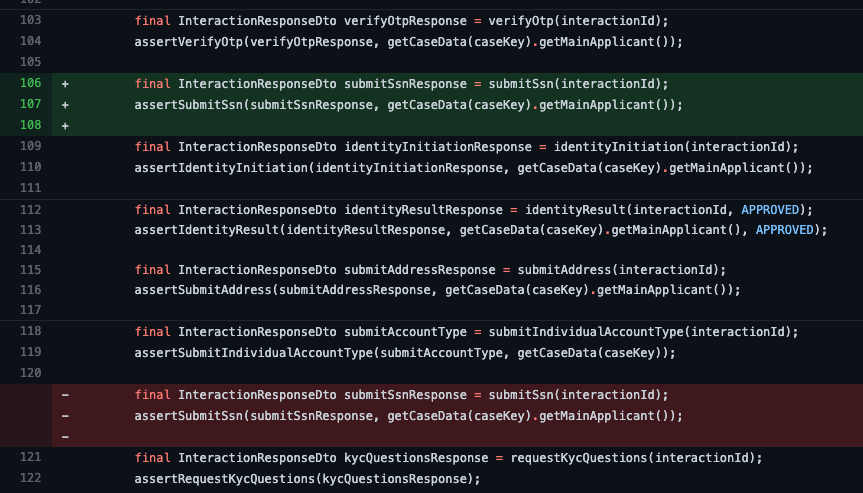
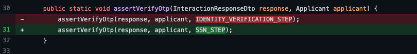
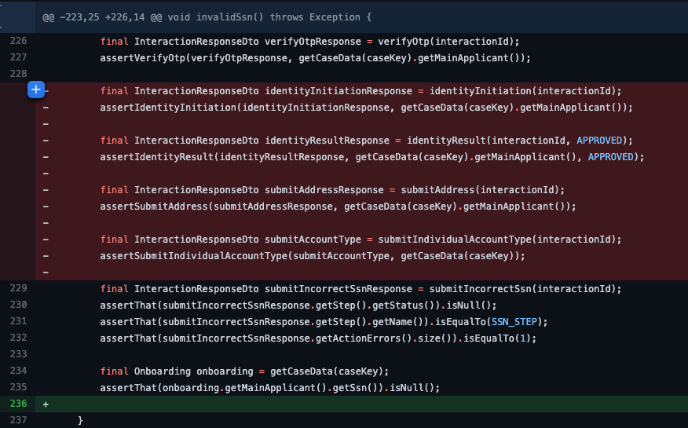
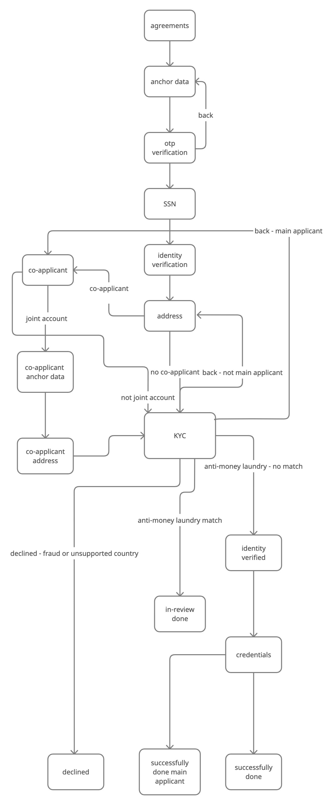
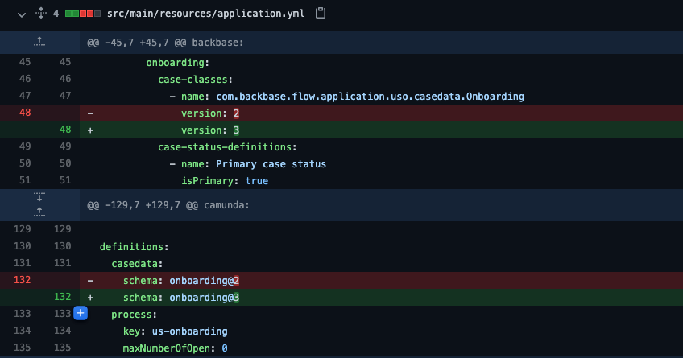

# How to: Adjust a step in onboarding flow
*   1 [Introduction](#Introduction)
*   2 [Current onboarding flow](#Current-onboarding-flow)
*   3 [Update interaction - onboarding.json](#Update-interaction---onboarding.json)
*   4 [Adjusted onboarding flow](#Adjusted-onboarding-flow)
*   5 [Bump the interaction version](#Bump-the-interaction-version)
*   6 [References](#References)
*   7 [Related articles](#Related-articles)

## Introduction

This guide aims to demonstrate how to adjust a step in an onboarding flow either by moving it up or down the interaction order from a back end perspective. The technique discussed in this guide applies to both scenarios.

There are scenarios that will require you to adjust the interaction step; in our context, we want to make sure the applicant provides **SSN** ( Social Security Number ) before moving on to **IDV** ( Identity Verification) step.

## Current onboarding flow

## Update interaction - onboarding.json

1.  The first step is to adjust the SSN step in onboarding.json by changing the transition of `otp-verification` to `ssn` and then transition `ssn` to `identity-verification`.
    

This is how it will look in the onboarding.json file:

`{ "name": "otp-verification", "enabled": "true", "back": [ { "condition": "true", "step": "anchor-data" } ], "handlers": [ { "name": "fetch-co-applicant" }, { "name": "agree-to-terms" }, { "name": "submit-anchor-data" }, { "name": "available-otp-channels" }, { "name": "request-otp" }, { "name": "verify-otp", "postExecutions": [ { "name": "resume-previous-case" }, { "name": "otp-verified-preliminary-case-promotion" }, { "name": "start-onboarding-process" } ], "transitions": [ { "condition": "success()", "step": "ssn" } ] } ] }, { "name": "ssn", "enabled": "true", "handlers": [ { "name": "fetch-co-applicant" }, { "name": "agree-to-terms" }, { "name": "submit-ssn", "transitions": [ { "condition": "success()", "step": "identity-verification" } ] } ] }`

2\. The second step is to resolve every other step that has a dependency on `ssn`. The affected steps by looking at the previous diagram are `address`, `kyc`, `co-applicant` and `co-applicant-address`.

The following images show what the steps look like after resolving the `ssn` dependencies, please note that these are snippets reflecting where the update was applied for brevity. Check out the [repository](https://github.com/baas-devops-cse/us-onboarding-service "https://github.com/baas-devops-cse/us-onboarding-service") on Github for the full [file](https://github.com/baas-devops-cse/us-onboarding-service/blob/master/src/main/resources/interactions/onboarding.json "https://github.com/baas-devops-cse/us-onboarding-service/blob/master/src/main/resources/interactions/onboarding.json").

**Address step:**

**KYC step:**

**Co-applicant step:**

**Co-applicant address step**:

3\. The third step will be refactoring the integration tests. The affected integration tests are **OnboardingIT.java**, **CoApplicantWelcomeIT.java**, **FinalizingOnboardingIT.java** and finally the helper class - **OnboardingAssertions.java.**

The test cases in these integration tests observe the order in the interaction step meaning the tests will assert that each step transits forward or back to the next step stated in the interaction - onboarding.json.

Since we have moved the ssn step before identity verification we need to reciprocate this order in the test cases and update the assertions.

The following image shows ssn triggered right after otp-verification in OnboardingIT same applies to the rest of the integration tests:

The helper class needs to be updated with the correct step assertions:

Finally, you need to make sure that redundant codes are removed as well, for example in the `invalidSsn` test case in OnboardingIT.java the other steps that formerly needed to execute before getting to the ssn step needs to be removed since now we transit straight to ssn after otp-verification.

This image shows redundant codes that were deleted for invalidSsn test case:

## Adjusted onboarding flow

After a successful build the desired flow will look as follows:

## Bump the interaction version

Each time you make a change to the interaction or case definition - onboarding.json file as we did in this case you need to bump the version to avoid deployment issues because the interaction is immutable.

Update the version in `resource file`; application.yml, the `interactions`; onboarding.json, co-applicant-welcome.json, finalize-onboarding.json, origination.json and `case definition`; onboarding.json.

**appplication.yml**

**case definition - onboarding.json**

See the link in the references section for the rest of the updating of the interactions.

## References

Backend source code:

Adjust ssn step

[https://github.com/baas-devops-cse/us-onboarding-service/commit/4fe6056b1ba5286990a8e3a541e635d08e489e45#](https://github.com/baas-devops-cse/us-onboarding-service/commit/4fe6056b1ba5286990a8e3a541e635d08e489e45#)

Bump the interaction

[https://github.com/baas-devops-cse/us-onboarding-service/commit/8165b4ec5a183096afbfc2d510352f7ab28f4b9c](https://github.com/baas-devops-cse/us-onboarding-service/commit/8165b4ec5a183096afbfc2d510352f7ab28f4b9c)

## Related articles

[https://backbase.atlassian.net/wiki/spaces/CSE/pages/3314909187](https://backbase.atlassian.net/wiki/spaces/CSE/pages/3314909187)