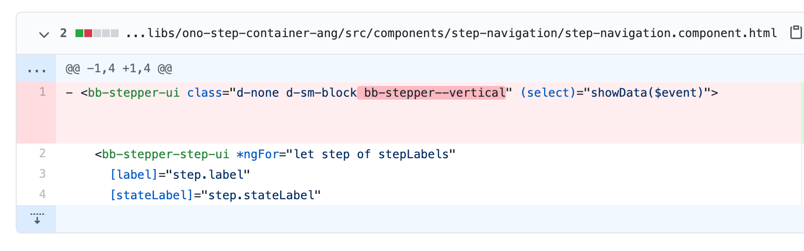

# How-to: group steps horizontally
Some customers may prefer to display the journey track in different ways, such as horizontally or grouping many steps into a parent one. Both options can get achieved using the component available in the Design System. Also, with some extra CSS, we can deliver the design proposed in the user story.

## Instructions

### Horizontal stepper

Design System Stepper component supports both horizontal and vertical styles. By default, the flow comes with the vertical variant, which can get changed by removing "bb-stepper--vertical" class from "bb-stepper-ui".

> From 2021.08 release onwards, the step container isn’t part of the app project anymore and is imported as an OOTB dependency. To make these changes, the container’s source code has to be ejected into the project or a custom container has to get generated.

### Group journeys/steps

Grouped journeys is also a feature supported by the OOTB Design System. The goal can get achieved by simply changing the model of the stepper, wrapping all the steps into a parent with a "children" property.

``const PROSPECT_LABELS: StepLabels[] = [ { step: 'profile', label: 'Profile', children: [ { step: 'anchor-data', label: `Let's get to know you`, headline: `Let's get to know you` }, { step: 'otp-verification', label: 'Account Verification', headline: `Let's secure your account` }, { step: 'identity-verification', label: 'ID and Verification', headline: 'ID Verification' }, { step: 'ssn', label: 'Provide your SSN', headline: 'Provide your SSN' }, { step: 'address', label: 'Your address', headline: 'Your address' }, ]}, ...``

### Visual customisation

When the requirements reach complex scenarios, such as showing the steps fulfilment as progress bars, some changes may be necessary for the stepper component template. Design System’s Stepper component allows us to inject custom templates to its originals, so there is no need of creating any custom smart component to handle the functionality.

The component supports a directive called `bbCustomStepperStep` – see line 20 –, which combined with ng-template serves as an entry point to inject any HTML. Using that, developers can code the UI as per requirements and introduce logic driven by the parent component.

`<bb-stepper-ui class="d-none d-md-block"> <bb-stepper-step-ui *ngFor="let step of stepData" [label]="step.label" [stateLabel]="step.stateLabel" [data]="step.data" [ariaLabel]="step.label" [isCurrent]="step.isCurrent" [isActive]="step.isActive" [isChecked]="step.isChecked" > <bb-stepper-step-ui *ngFor="let step of step.children" [label]="step.label" [data]="step.data" [ariaLabel]="step.label" [isCurrent]="step.isCurrent" [isActive]="step.isActive" [isChecked]="step.isChecked" ></bb-stepper-step-ui> </bb-stepper-step-ui> <ng-template bbCustomStepperStep let-step let-number="number" let-isChild="isChild"> 
 
 {{ step.label }} 
 
 

 
 
 </ng-template> </bb-stepper-ui>`

At this point, any visual customisation is possible through CSS in the theme or in the component itself, depending on the level of encapsulation needed.

## Related articles

 

*   Page:
    
    [How-to: group steps horizontally](/wiki/spaces/CSE/pages/3333685249/How-to%3A+group+steps+horizontally)
    
*   Page:
    
    [\[Android\] How-to: Integrate a Flow Journey into the Productized App](/wiki/spaces/CSE/pages/3516760418)
    
*   Page:
    
    [How to: Enable multiple products selection](/wiki/spaces/CSE/pages/3499721196/How+to%3A+Enable+multiple+products+selection)
    
*   Page:
    
    [Add edit button to fields in Review screen](/wiki/spaces/CSE/pages/3471835233/Add+edit+button+to+fields+in+Review+screen)
    
*   Page:
    
    [How-to: add custom icons](/wiki/spaces/CSE/pages/3331981784/How-to%3A+add+custom+icons)