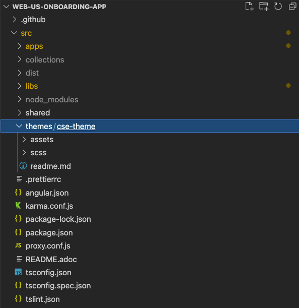
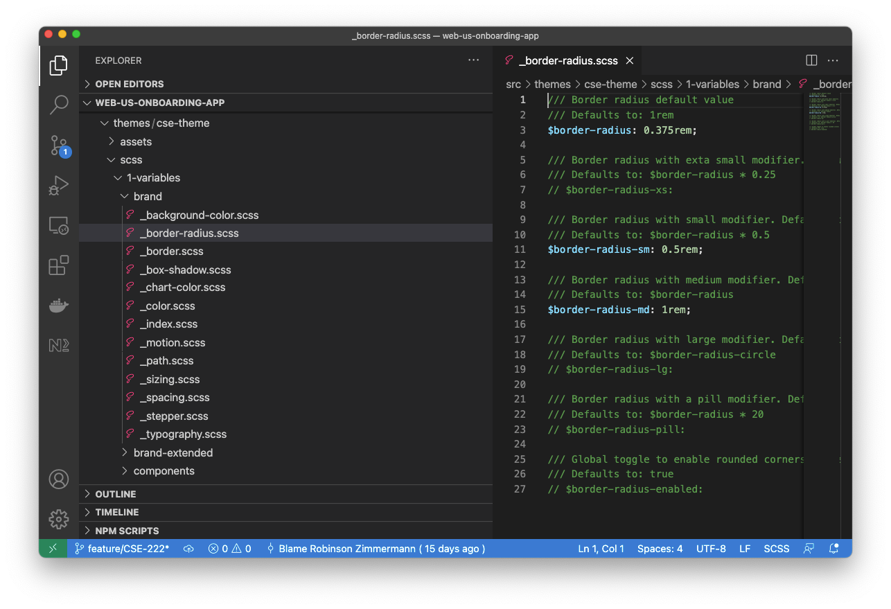
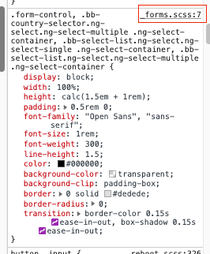
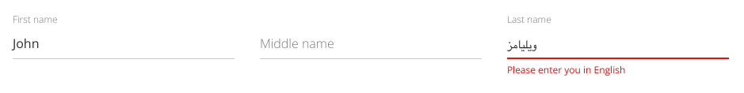

# How-to: theme Digital Sales projects
Backbase Design System’s Playground provides a complete SASS theme compatible with all the components in our library. The theme extracted from Playground comes with a set of predefined tokens/variables to set the basic “look and feel” of the branding guidelines. Nevertheless, a frontend engineer is still able to add further configuration and extend the theme using SASS. This guide aims to show the possibilities for customisation in a Digital Sales flow within the boundaries of the product.

## Instructions

### Add the theme to the project

Theming for DS apps is no exception from other Backbase or Angular apps.

Assuming the app follows the guidelines of the Design System, the task should be straightforward. The extract should provide the necessary styles to change the whole look and feel, so in essence, it is a matter of switching the theme entry-point.

1.  Take the extracts provided by the UX designer and paste the web theme to the project  
      
    
    
    
2.  Edit the angular.json file to point the styles of the app to the main SCSS file  
      
    
    `"journey": { ... "styles": [ "themes/cse-theme/scss/main.scss" ], ...`
    
3.  Restart the server to view the changes
    

### Additional configuration

Design System's Playground offers a great range of controllers to play with and scaffold a preset theme, but that's not everything.

The project uses SASS as a CSS preprocessor, which preconfigures the project through a set of variables – or tokens – that a developer can set up and change the UI without extra code.

> Before introducing any CSS override, check if the same result can get achieved setting up these variables. Avoid overrides as much as possible to reduce the risks of undesired behaviours.

These variables/tokens can be found in the first directory of the `scss` folder tree, and most of the options are exposed as commented out code.

If you can’t find what you’re looking for, it’s also possible to see the variables inspecting the element in the browser. Inspect the element you’re targeting and click on the file name to reveal its sources.

#### Extending the styles

It’s not always possible to get the desired results with the variables, so you need to extend the styles. As an example of it, we have the input field of our screens.

The floating label style differs from the Design System, but we can combine techniques to achieve that with not so much effort.

To display the bottom line only:

1.  Set the input border width to “0”:
    
    `$input-border-width: 0;`
    
2.  Add the bottom border width you want to the form-control:
    
    `.form-control, .form-control[type="text"], .form-control[type="number"], .form-control[type="email"], .form-control[type="password"], .form-control[type="tel"], .form-control[type="search"], .input-group-append .btn { border-bottom-width: 1px; }`
    

#### Extending behaviours with directives

Sometimes you need the help of JavaScript logic to create the styles. Angular directives are great tools as you can include an attribute to your elements and extend the behaviour of HTML elements.

In our subject, we created a directive to handle focus and change events of the fields. With these events, we can provide classes that make the implementation with CSS possible.

`@Directive({ selector: '[bbUsFloatingLabel]' }) export class FloatingLabelDirective implements AfterViewInit { private nativeElement: HTMLElement = this.elRef.nativeElement as HTMLElement; @HostListener('focusin', ['$event.target']) onFocus() { this.nativeElement.classList.add('floating-label--focus'); } @HostListener('focusout', ['$event.target']) onBlur() { this.nativeElement.classList.remove('floating-label--focus'); } @HostListener('change', ['$event.target.value']) onChange(value: string) { if (value.length) { this.nativeElement.classList.add('floating-label--has-value'); } else { this.nativeElement.classList.remove('floating-label--has-value'); } } constructor(private elRef: ElementRef) {} ngAfterViewInit() { this.nativeElement.classList.add('floating-label'); } }`

> We expect this directive to be used throughout the whole application, so it’s wise to implement it in a shared UI library.

### Adding custom styles

Custom styles may be necessary during the process, which is a good idea to follow some guidelines when introducing.

The default theme structure comes with a folder for components where you can organise the global styles. However, use your judgement to decide whether your stylings should be global or encapsulated within your Angular component. Stylings that affect the general look and feel, or are part of other libraries such as the Design System, belong to the theme, as it gets as deep as your DOM go, and it's where your colour and other configurations are.

Structural stylings, or particular rules, should be added to the component itself in your library. The component styles are encapsulated and will not affect any other element, even if it's a child one, keeping your stylings predictive.

> If you need variables in your component styles, you can import “1 - variables” into it. This folder must be an abstract that contains SCSS partials only, so it shouldn’t add any dirty to your final CSS.

### Change background images

Digital Sales apps come with a background container component, which has some configurable properties to set – or unset – the background files. In the context of the user story, all we have to do is unset those properties, clearing the path to the image files. In the model of the onboarding flow, just search for all the occurrences of `OnoStepContainerAngComponent` and edit these properties:

`... "classId": "OnoStepContainerAngComponent", "route": "terms-and-conditions", "backgroundImageL": "", "backgroundImageM": "", "backgroundImageS": "", ...`

Additionally, we want the section to have a solid colour, which requires some CSS change. In the background container component, add a background-color property with the value, which can be hexadecimal, RGBA or a gradient (use the "background" property in this case).

## Related articles

 

*   Page:
    
    [How-to: group steps horizontally](/wiki/spaces/CSE/pages/3333685249/How-to%3A+group+steps+horizontally)
    
*   Page:
    
    [\[Android\] How-to: Integrate a Flow Journey into the Productized App](/wiki/spaces/CSE/pages/3516760418)
    
*   Page:
    
    [How to: Enable multiple products selection](/wiki/spaces/CSE/pages/3499721196/How+to%3A+Enable+multiple+products+selection)
    
*   Page:
    
    [Add edit button to fields in Review screen](/wiki/spaces/CSE/pages/3471835233/Add+edit+button+to+fields+in+Review+screen)
    
*   Page:
    
    [How-to: add custom icons](/wiki/spaces/CSE/pages/3331981784/How-to%3A+add+custom+icons)