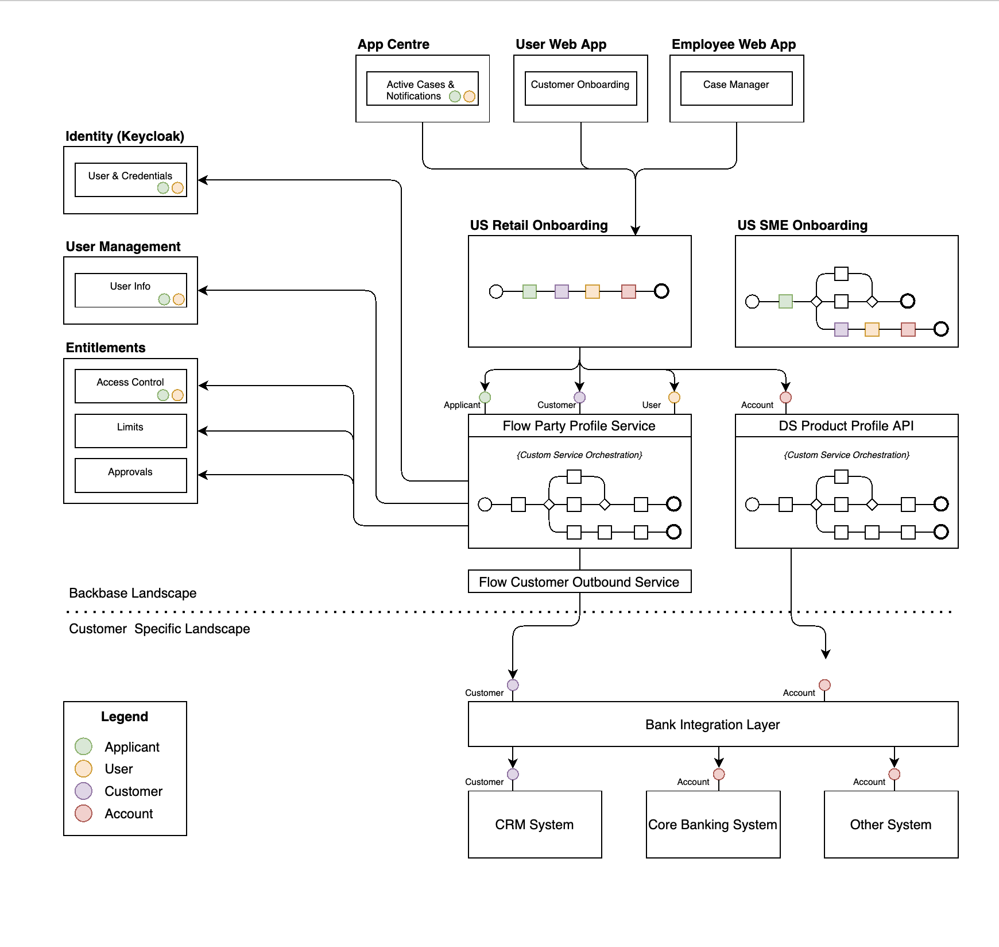

# CSE-231 : Submitting case data to core. Integration Analysis
The current Analysis is based on Mambu as a core system. This can be generalized to other core banking applications with a minor change based on project requirements.

A major focus was to post/submit the data to the core. This involves both creating customers/clients and/or creating an account.

**BPMN’s**

Main- Process: US onboarding as an example

Sub-Process: Sending data to Core

**Sequence Diagram :**

Client/Customer Creation

Product/Account Creation:

We can store the core integration state using OOTB’s available integration state service ([Manage Integration State - flow\_foundation](https://community.backbase.com/documentation/flow/latest/manage_integration_state) ). This service is currently being used to maintain the integration state of the 3rd party services.

1.  This helps avoid thread overload by multiple calls on dead or error-prone core-service.
    
2.  Core integration state can be used by an interaction engine, this enables avoiding tight coupling between process engine and interaction engine keeping screen flow smooth.
    
3.  Unless the related integration state is not “DONE" the case can not be archived
    

Integration state is not a source of truth to refer Account number ,CIF or any other functional id’s CaseData store would be the source .

The whole purpose of the IntegrationState is to store core references which incase used for further connections to core with the same reference .And making recovery of the broken connections(OPEN state) to make sure data is sent to core and acknowledge before closing/archiving the case.

Note: Separate Integration service will not be created for CSE. At the project level Integration can be handled in separate services if required.

**Background Context R&D Roadmap**

R&D has a roadmap to build an integration to internal and external systems. The solution would be aligned with the R&D vision.

### Interaction Patterns:

Digital sales will send the case data to the core using outbound API. Due to the continuity of the process, it is advised to keep the communication asynchronous there are two variants of the async patterns which could be used.

*   **Alternative 1**: Request / Ack + Polling
    
    
    
*   **Alternative 2**: Request / Ack + Callback
    
    
    

**Save integration state**

After sending the data to the core an integration state shall be updated in order to keep the communication async and reduce the impact on backbase components.

The archiving strategy should be modified based on the decision at the project level.

1\. The case can be closed when data is sent to the core.

2\. The case can be closed when the core status is updated.

In order to roll back, DB updates in case of an exception compensate component of the camunda will be used to roll back the DB transaction. This uses a saga pattern.

**Saga Pattern**

The Saga pattern will solve transactions in distributed systems. A saga is a sequence of local transactions. Camunda is a Java-based framework that supports Business Process Model and Notation (BPMN) standard for workflow and process automation. The following [blog](https://camunda.com/blog/2015/08/brining-together-transactions-cancel/ "https://camunda.com/blog/2015/08/brining-together-transactions-cancel/") contains a detailed explanation and example of how to implement the Saga Pattern making use of Camunda.

The Flow Party Profile specification defines the interface of the services used by all the Product Flows (US Retail Onboarding, US SME Onboarding, etc..) to search, create, read, update and delete Flow Party records within the Core Banking System.

