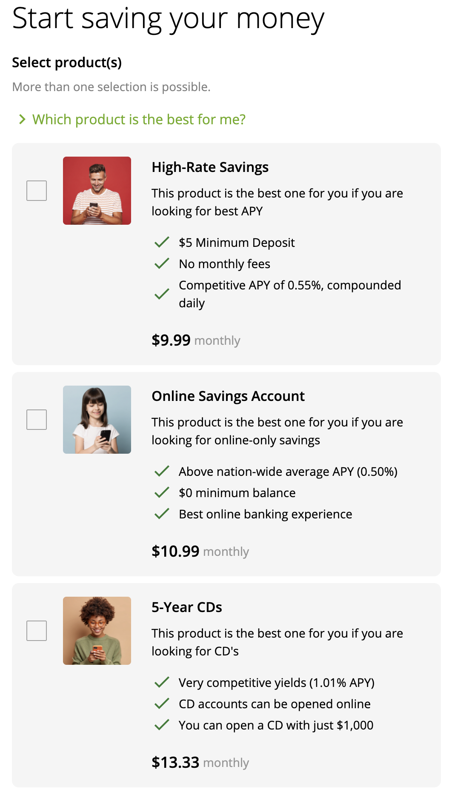

# How to: Enable multiple products selection
When working with the [OOTB product selection journey](https://community.backbase.com/documentation/flow/latest/journey_widgets_product_selection_understand "https://community.backbase.com/documentation/flow/latest/journey_widgets_product_selection_understand"), you can easily switch between single and multiple products selection [as described in its documentation](https://community.backbase.com/documentation/flow/latest/product_selection_journey_widget_reference "https://community.backbase.com/documentation/flow/latest/product_selection_journey_widget_reference").

Assuming you’re implementing a solution using an app based on the OOTB US Onboarding Flow, you will be able to find the journey in your app module and its SDLC model. Since the property is handled as an input, just add the property to the SDLC model:

In src/apps/journey/sdlc/pages/prospect.json:

`{ "classId": "ProductSelectionJourneyAngComponent", ... "selectionType": "multiple", "product1": { ... }, "product2": { ... }, "product3": { ... } ... }`

Generate the app model to apply the changes to your standalone/dev app running the following command:

`$ npm run sdlc:build-model:prospect`

Now your product selection list will be displayed with checkboxes instead of radio buttons:

##  Related articles

 

*   Page:
    
    [How-to: group steps horizontally](/wiki/spaces/CSE/pages/3333685249/How-to%3A+group+steps+horizontally)
    
*   Page:
    
    [\[Android\] How-to: Integrate a Flow Journey into the Productized App](/wiki/spaces/CSE/pages/3516760418)
    
*   Page:
    
    [How to: Enable multiple products selection](/wiki/spaces/CSE/pages/3499721196/How+to%3A+Enable+multiple+products+selection)
    
*   Page:
    
    [Add edit button to fields in Review screen](/wiki/spaces/CSE/pages/3471835233/Add+edit+button+to+fields+in+Review+screen)
    
*   Page:
    
    [How-to: add custom icons](/wiki/spaces/CSE/pages/3331981784/How-to%3A+add+custom+icons)