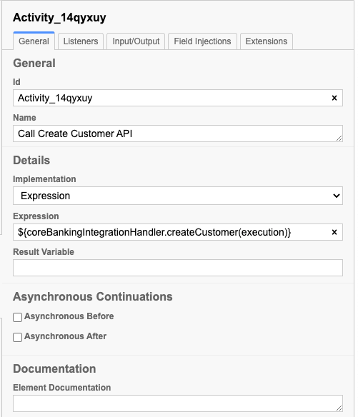
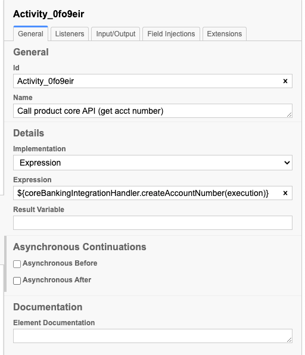
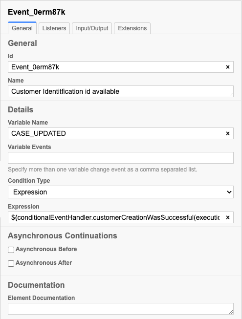
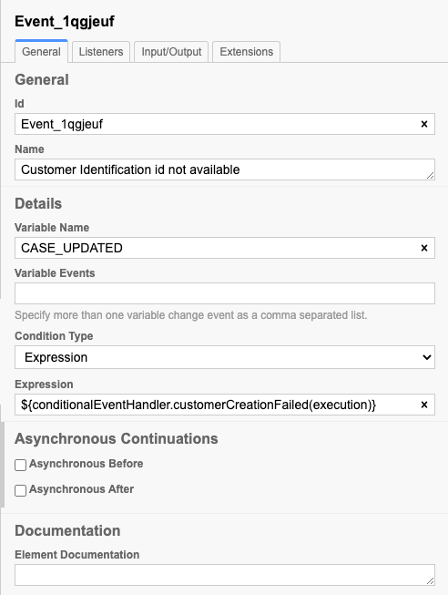
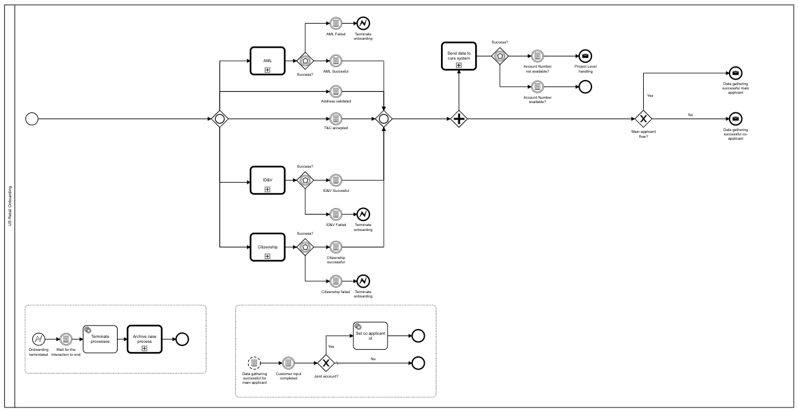
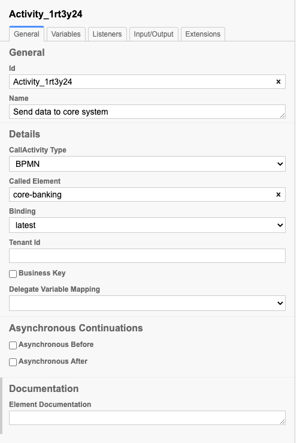
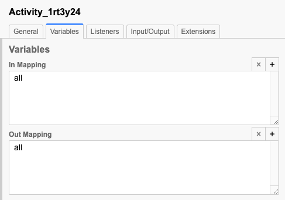
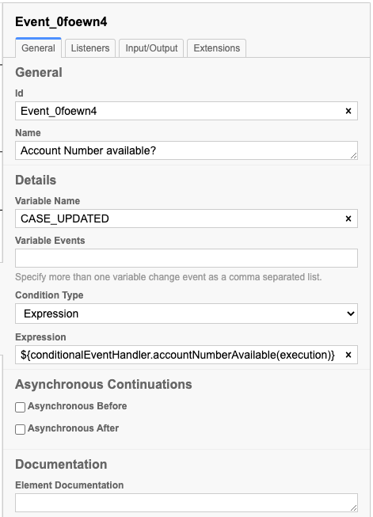
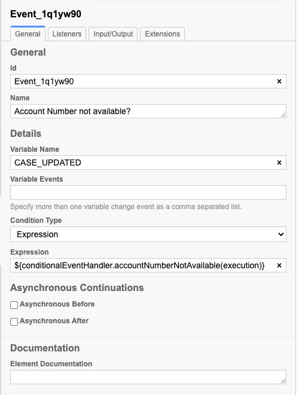
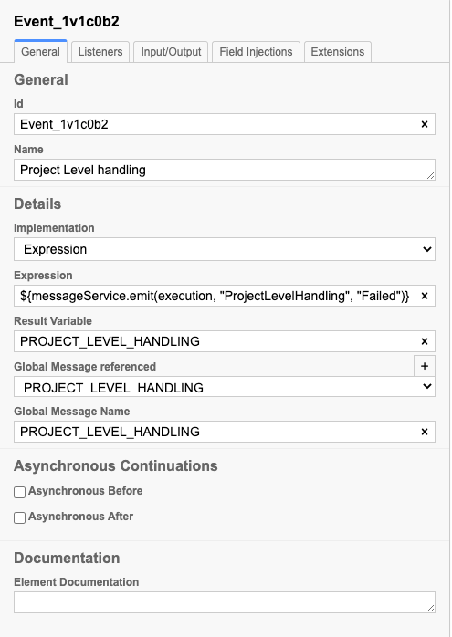

# How to: Integrate Flow with a core banking system
*   1 [Introduction](#Introduction)
*   2 [Core banking sub-process](#Core-banking-sub-process)
*   3 [US Retail Onboarding Flow](#US-Retail-Onboarding-Flow)
*   4 [CoreBankingIntegrationHandler Class](#CoreBankingIntegrationHandler-Class)
*   5 [References](#References)
*   6 [Related articles](#Related-articles)

## Introduction

This is an implementation of the core banking integration analysis highlighted on this [page](https://backbase.atlassian.net/wiki/spaces/CSE/pages/3356885021/CSE-231+Submitting+case+data+to+core.+Integration+Analysis "https://backbase.atlassian.net/wiki/spaces/CSE/pages/3356885021/CSE-231+Submitting+case+data+to+core.+Integration+Analysis") while it focuses on the high-level overview of the system this article will highlight the steps taken to achieve the integration.

We will be focusing on the **Mambu** core banking system but this is also applicable to other core banking systems since the BPMN that handles the integration has been de-coupled from the main flow into a BPMN sub-process.

There are various use cases for case data submission to a core banking system but the use case in this guide covers customer (client) and savings or current account creation at the end of the flow.

## Core banking sub-process

This is the core banking sub-process that can easily be plugged in at any step in your main flow.

*   Configure the “**Call create Customer API**” service task as follows:
    

*   Configure the “**Call product core API (get account number)**” service task as follows:
    

The intermediate, interrupting events evaluate the outcome of “**Call create Customer API**”

*   Configure “**Customer identification id available**” event:
    

*   Configure “**Customer identification id not available**” event:
    

## US Retail Onboarding Flow

*   Configure the core banking sub-process in the main flow as flows:
    

In the Variables tab set “**In Mapping**” and “**Out mapping**” as follows:

Similar to the intermediate events in the core banking sub-process configure the “**Account number available**” and “**Account number not available**” likewise :

*   Configure the “**Project Level handling**” intermediate event
    

The “Project Level handling” intermediate throw event is an optional event set up for projects to utilize in case they want to listen for this event and propagate an appropriate message to the applicant like an email or SMS notification.

## CoreBankingIntegrationHandler Class

The CoreBankingIntegrationHandler will be interacting with the BPMN so mark it as a Process bean and give it a name - `coreBankingIntegrationHandler` make sure it sure it matches the reference used in the Core banking sub-process.

The _**MambuService**_ is just a service class sitting in the same Flow application depending on the complexity of your business logic this can be extracted into an outbound integration service.

*   **Customer Creation**
    

This is an implementation of the sequence diagram on this [page](https://backbase.atlassian.net/wiki/spaces/CSE/pages/3356885021/CSE-231+Submitting+case+data+to+core.+Integration+Analysis "https://backbase.atlassian.net/wiki/spaces/CSE/pages/3356885021/CSE-231+Submitting+case+data+to+core.+Integration+Analysis") under “_**Client/Customer Creation**_”

`@ProcessBean("coreBankingIntegrationHandler") public class CoreBankingIntegrationHandler { public void createCustomer(DelegateExecution execution){ final var onboarding = getOnboarding(execution); final var newClient = buildClient(onboarding, mambuConfigurationProperties); final var encodedKey = mambuService.postCreateClient(newClient); if (!StringUtils.isBlank(encodedKey)) { final var connectorKeyData = Map.of("email", newClient.getEmailAddress()); final var integrationStateData = Map.of("encodedKey", encodedKey); // Save the client id temporarily in integration state coreBankingIntegrationService.saveIntegrationState(getCaseKey(execution), connectorKeyData, integrationStateData); } else { log.warn("Mambu client creation failed."); } } }`

_**Please note that for brevity some part of this code has been left out, check out this Github**_ [_**tag**_](https://github.com/baas-devops-cse/us-onboarding-service/releases/tag/2021.08-0.7.0 "https://github.com/baas-devops-cse/us-onboarding-service/releases/tag/2021.08-0.7.0") _**for the full code.**_

*   **Account Creation**
    

The account creation flow is similar to customer creation and the sequence diagram can be found [here](https://backbase.atlassian.net/wiki/spaces/CSE/pages/3356885021/CSE-231+Submitting+case+data+to+core.+Integration+Analysis "https://backbase.atlassian.net/wiki/spaces/CSE/pages/3356885021/CSE-231+Submitting+case+data+to+core.+Integration+Analysis") under “**Product/Account Creation**”.

`public void getAccountNumber(DelegateExecution execution){ final var onboarding = getOnboarding(execution); final var email = onboarding.getMainApplicant().getEmail(); final var caseKey = getCaseKey(execution); final var connectorKeyData = Map.of("email", email); // Fetch client ID from the integration state required for account creation final var mambuIntegrationState = coreBankingIntegrationService .retrieveIntegrationByProperty(caseKey, connectorKeyData); final var accountId = mambuService.postCreateAccount(buildDepositAccount(mambuIntegrationState.getEncodedKey())); if (!StringUtils.isBlank(accountId)) { // Mark the end of the integration cycle by updating the integration state coreBankingIntegrationService.updateIntegrationState(caseKey, connectorKeyData); final var applicant = OnboardingCaseDataUtils.getApplicant(onboarding); // Save the new account ID in mambuAccountId field in the case data applicant.setMambuAccountId(accountId); OnboardingCaseDataUtils.setApplicant(onboarding, applicant); saveCaseData(execution, onboarding); } else { log.warn("Mambu account creation failed."); } }`

## References

Backend source code:

Core banking integration

[https://github.com/baas-devops-cse/us-onboarding-service/releases/tag/2021.08-0.6.0](https://github.com/baas-devops-cse/us-onboarding-service/releases/tag/2021.08-0.6.0 "https://github.com/baas-devops-cse/us-onboarding-service/releases/tag/2021.08-0.6.0")

## Related articles

[How to: Adjust a step in onboarding flow](https://backbase.atlassian.net/wiki/spaces/CSE/pages/3340763584)