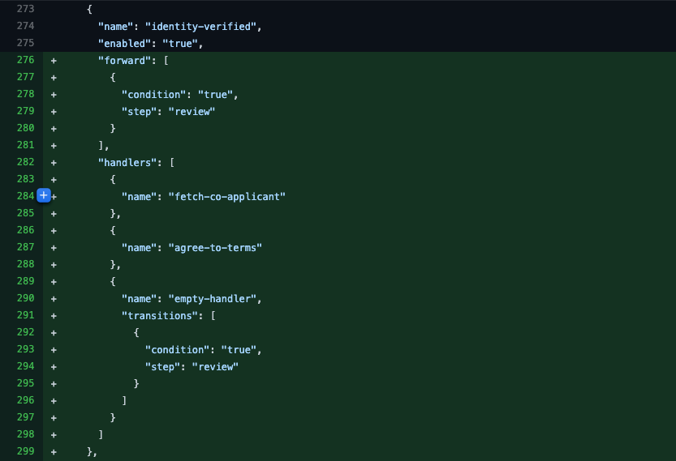
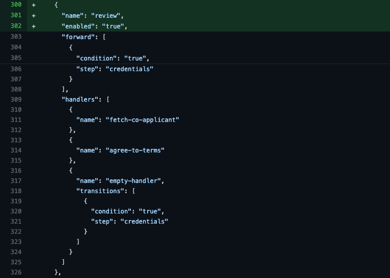
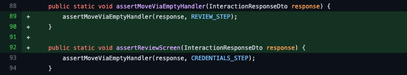
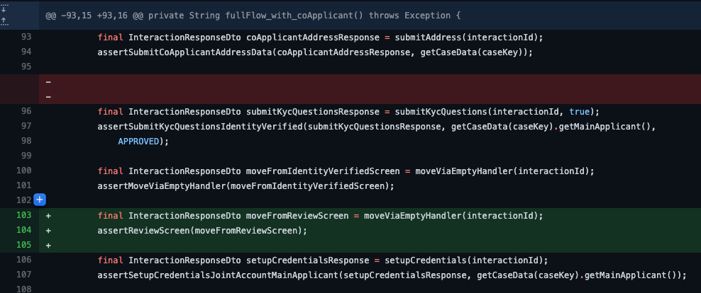
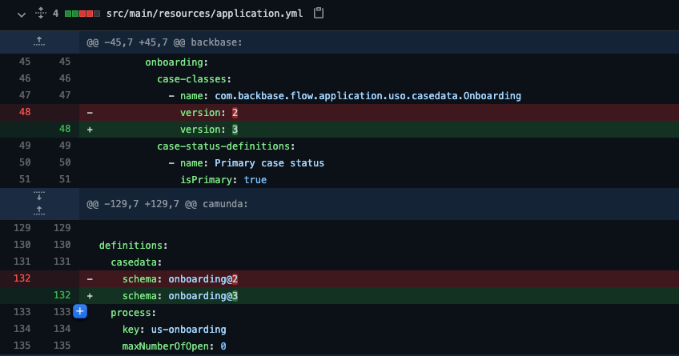
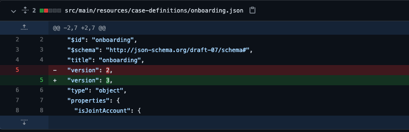

# How to: Add a step in the flow interaction
*   1 [Introduction](#Introduction)
*   2 [Adding a new step in interaction](#Adding-a-new-step-in-interaction)
*   3 [Refactor integration tests](#Refactor-integration-tests)
*   4 [Bump the interaction version](#Bump-the-interaction-version)
*   5 [References](#References)
*   6 [Related articles](#Related-articles)

## Introduction

This guide aims to demonstrate how to add a new step in the onboarding flow. The requirement is to give the applicant a review screen for reviewing all the data entered through the onboarding journey at the end of the flow.

## Adding a new step in interaction

First, we begin by identifying the point in the interaction where to add the new step. In our case that will be in-between the `identity-verified` and `credentials` steps.

The new onboarding interaction will look as follows after adding the `review` step:

Modified identity-verified step

New review step

There is no business logic required in the review step so transition it to the next step - credentials using the empty-handler.

## Refactor integration tests

After carefully adding the new step in the onboarding interaction it will likely trigger broken tests during build. To resolve the broken tests identify the following integration test (IT) classes: **OnboardingIT.java**, **CoApplicantWelcomeIT**.**java**, **FinalizeOnboardingIT**.**java** and these helper classes: **BaseAssertions.java** and **OnboardingAssertions.java**.

*   Create a new variable to hold the new step - review in BaseAssertions.java:
    

*   Update the `identity-verified` step assertions in `OnboardingAssertions.java` to reflect our new step - `review`. Afterwards, create a new assertion method to verify we transition to `credentials` from the `review` step.
    

*   Update the **IT**s by adding the triggering of the review step in the right position in the flow which is in-between identity-verified and credentials. The order is very important. This snippet is from CoApplicantWelcomeIT.java but the same principle applies to the rest of the integrations tests. See the references section for the link to the Github repository.
    

## Bump the interaction version

Each time you make a change to the interaction or case definition - onboarding.json file as we did in this case you need to bump the version to avoid deployment issues because the interaction is immutable.

Update the version in `resource file`; application.yml, the `interactions`; onboarding.json, co-applicant-welcome.json, finalize-onboarding.json, origination.json and `case definition`; onboarding.json.

**appplication.yml**

**case definition - onboarding.json**

See the link in the references section for the rest of the updating of the interactions.

## References

Backend source code:

Add review step

[https://github.com/baas-devops-cse/us-onboarding-service/commit/750f4234cce5c2145c1ba41467cdd4cd404b0ff7](https://github.com/baas-devops-cse/us-onboarding-service/commit/750f4234cce5c2145c1ba41467cdd4cd404b0ff7)

Bump the interaction

[https://github.com/baas-devops-cse/us-onboarding-service/commit/8165b4ec5a183096afbfc2d510352f7ab28f4b9c](https://github.com/baas-devops-cse/us-onboarding-service/commit/8165b4ec5a183096afbfc2d510352f7ab28f4b9c)

## Related articles

[https://backbase.atlassian.net/wiki/spaces/CSE/pages/3314909187](https://backbase.atlassian.net/wiki/spaces/CSE/pages/3314909187)

[https://backbase.atlassian.net/wiki/spaces/CSE/pages/3340763584/How+to+-+Adjust+a+step+in+onboarding+flow](https://backbase.atlassian.net/wiki/spaces/CSE/pages/3340763584/How+to+-+Adjust+a+step+in+onboarding+flow)