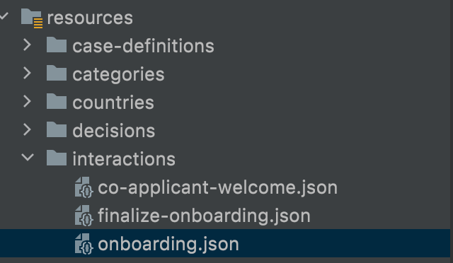
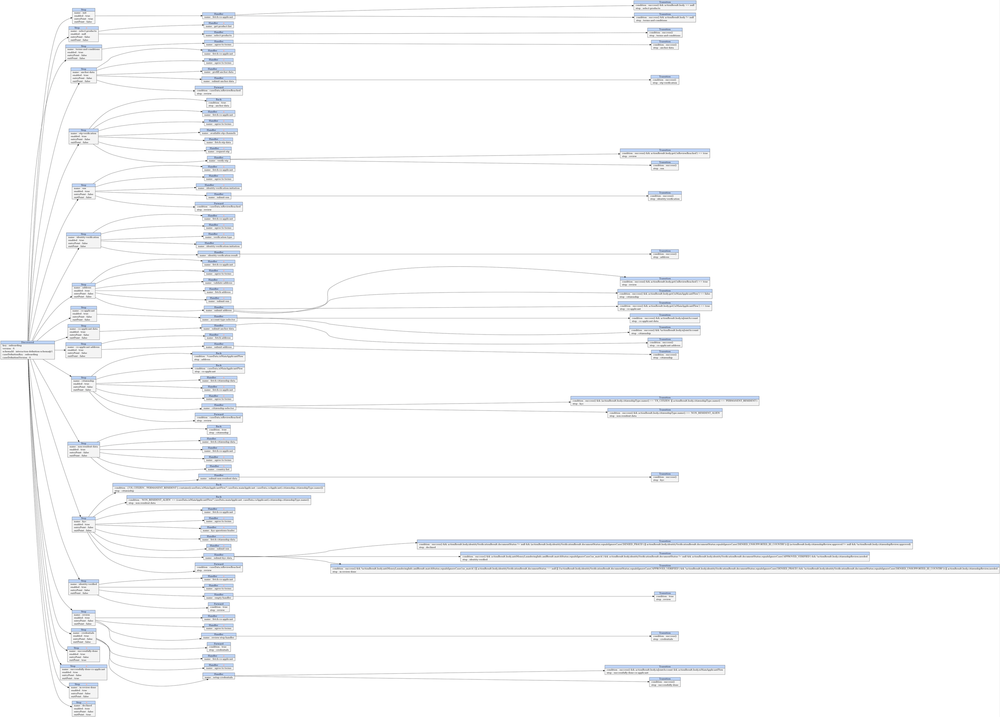

# Flow Integration: creating Step Interaction Handlers  and DTOs
*   1 [Introduction](#Introduction)
*   2 [considerations](#considerations)
*   3 [Flow JSON analysis](#Flow-JSON-analysis)

## Introduction

Flow integrations require a series of steps to be performed sequentially in order to achieve a successful execution. in the reference code there are two types of Handlers to consider: Interaction handlers and process handlers. Process handlers take care of automated tasks while interaction handlers take care of capturing and processing user inputs that get triggered during the flow operation. The interaction is controlled by a JSON file that Camunda process to determine the rules to use in the workflow.  
  

Step interaction handlers mainly take care of two optional tasks:

*   provide a return DTO object wrapped into a StepHandlerResult object
    
*   Persist the values into the CaseData Store.
    

  
This document is a guide for concepts to be taken into consideration when creating Interaction handlers to be used by a flow pipeline.

## considerations

*   analyze and identify inputs and outputs in each step: it is adviceable to first use a visual analyisis tool of the flow and determine the data needs and payload of each step.
    
*   create a baseline DTO: identify what data is common to all steps and what data is expected for each step. if a variable is needed in several steps and is relevant to the flow and not the user data, then it is usually a good idea to keep it in a baseline DTO that other dto’s can extend, this creates uniformity in the way that the DTO can be accessed in the frontend while at the same time maintaining flexibility for custom use cases needed by specific steps
    
*   do not include sensitive information unless absolutely needed: this a security principle known as “reducing the area of attack” the less information exposed by the DTO the better.
    
*   use a POJO generator if the flow allows it: if the project is relatively small and no sensitive information is to be exposed, a POJO generator can be a useful accelerator by reading the json file and generating the POJOS from there.
    

## Flow JSON analysis

*   create a Json Schema: the Json file can be used to generate a JSON schema thorough various means, for example: [JSON Schema Generator.](https://www.jsonschema.net/login)
    
*   create a diagram based on the schema,  
      
    
    
    
    us-onboarding flow
    

After the diagram is outlined, the steps can be analyzed and decisions can be made on what data is needed by each step.