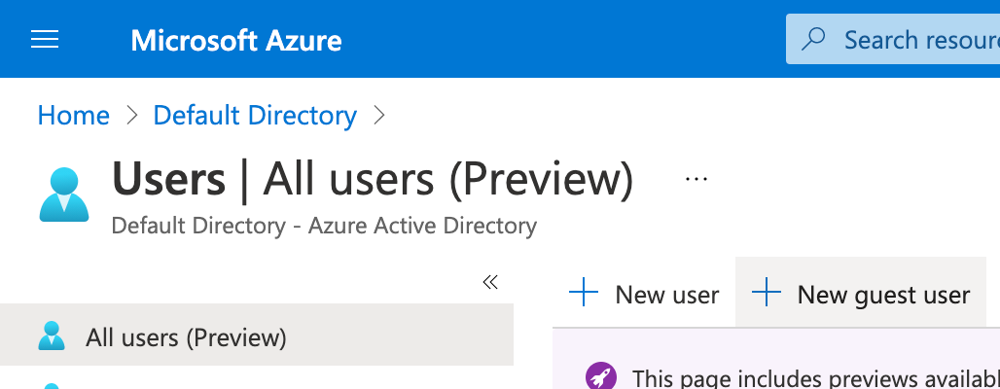
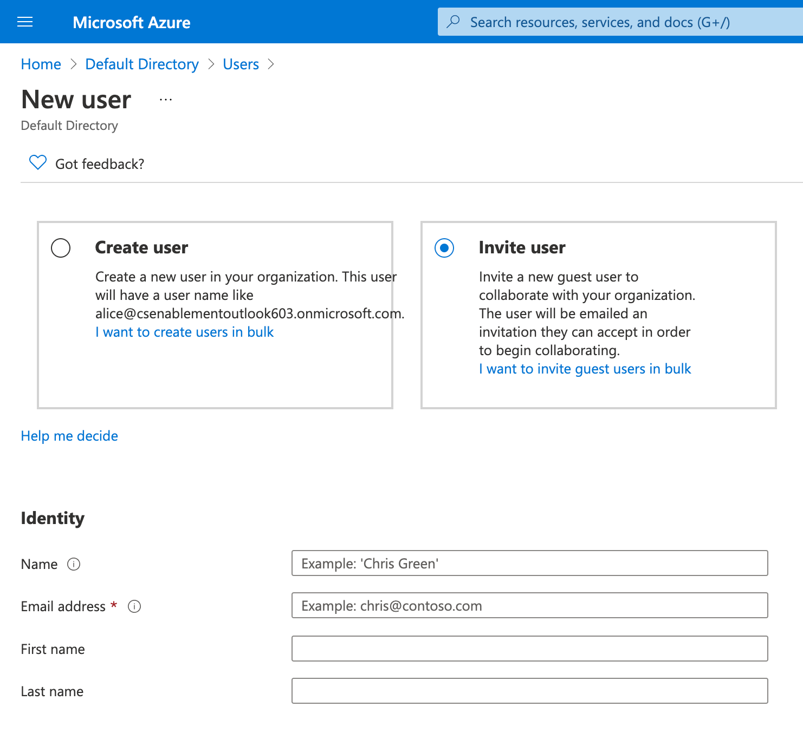
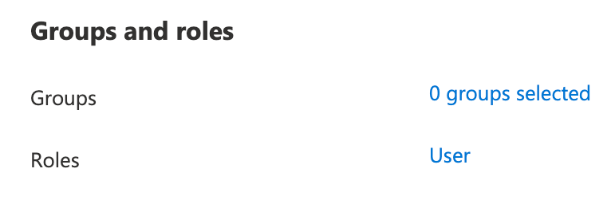
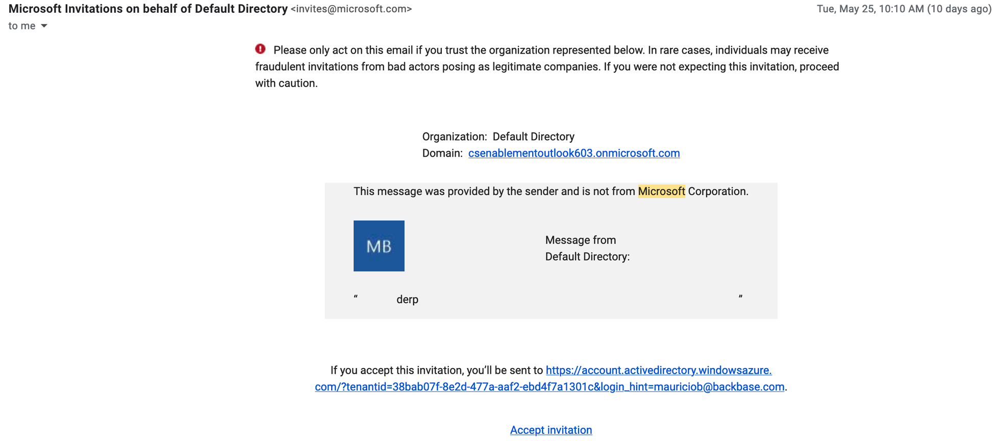
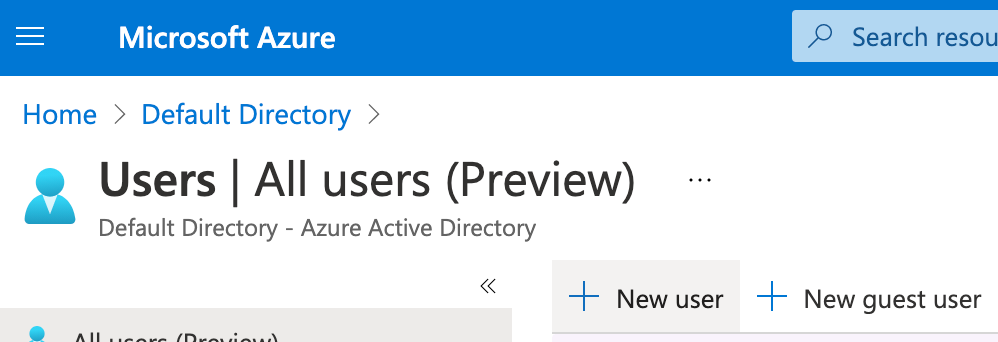
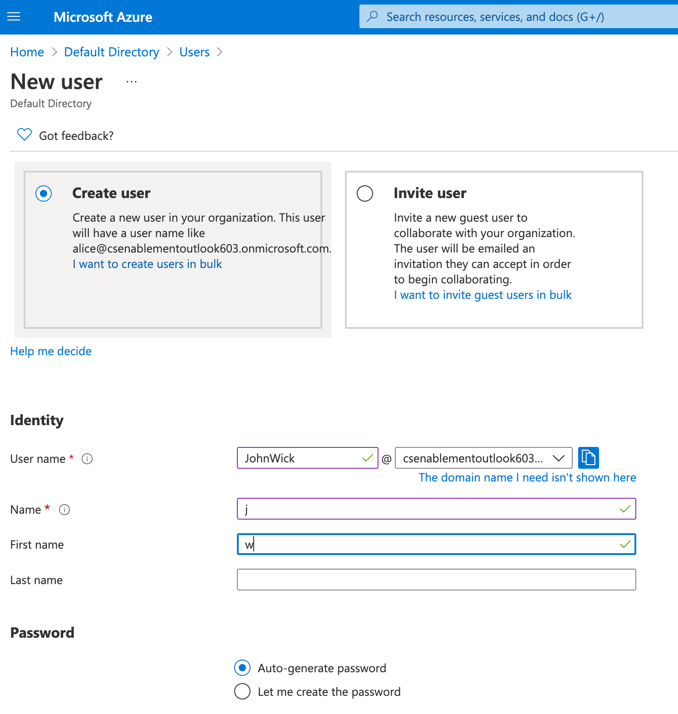

# How-To: Add users in AzureAD
## Introduction

Microsoft Azure cloud platform includes an instance of Active Directory that can be used to add and manage users in an organization, this guide details the essential details for setting up users that can be federated to Backbase Identity.

----------

## Guests

Guest users are members that have an external email address that can be incorporated into the Active Directory, they have an external email address that can be used to log into the platform

### creating new guests

*   Click on new guest user in the user management console  
      
    
    
    
*   enter the new user details  
      
    
    
    
*   Select what group the user will be added to or what roles should the user have (depending on the implementation needed)  
      
    
    
    
*   Click on invite at the bottom of the page.  
      
    

the user will receive an invite mail. this email contains a series of links pertaining the new enrollment, the most important one is the one that starts the enrollment process. the name of the link is **Accept Invitation**  
  

**The new user must complete the enrollment process**, including setting up a new password. failure to do so will prevent the user from logging in successfully.

----------

## Members

members are users that are created inside the Active Directory and are not invited as guests. the process is similar to the guest users enrollment, but the user will not receive an email.

### creating a new member

*   in the user management console, click on New User  
      
    
    
    
*   set up the user’s credentials  
      
    
    
    

if the users in your AD have a mapping for email address (recommended) an email address has to be added manually as the user’s account email address will not be accepted as a valid address

----------