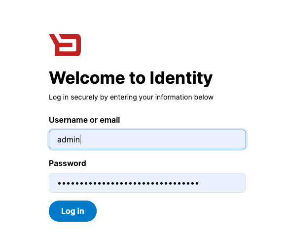
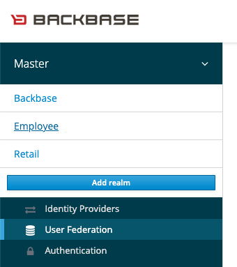
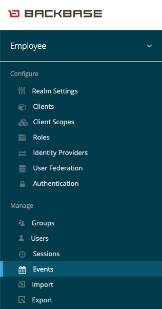
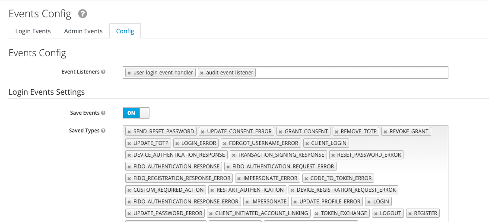
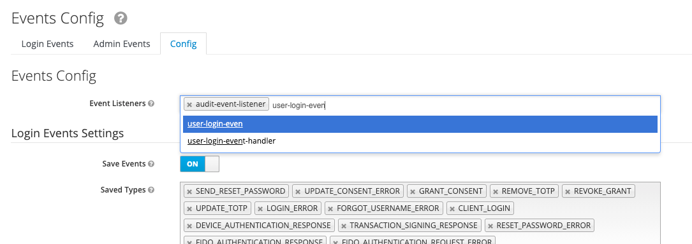
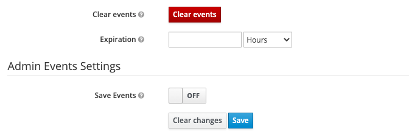

# Identity Configuration for entitlements synchronisation for  a brokered realm
*   1 [Introduction](#Introduction)
*   2 [Register Employee user sync service](#Register-Employee-user-sync-service)
*   3 [Add broker configs to Model Bank Identity](#Add-broker-configs-to-Model-Bank-Identity)
*   4 [Conclusion](#Conclusion)

## Introduction

Having set up Backbase Identity Brokering with an [External IAM](/wiki/spaces/CSE/pages/3052930876 "/wiki/spaces/CSE/pages/3052930876") the next step is to configure the [model bank identity](https://github.com/baas-devops-cse/modelbank-bb-identity "https://github.com/baas-devops-cse/modelbank-bb-identity") with the required configs. This guide assumes you have already set up Identity brokering with an external IAM.

----------

## Register Employee user sync service

To enable Model Bank Identity to handle the log in event of an employee user we need to register a custom event listener: `user-login-event-handler.` A `user-login-event-handler` is an implementation of Keycloak `EventListenerProviderFactory` that syncs employee user job-profile with DBS.

To register the event listener:

*   Log into identity with admin user.
    

*   Select your “Employee” realm.
    

*   Select "Events” from the left menu.
    

*   Select the "Config” tab.
    

*   In the “Events Config,” section enter the name of the event listener in the textbox - `user-login-event-handle` if the listener was registered it will pop up, select it and make sure you click “Save” at the bottom of the page.
    

*   Save updated config.
    

Now your event listener is registered go ahead and add the remaining required configurations.

## Add broker configs to Model Bank Identity

Model Bank Identity will need the following configs in order to successfully synchronise entitlements for a Bank employee user:

`"KEYCLOAK_CSE_BROKER_URL": "http://login-event-service:8080" "KEYCLOAK_CSE_BROKER_LEGAL_ENTITY_NAME": "Moustache Bank" "KEYCLOAK_CSE_BROKER_LEGAL_ENTITY_TYPE": "BANK" "KEYCLOAK_CSE_BROKER_LEGAL_ENTITY_EXTERNAL_ID": "moustache-bank" "KEYCLOAK_CSE_BROKER_ROLE_BB_APP_SU": "Entitlements - Manager" "KEYCLOAK_CSE_BROKER_ROLE_BB_APP_CSR": "Employee Portal"`

*   KEYCLOAK\_CSE\_BROKER\_URL
    

The entitlement synchronisation is handled by the [login-event-service](https://github.com/baas-devops-cse/login-event-service "https://github.com/baas-devops-cse/login-event-service"). The service uses Backbase stream API to synchronise entitlements for bank employees on login. Model Bank Identity uses this URL to determine where to route the request.

*   KEYCLOAK\_CSE\_BROKER\_LEGAL\_ENTITY\_NAME
    

This is the financial institution name that the employee belongs to the implementation assumes the employees belong to one parent legal entity in this case `Moustache Bank` the set-up of a multi-parent legal entity is out of scope for this setup.

*   KEYCLOAK\_CSE\_BROKER\_LEGAL\_ENTITY\_TYPE
    

The parent legal entity type.

*   KEYCLOAK\_CSE\_BROKER\_LEGAL\_ENTITY\_EXTERNAL\_ID
    

The ID of the parent legal entity.

*   KEYCLOAK\_CSE\_BROKER\_ROLE\_\*
    

This config consists of an array of roles supported for the employee user. It is a direct map of the broker role to the DBS role. The employee user must have been assigned one of these roles in the Identity console: `BB_APP_SU`and `BB_APP_CSR` this was achieved in the previous [article](/wiki/spaces/CSE/pages/3052930876 "/wiki/spaces/CSE/pages/3052930876").

Each role comes with a prefix of `ROLE_` meaning to map more roles just add a suffix to `KEYCLOAK_CSE_BROKER_ROLE_` for example:

`"KEYCLOAK_CSE_BROKER_ROLE_BB_APP_COS": "Entitlements - Manager"`

----------

## Conclusion

These config values will be read by the \`modelbank-bb-identity\` project and propagated to \`login-event-service\` for entitlement synchronisation. So if they have not been properly configured the synchronisation will not be a success.