# Identity Hardening for production environments
*   1 [Introduction](#Introduction)
*   2 [general considerations](#general-considerations)
*   3 [realm level hardening](#realm-level-hardening)
    *   3.1 [realm settings](#realm-settings)
        *   3.1.1 [general](#general)
        *   3.1.2 [Login](#Login)
        *   3.1.3 [keys](#keys)
        *   3.1.4 [token settings](#token-settings)
        *   3.1.5 [client registration](#client-registration)
        *   3.1.6 [security defenses: headers](#[hardBreak]security-defenses:-headers)
        *   3.1.7 [Security Defenses: Brute Force Protection](#Security-Defenses:-Brute-Force-Protection)
    *   3.2 [realm roles](#realm-roles)
        *   3.2.1 [roles configuration](#roles-configuration)
        *   3.2.2 [default roles](#default-roles)
*   4 [client level hardening](#client-level-hardening)
    *   4.1 [client configuration](#client-configuration)
        *   4.1.1 [settings](#settings)
        *   4.1.2 [roles](#roles)
        *   4.1.3 [client scopes](#client-scopes)
        *   4.1.4 [scopes](#scopes)
        *   4.1.5 [revocation](#revocation)
*   5 [References and additional information](#References-and-additional-information)

## Introduction

While Backbase’s Identity console is pretty secure by default, there some configuration settings that might lead to less than desirable operational states that while functional, might lead to security gaps or oversights that are ought to be corrected. This document lists a checkpoints and settings that are worth double checking and ensure that they are in their optimal, secure values.

The sample project [https://github.com/baas-devops-cse/modelbank-bb-identity](https://github.com/baas-devops-cse/modelbank-bb-identity) - Connect your Github account contains already hardened settings that are suitable for usage in production environments, this is a POC however, and changes might be needed for specific projects.

## general considerations

The concepts shown in this guide can be summarized as follows:

*   **What are the target clients for the Identity service?**  
    are the clients front end facing? are they all backend services and/or depending on back channel communication? is there a mix of different clients? do the clients need SAML2 or OIDC?. The different requirements for the clients should guide what token flows and protocols to enable and what visibility/access level to set for clients, roles and groups.
    
*   **Disable/delete what is not needed**  
    Is a client only used during development or deployment of the console? if so, it should be removed during regular operations. the same applies for redundant roles, groups and mappings.
    
*   **ensure that tokens only contain absolutely necessary information**  
    does the realm need to have confidential information built into a token for the proper operation of the platform? more often than not it is a big security risk to liberally map claims to tokens without proper consideration of the usage of the data, specially when it comes to mapping claims to the access token and not the identity token.
    
*   **Know your tech stack**  
    different kinds of clients have different OIDC/SAML token configurations, it is of vital importance to know when and how to use the different token flows. while backbase’s systems are pretty standard when it comes to token flows, it is not unusual for 3rd party clients to require specific configuration that might not work as intended using the most common type of token settings.
    
*   **prefer a white list approach instead of a blacklist**  
    when configuring the clients, always approach the configuration with a need-to-have basis for the users. the idea is always to have a detailed list of profiles that can access certain resources instead of creating a list of who can’t access the resources.
    
*   **prefer client roles over realm roles**  
    while realm roles are quite useful for a baseline collection of roles used thorough an organization, if a role or group of roles are exclusive to a client, always create roles for the client only so you can use a mixture of realm roles that are useful for all clients and roles that pertain only to the specific use case of a client.
    

## realm level hardening

### realm settings

The realm settings is used to define configuration that effects all clients present in a given realm.  
  

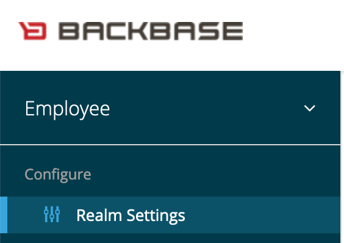

#### general

the general Tab holds one setting of noteworthy importance for hardening: User managed access

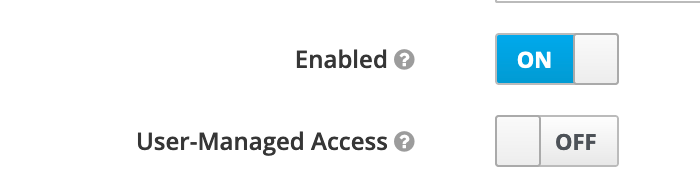

this setting enables users to access their own profile and see and potentially modify his own roles (when combined with a permissive role configuration), unless required, this setting should remain disabled.

#### Login

One of the most important sections to check. pertains to all users login into the realm  
  

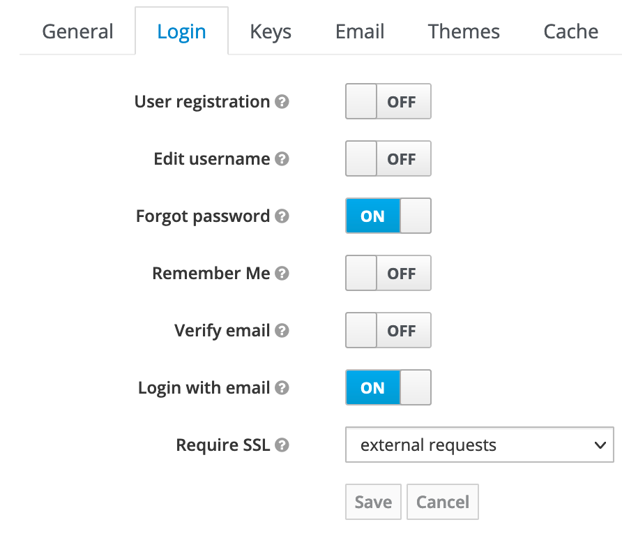

**User registration**

determines if a visitor can follow a flow that allows them to become a registered user. implementation dependant.

**Edit username**

If enabled, the user can modify their username at will. in most situations this is not recommended.

**forgot password**

enables the display of an email reset link in the login page. Only operational when an ldap server or another mean of email communication is enabled in the server.

**Remember Me**

Allows for the session tokens to persist between browser sessions, the tokens will remain active until the session timeout is triggered.

**Verify Email**

this setting will make the user receive a verification email the first time they login or each time there’s an email change in the system. as with the forgot password toggle, this requires an LDAP service to be configured.

**Require SSL**

a mandatory configuration for hardening. this will require that each client connected has a Secure Socket Layer http connection to the server. this can be scoped for external addresses only or for every connection regardless of location of the source. the recommended setting is enable it for all connections.

#### keys

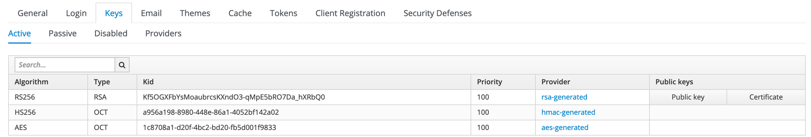

The way Identity console provides the primary layer of security is by the use of Asymmetric cryptographic keys. the server uses these keys to sign any communication going out to prove that the server is the truthful issuer of the communication. Active keys are the keys that are currently being used by the server, passive keys are keys that are not longer issued by the server but still valid, disabled keys keeps the historic trail of previously used keys that are no longer valid.

In continued production operations, it is advisable to rotate the realm keys periodically every 3 to 6 months to ensure the security of the platform.

#### token settings

The token page contains all the settings on the behaviour of the sessions for the users on the realm, it is of critical importance to the behaviour and security of the realm.

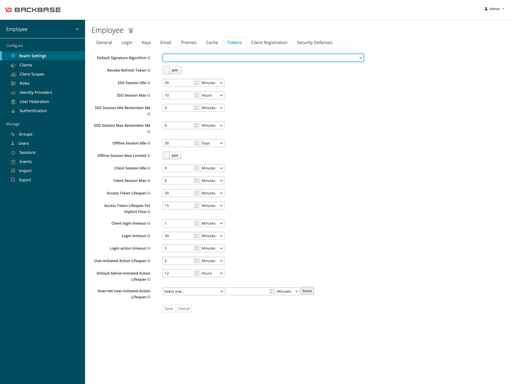

**Default Signature Algorithm**

The signature Algorithm defines the level of encryption security level for the token. a 256 bit encryption strength Algorithm is the baseline. the types of signatures available are defined by the key providers installed in the platform.

**Revoke refresh token**

If disabled, a refresh token can be used as long as the time to live value is not reached. in practical terms, it means that the refresh token can be used more than once, this has an impact on the clients connected as the refresh token is automatically used when an id or access tokens are expired and are transparently renewed with the refresh token.

enabling the revocation of tokens might cause the clients to fail authentication if the clients are not designed to handle this scenario.

**SSO session idle**

time that the session is allowed to be kept alive while there’s no actions performed. It is recommended that this setting only spans a few minutes

**SSO session max**

Absolute maximum time for a session to remain valid regardless of activity. it usually is configured for a longer span than session idle but should not be longer than 20 to 30 minutes for banking applications.

**SSO Session Max Remember Me**

If the browser is closed or reopened, this setting determines for how long can the user be able to access the system using the same token. defaults to SSO Session Max, this is default is acceptable for production.

**Offline Session Idle and max**

Offline sessions are sessions that are allowed to persist and to connect to the clients without constant communication to the identity service, this is used for mobile clients that might have less than ideal connectivity, unless required by the financial institution, offline sessions should never be allowed.

**Access Token Lifespan For Implicit Flow**

Implicit flow does not allow for the renewal of the access token, for this reason, it is recommended that the lifespan of the token is shorter than the SSO lifespan.

**Timeout actions**

controls how long requested actions for the client remain valid. It is recommended to set them for spans of time no longer than a few minutes. the SSO defaults for timeout actions are usually safe and should be kept as they are.

#### client registration

Client registrations are a way for applications to register themselves into the Identity console. Backbase’s applications have other means to register with the console (ingestion services) so under normal circumstances this is not used.

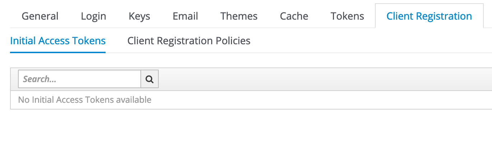

####   
security defenses: headers

This menu provides access to settings that take care of common vectors of attack that use headers as the point of entry. the defaults are recommended.

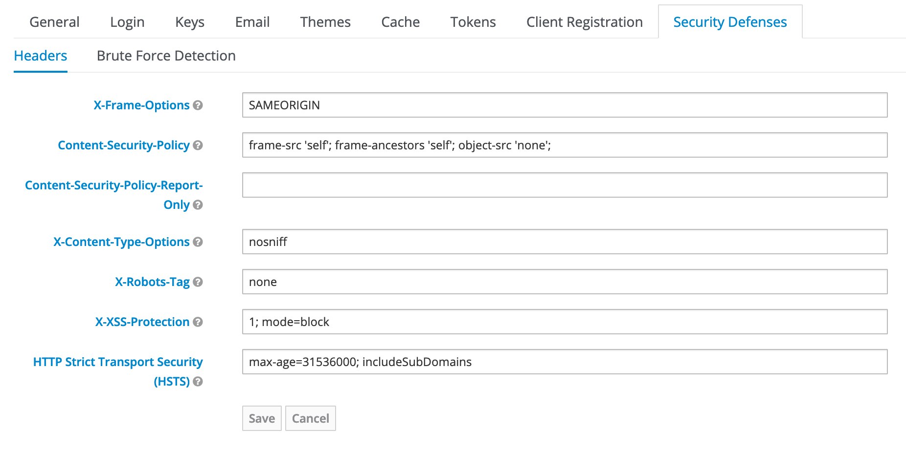

**X-frame Options**

This header sets the policy for handling frames. Clickjacking is an intrusion technique that consists in placing external invisible frames over inputs that can then be captured by malicious actors. this default (SAMEORIGIN) ensures that the page only loads frames that are from the same source as the rest of the page.

**Content-Security-Policy**

This header defines the targets that the page can execute/fetch code from. the defaults allows for the page to only handle content provided by itself and no other external source.

**Content-Security-Policy-Report-Only**

used for header testing and validation. should have no value in production.

**X-Content-Type-Options**

Policy that restricts the MIME Sniffing of web browsers. the default setting (noSniff) tells the browsers to not try to extract the MIME properties instead of just using the declared MIME type.

**X-robots-tag**

Header that requests search engines web crawlers to refrain themselves from specific actions within the domain. the default (none) is equivalent to a combination of noIndex and noFollow values, this tells the web crawlers to not index the page in the search engine and to not follow any of the links in the page.

**X-XSS-protection**

This header handles the execution of cross-site code in the server. the default is to block all attempts at executing remote code.

**HTTP Strict Transport Security (HSTS)**

This header lets browsers know that the site should only be visited using the HTTPS protocol. the default setting sets the time for when this is required to a year and that it should use HTTPS for every subdomain as well.

#### Security Defenses: Brute Force Protection

These settings define the behavior of the Identity service when malicious activity is detected by way of suspicious login attempts such as bots using rainbow tables. the defaults are fine in this menu.

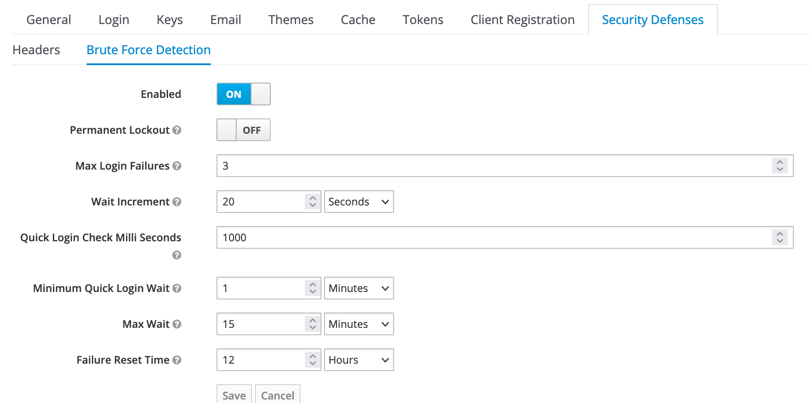

Permanent lockout is NOT recommended as a malicious actor that is aware of a user’s valid name could intentionally trigger this protection and lock legitimate users out of the system until a manager manually unlocks the user.

### realm roles

Roles are the main access control method that is provided by Identity Console. there are two main types of roles: realm roles and client roles.

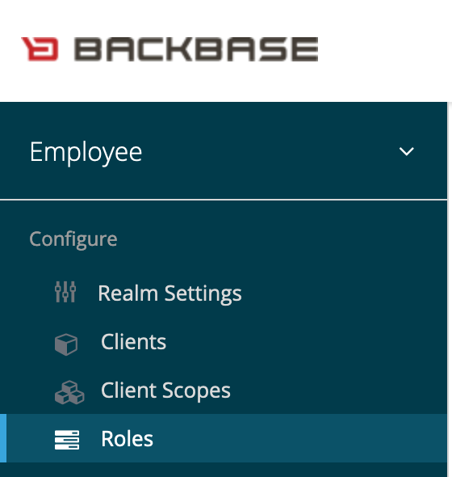

When creating a role is necessary to consider if the role is essential for use on all the applications in the realm of if the role is better suited for a client only role.

#### roles configuration

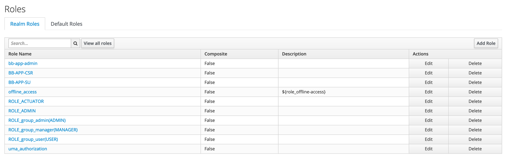

Identity Console comes preinstalled with needed realm roles for normal operation. unless required (or if granular roles per client are not needed) no more roles should be added to the realm.

> a composite role is a combination of two or more roles in one, meaning that if a user has a given composite role, it will automatically have the roles that are associated to the composite.

#### default roles

Default realm roles allows to map roles automatically when a new user is created. as with the realm roles configuration, this behavior should only be used for specific use cases.

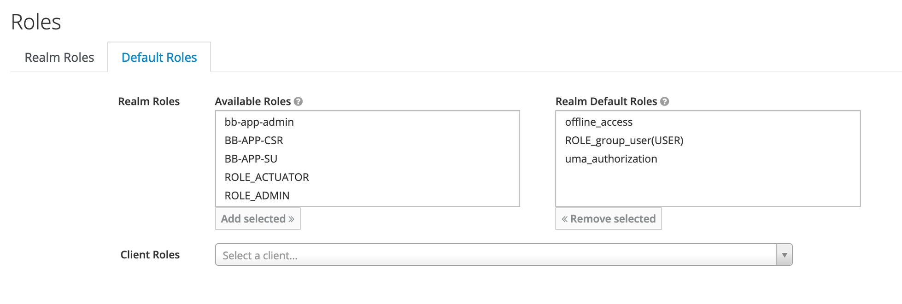

> Default client roles, on the other hand, is an extremely useful way to automatically assign base client roles for users that are logging in for the first time.

Authentication Hardening

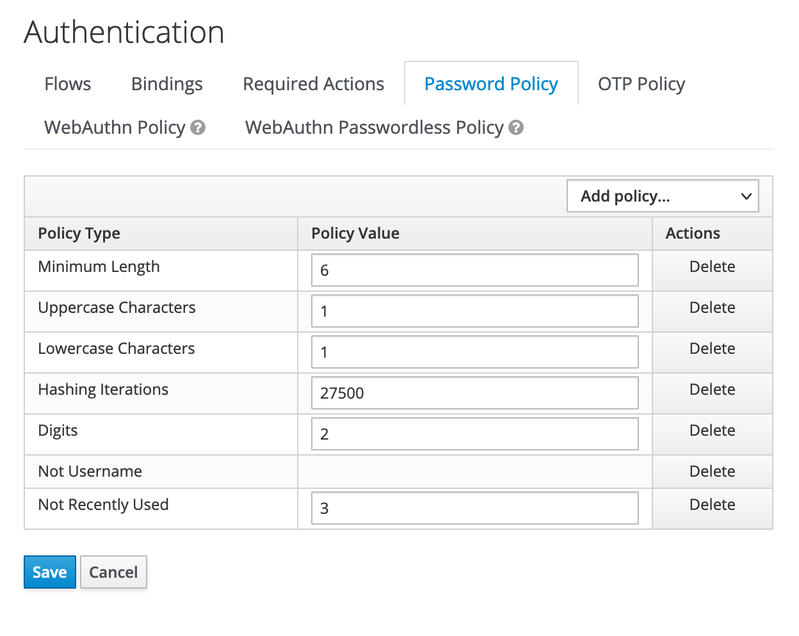

## client level hardening

### client configuration

> A sample client configuration can be found in the CSE retail realm here (VPN connection needed): [https://identity.ret.cse.live.backbaseservices.com/auth/admin/master/console/#/realms/retail/clients/ea42e539-0f84-4612-b75f-c368e3ee7de0](https://identity.ret.cse.live.backbaseservices.com/auth/admin/master/console/#/realms/retail/clients/ea42e539-0f84-4612-b75f-c368e3ee7de0 "https://identity.ret.cse.live.backbaseservices.com/auth/admin/master/console/#/realms/retail/clients/ea42e539-0f84-4612-b75f-c368e3ee7de0")  
>   
> Access details for the environment can be found here: [\[AWS\] Access Linksarchived](https://backbase.atlassian.net/wiki/spaces/RND/pages/2189591326)

#### settings

the Client settings page contains basic rules on the look&feel and connection configuration of each client, customized hardening can be achieved here when a specific client requires increased security or customized interaction with the identity console for compatibility reasons.

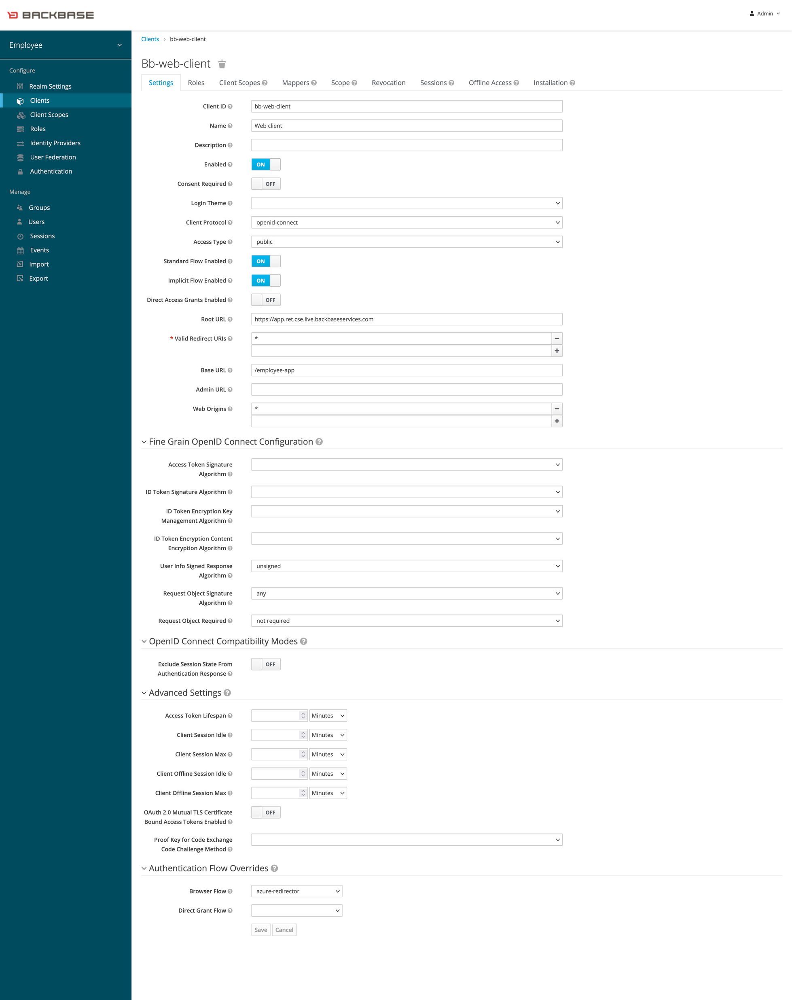

**Access type**

This setting defines the type of client connecting in regards of security level.

_Public:_ This client will be able to connect without the need of a client secret, default setting

_Confidential:_ this access type requires the client to provide a secret before login can start

_Bearer-only :_ this access is reserved for clients that do not have a login process, such as web services

**Flow configuration**

There are three flows that can be enabled in the client:

_Standard flow:_ the default method for front facing applications, enables logins thorough redirects to and from the identity console and the passing of authorization codes. in OIDC and Oauth2 is known as the authorization code flow.

_Implicit flow:_ similar as the standard flow, but does not need an authorization code to work.

_Direct access grant flow:_ Used for web services, these web services must store the connection secret, so it is expected that they follow proper security measures as well.

> the default for Backbase applications is the OIDC hybrid flow, this flow is achieved by enabling both the Standard Flow and Implicit flow.

**Url Settings**

The most important setting to configure is CORS Web Origins. this setting allows for clients with specific domain to be able to interact with the identity console successfully.

the wildcard \* should NOT be used in a production environment. For proper CORS access coming from the valid URLs configured in the URL fields, the + wildcard should be used. if a service is authenticating from an external domain, those domains should always be declared here.

This should be checked for on EVERY client in the realm. None should have the wildcard set as this will allow redirect issues on logout and fail pentests.

**Fine Grain OpenID Connect Configuration**

These settings allow for customized OIDC settings, effectively overriding the realm settings for a single client only.

**Advanced Settings**

As the previous setting, this fields overrides the OIDC token lifespan configuration of the realm for the client.

**Authentication Flow Overrides**

allows for customization of the authentication flow.

The authentication providers used for testing purposes should not be allowed in production. always ensure that the authentication providers available are only the necessary ones.

#### roles

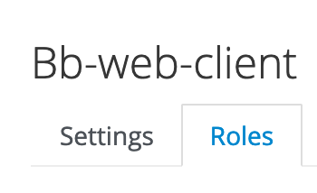

As mentioned in the realm hardening section of this document, it is recommended to create roles in this tab when the roles are to be used exclusively by a single application.

#### client scopes

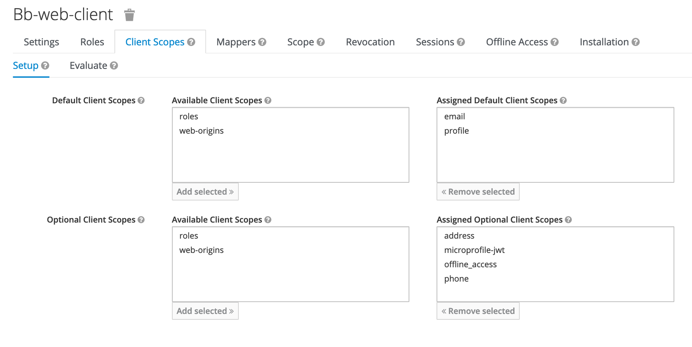

Client scopes allow for easy configuration of multiple default roles and optional roles that can be used by a client.

A good practice when hardening is to limit the common roles as much as possible as having specific scopes and roles for the clients attenuates the risk of a bad actor gaining access to the system, if all roles are assigned to all clients, the actor can access all the clients in the domain instead of just having limited access to one single client.

the scope mappers can be configured in the main menu  
  

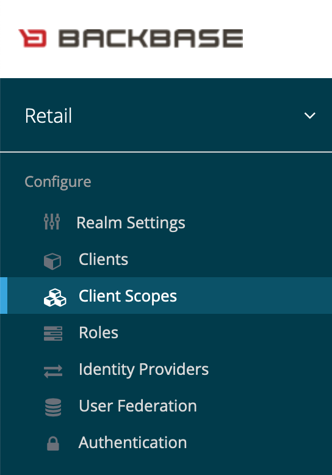

then these scopes can be assigned to the required application based on what the application requires.

#### scopes

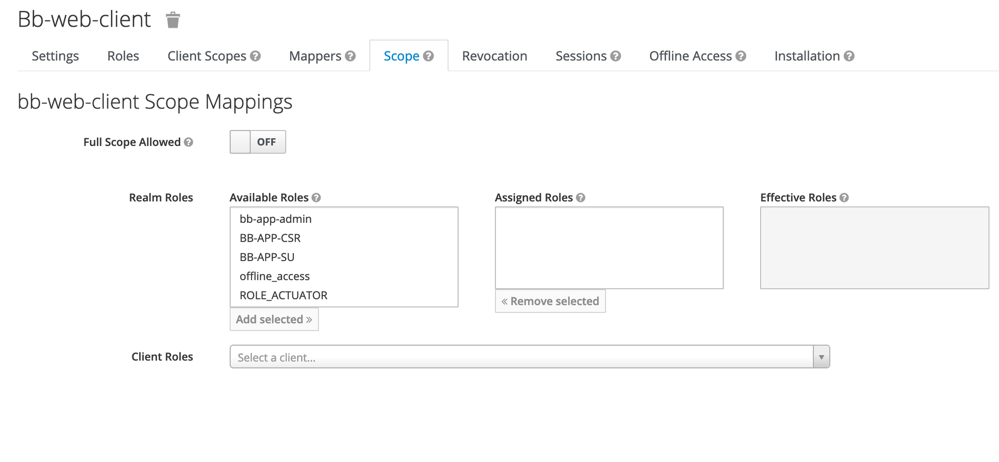

in order to avoid unwanted roles being exposed in the token, this tab allows for fine tuning of what roles to expose in the identity token, it is highly recommended to fine tune this setting when hardening.  
  

the default for Identity console is to provide the client claims using the _userinfo_ endpoint instead of filling the identity token with them. the advantage of this is that no information is exposed in the tokens on the user side, the drawback being an increase on calls to the identity console in order to fetch the required claims.  
It is possible to provide the token with some select claims that can ease the load, but it is recommended to keep the built in claims to a minimum. it is even possible to have a minimum configuration be operational

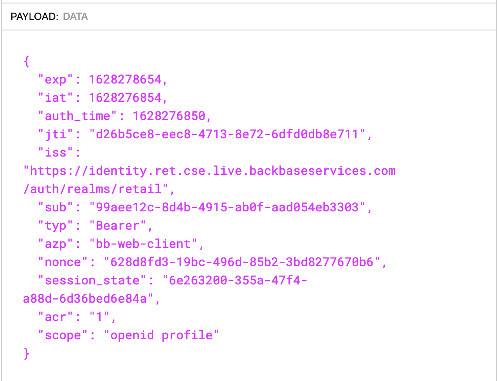

#### revocation

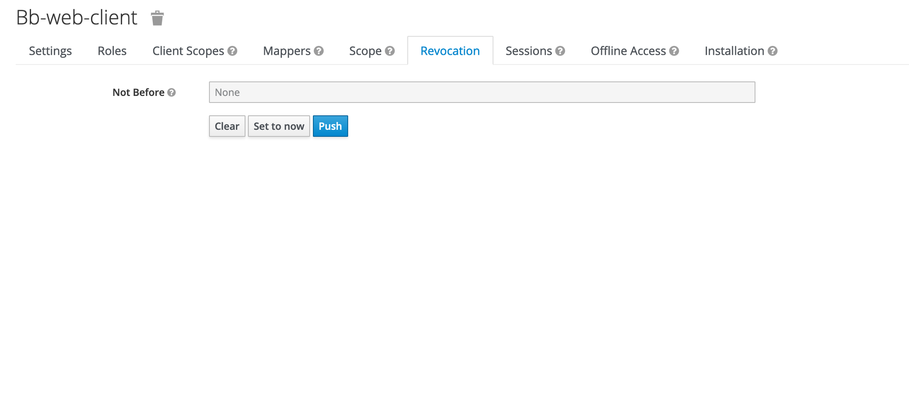

if the client is compromised, one of the first steps to take is to revoke all tokens created in order to make ongoing intrusions more difficult to complete.

## References and additional information

*   [Security checklist - identity](https://community.backbase.com/documentation/identity/1-8-5/security_guidelines#identity_security_checklist)
    
*   [Threat model mitigation - identity](https://community.backbase.com/documentation/identity/1.8.5/threat_model_mitigation)
    
*   [Securing Applications and Services Guide](https://www.keycloak.org/docs/latest/securing_apps/)
    
*   [Keycloak Authentication Flows, SSO Protocols and Client Configuration](https://www.thomasvitale.com/keycloak-authentication-flow-sso-client/)
    
*   [JWT.IO](https://jwt.io/)