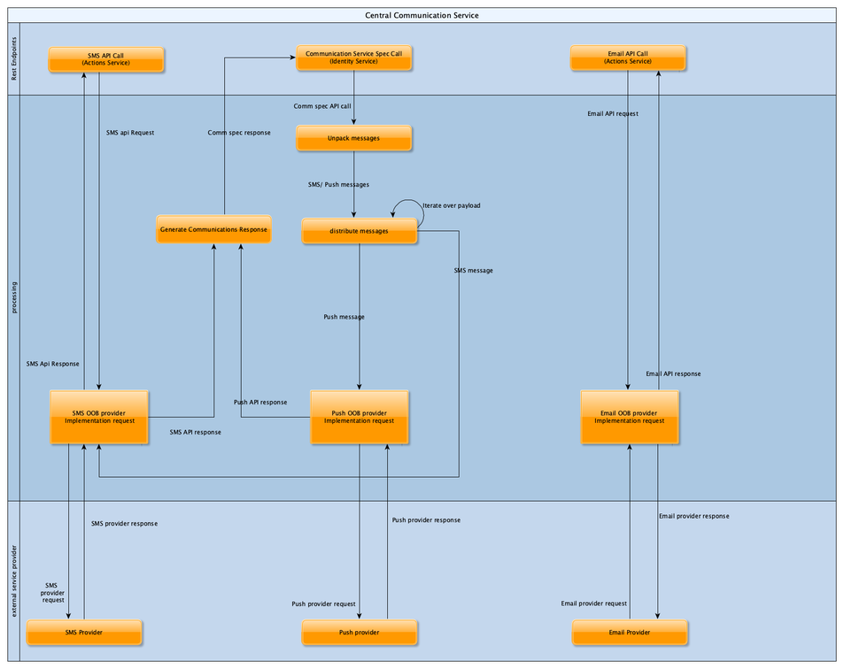
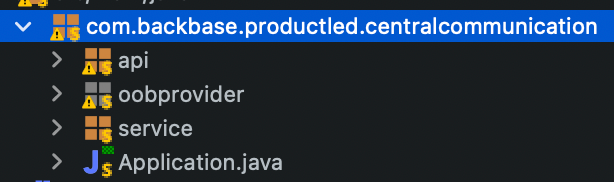
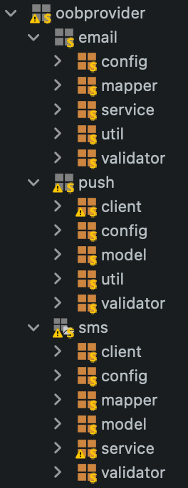
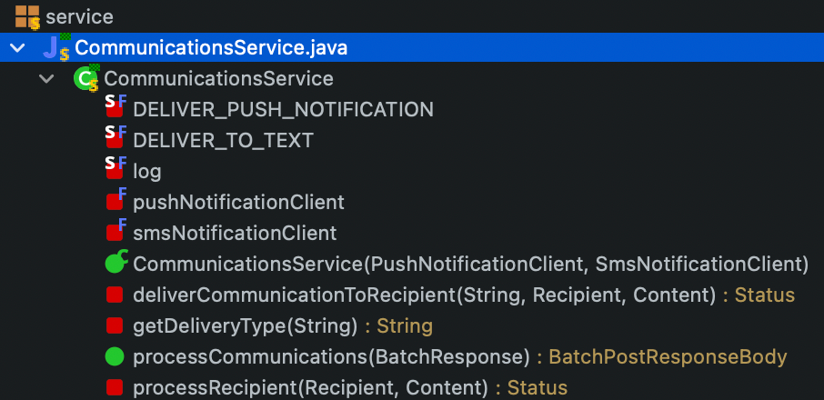
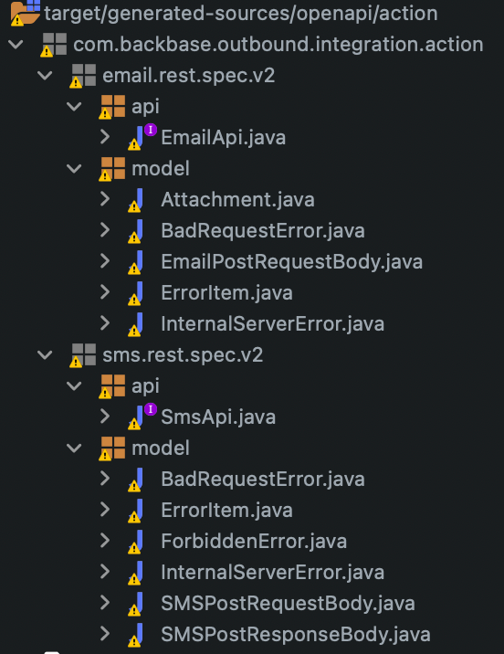
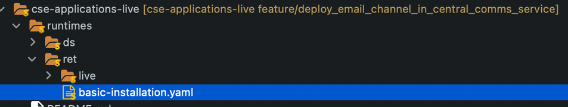

# Central Communication service overview
*   1 [Introduction](#Introduction)
*   2 [features](#features)
*   3 [Diagram](#Diagram)
*   4 [structure](#structure)
    *   4.1 [API](#API)
    *   4.2 [OOB Provider](#OOB-Provider)
    *   4.3 [Service](#Service)
*   5 [Autogenerated sources](#Autogenerated-sources)
*   6 [Configuration](#Configuration)
    *   6.1 [Postman API collection](#Postman-API-collection)

# Introduction

Today, In order for Backbase components like Identity and Actions to send messages via push, sms or email channels the projects need to develop their own implementations.

Each project has to create and deploy an implementation of the following specs -

**Identity**

Sends out messages for features like oob authentication, oob transaction signing , device enrollment) , based on the selected channel (Push, SMS, email)

*   [Create a custom communications outbound integration service - identity](https://community.backbase.com/documentation/identity/latest/create_a_custom_communications_outbound_integration_service)
    

**Actions -**

Sends out SMS and email with the help of integration services-

*   [https://community.backbase.com/documentation/DBS/latest/how\_to\_add\_email\_adapter](https://community.backbase.com/documentation/DBS/latest/how_to_add_email_adapter)
    
*   [https://community.backbase.com/documentation/DBS/latest/how\_to\_add\_sms\_adapter](https://community.backbase.com/documentation/DBS/latest/how_to_add_sms_adapter)
    

Hence there is a need of a project accelerator that implements all the above 3 specifications for Identity and Actions to work end to end.

The Central Communication Service provides connectivity functionality that integrates with actions and identity service for out of band communication such as SMS and Push notifications. these features are refactored from their independent service implementations (sms-service, Push-notification-service).

# features

*   Orchestration of requests coming from Identity and Actions via their respective Api’s
    
*   Push Notification Service Integration for Identity to send push notifications for out of band authentication and out of band transaction signing
    
*   SMS integration
    
*   Example Integration for sending Emails using AWS SNS via actions
    
*   Example Integration for sending SMS using Twilio via Identity and actions
    
*   85% Exhaustive code coverage with unit tests.
    

> **Why is this not productised yet?**
> 
> Q: We understand that email and sms connectors vary per project, Why is push notification integration not productised yet? -
> 
> A: **It is in Beta!** - With the upcoming Message Delivery Service [Overview - foundation\_services](https://community.backbase.com/documentation/foundation_services/latest/overview_message_delivery) It is in **beta** right now and available GA in the coming months.
> 
> **However** -
> 
> *   Identity is yet to adopt the message delivery service (Plan Q4).
>     
> *   Actions will be deprecated in favour of Engagement Orchestrator which has to be adopted in the projects before message delivery service can be used.
>     
> 
> Hence this accelerator will also act as a bridge for projects which won’t be immediately adopting either the Latest version of identity when released, or dropping actions in favor of engagement orchestrator.

# Diagram

# structure

## API

This package contains the main controllers that handle the calls to the service. all API endpoints are defined here.

## OOB Provider

Every implementation is contained within this package. all connection logic, mappers and utilites for each implementation are stored here.

## Service

this package is used by services that are expecting batch requests, to be channelled via the supported channels in actions service. not all OOBs implementations need to be integrated here.

# Autogenerated sources

in order for the IDE to resolve the correct object classes for the project the following command has to be executed in the system’s console:  
  

`mvn clean generate-sources`

this uses the backbase building blocks maven dependency to create the common objects for services that need to interact with the actions services.

# Configuration

Configuration of the service is done via enviroment parameters in the basic installation yaml file in the CSE-applications-live repository.

all configuration values have to be stored in kubernetes secrets and referenced in this file.

the current environment values for the comms service are as follows:  
  

`env: "spring.autoconfigure.exclude": "org.springframework.cloud.netflix.eureka.loadbalancer.LoadBalancerEurekaAutoConfiguration,org.springframework.cloud.function.context.config.ContextFunctionCatalogAutoConfiguration" twilio.accountSid: valueFrom: secretKeyRef: name: twilio-credential key: accountSid twilio.authToken: valueFrom: secretKeyRef: name: twilio-credential key: authToken twilio.fromNumber: valueFrom: secretKeyRef: name: twilio-credential key: fromNumber valueFrom: secretKeyRef: name: cse-ret-eu-central-1-email-sender-account key: username spring.mail.password: valueFrom: secretKeyRef: name: cse-ret-eu-central-1-email-sender-account key: password spring.mail.host: valueFrom: configMapKeyRef: name: email-env key: host spring.mail.port: valueFrom: configMapKeyRef: name: email-env key: port spring.mail.properties.mail.transport.protocol: valueFrom: configMapKeyRef: name: email-env key: protocol spring.mail.properties.mail.smtp.auth: valueFrom: configMapKeyRef: name: email-env key: smtpAuth spring.mail.properties.mail.smtp.starttls.enable: valueFrom: configMapKeyRef: name: email-env key: starttlsEnable backbase.mail.from-address: valueFrom: configMapKeyRef: name: email-env key: fromAddress backbase.mail.from-name: valueFrom: configMapKeyRef: name: email-env key: fromName`

## Postman API collection

In order to add the email and phone number metadata for interacting and testing the service, calls to the model bank environment are needed. the collections can be downloaded below  
  

<table data-number-column="false"><colgroup><col style="width: 679px;"></colgroup><tbody><tr><th rowspan="1" colspan="1" colorname="" class="ak-renderer-tableHeader-sortable-column__wrapper" data-colwidth="680" aria-sort="none">

<ul class="css-1llfiv8" style="transform: translateX(0px); transition-property: none; transition-duration: 0s;"><li class="media-filmstrip-list-item css-cctmi9" data-testid="media-filmstrip-list-item">

<svg height="24" width="24" viewBox="0 0 16 16" xmlns="http://www.w3.org/2000/svg" class="css-lowrtd" style="animation-delay: 0ms;"><circle cx="8" cy="8" r="7" class="css-1qav847" style="stroke: var(--ds-icon-subtle, #42526E);"></circle></svg>

</li><li class="media-filmstrip-list-item css-cctmi9" data-testid="media-filmstrip-list-item">

<svg height="24" width="24" viewBox="0 0 16 16" xmlns="http://www.w3.org/2000/svg" class="css-lowrtd" style="animation-delay: 0ms;"><circle cx="8" cy="8" r="7" class="css-1qav847" style="stroke: var(--ds-icon-subtle, #42526E);"></circle></svg>

</li></ul>

&nbsp;
<figure class="ak-renderer-tableHeader-sorting-icon__wrapper ak-renderer-tableHeader-sorting-icon__no-order">

</figure>
</th></tr></tbody></table>

<table data-number-column="false"><colgroup><col style="width: 679px;"></colgroup><tbody><tr><th rowspan="1" colspan="1" colorname="" class="ak-renderer-tableHeader-sortable-column__wrapper" data-colwidth="680" aria-sort="none">

<ul class="css-1llfiv8" style="transform: translateX(0px); transition-property: none; transition-duration: 0s;"><li class="media-filmstrip-list-item css-cctmi9" data-testid="media-filmstrip-list-item">

<svg width="24" height="24" viewBox="0 0 24 24" role="presentation"><path fill="#00B8D9" fill-rule="evenodd" d="M3 0h18a3 3 0 013 3v18a3 3 0 01-3 3H3a3 3 0 01-3-3V3a3 3 0 013-3zm5.017 12.265l-2.58-2.501L8.236 7.05a.999.999 0 10-1.392-1.436l-3.54 3.432a1 1 0 000 1.436l3.32 3.219a1 1 0 101.393-1.436zm6.638-8.21a1 1 0 00-1.271.62l-4.83 14.046a1 1 0 001.892.65l4.829-14.045a1 1 0 00-.62-1.271zm6.081 9.776l-3.32-3.219a.999.999 0 10-1.393 1.436l2.58 2.501-2.799 2.714a.999.999 0 101.392 1.436l3.54-3.432a1 1 0 000-1.436z"></path></svg>

CSE Identity - Ret.postman_environment.json

13 Jul 2021, 05:25 PM

</li><li class="media-filmstrip-list-item css-cctmi9" data-testid="media-filmstrip-list-item">

<svg width="24" height="24" viewBox="0 0 24 24" role="presentation"><path fill="#00B8D9" fill-rule="evenodd" d="M3 0h18a3 3 0 013 3v18a3 3 0 01-3 3H3a3 3 0 01-3-3V3a3 3 0 013-3zm5.017 12.265l-2.58-2.501L8.236 7.05a.999.999 0 10-1.392-1.436l-3.54 3.432a1 1 0 000 1.436l3.32 3.219a1 1 0 101.393-1.436zm6.638-8.21a1 1 0 00-1.271.62l-4.83 14.046a1 1 0 001.892.65l4.829-14.045a1 1 0 00-.62-1.271zm6.081 9.776l-3.32-3.219a.999.999 0 10-1.393 1.436l2.58 2.501-2.799 2.714a.999.999 0 101.392 1.436l3.54-3.432a1 1 0 000-1.436z"></path></svg>

Ingest Push Notification Template.postman_collection.json

13 Jul 2021, 05:25 PM

</li></ul>

&nbsp;
<figure class="ak-renderer-tableHeader-sorting-icon__wrapper ak-renderer-tableHeader-sorting-icon__no-order">

</figure>
</th></tr></tbody></table>