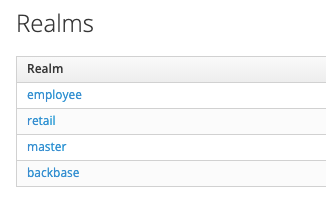
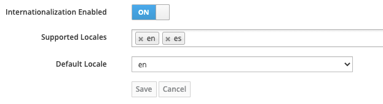

# Working with locales
*   1 [Introduction](#Introduction)
*   2 [Working with translation files](#Working-with-translation-files)
*   3 [Enable Internationalisation](#Enable-Internationalisation)
*   4 [Special characters](#Special-characters)
*   5 [RTL languages](#RTL-languages)

# Introduction

It’s not unusual that Identity projects need to customise their content or support multiple locales. For that, there are some techniques we can use in the theme to accomplish these tasks.

# Working with translation files

Assuming your theme is an extension of "base” theme, you can copy the translation file from there and paste to your theme. You’ll find them in `/themes/src/main/resources/theme/base/{section}/messages` named as `messages_{locale}.properties` and have to be placed in the new theme following the same folder structure.

The file contains all the labels and messages used in the original theme, however, you don’t need to keep them all in your theme. Identity falls back all the translations to the base theme, so you may keep your translation file to hold custom messages and new messages used in your theme.

# Enable Internationalisation

If your portal supports multiple languages, you must enable it on the admin console.

## Instructions

1.  Log in to the admin console
    
2.  Select the realm where your theme is applied  
      
    
    
    
3.  In the realm settings, select the theme tab and check the option “Internationalization enabled”  
      
    
    
    
4.  Now you can manage all your supported locales
    

# Special characters

Some languages might include latin characters with accents or use a different alphabet. For those cases, you have to make your message files to be read by Identity as UTF-8.

## Instructions

Add the following statement at the top of your `messages_{locale}.properties`:

`# encoding: UTF-8`

# RTL languages

RTL languages, such Arabic, are not supported OOTB. For that, you have to make some changes to the theme markup.

## Instructions

Adding the locale code to your HTML markup:

1.  The locale can get extracted from the URLs in the locale object:  
      
    
    `<#if realm.internationalizationEnabled && locale.supported?size gte 1> <#list locale.supported as l> <#if locale.current == l.label> <#assign locale_code = l.url?split('locale=')[1]?split('&')[0]> </#if> </#list> </#if>`
    
2.  Add the locale code to the HTML element tag:
    
    `<html xmlns="http://www.w3.org/1999/xhtml" class="${properties.kcHtmlClass!}" lang="${locale_code}">`
    
3.  Add the direction attribute to the HTML elements that must switch direction:
    
    1.  If you don’t have to support IE:
        
        `
 
My text
 
`
        
        Modern browsers are able to decide the text direction based on the locale declared in `lang`
        
    2.  Otherwise:
        
        1.  Add some extra variables to the first code block:
            
            `<#assign locale_code = l.url?split('locale=')[1]?split('&')[0] rtl_locale = ['ar'] // map of the rtl locales is_rtl = rtl_locale?filter(code -> code == locale_code)?size != 0 >`
            
        2.  Then add the `dir` attribute to your elements:
            
            `
 
My text
 
`