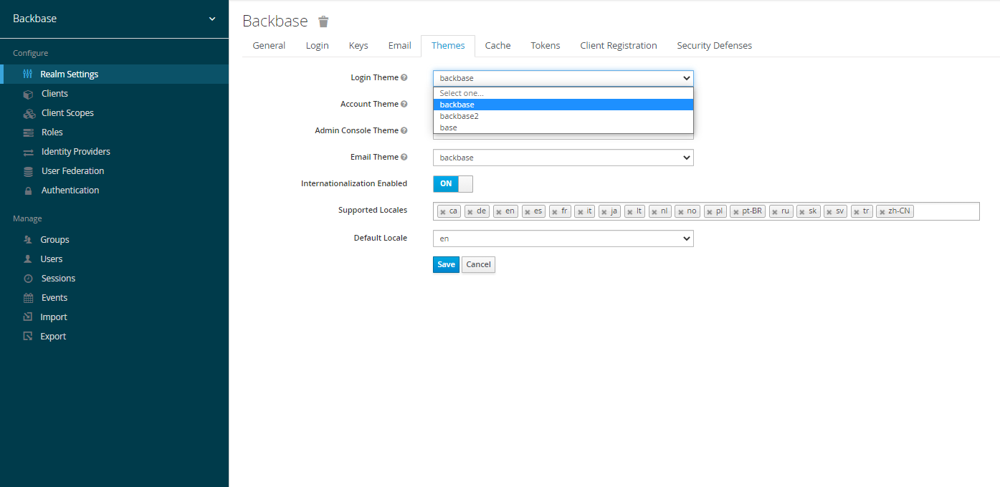
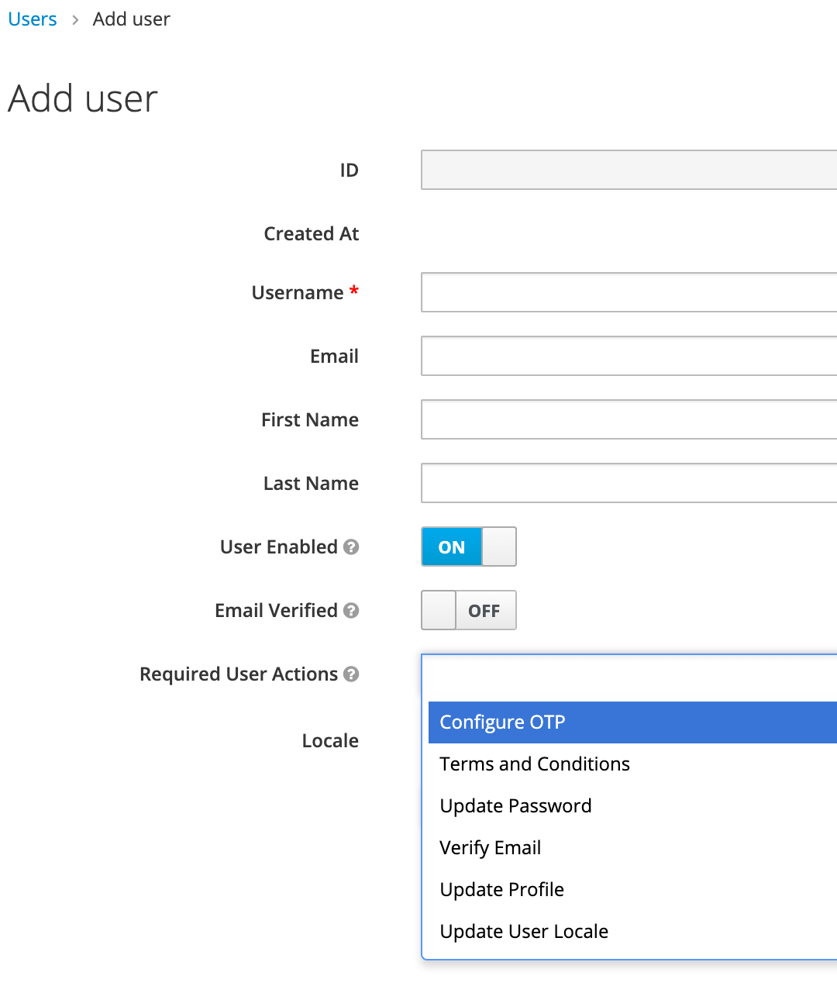

# How To: Apply a new theme to the Identity Out of the box Web Login screen
# Run Identity locally

After cloning the [repo](https://github.com/baas-devops-cse/modelbank-bb-identity "https://github.com/baas-devops-cse/modelbank-bb-identity") we need to build the project to generate the jar files.

`$ mvn clean install`

When the build is done we can start the application.

Fix host path for themes volume in docker-compose.yml → `./themes/target:/themes`

`$ docker-compose up`

And once is up we will be able to access Identity on [http://localhost:8180/auth](http://localhost:8180/auth "http://localhost:8180/auth").

# Create a theme

Out of the box, Identity comes with the **base** and **backbase** themes, and you can find the sources in the `themes/src/main/resources/theme` directory.

But for our client, we are going to create a new theme. Although duplicating and renaming the backbase folder is a valid option, we would be missing the possibility of extending themes.

1.  Create a folder in the `theme` directory. For example `theme/peachtree`.
    
2.  Inside the theme directory, create a folder for each of the types (account, admin, email, login, and welcome) the theme is going to provide. For example `theme/peachtree/login`.
    
3.  For each type create a file `theme.properties` which allow setting some configuration for the theme.  
    For example, to extend the **backbase** theme and import some common resources:
    
    `parent=backbase import=common/backbase`
    
4.  To add your own images, scripts and styles create a `resources` folder with `css`, `img`, and `styles` subfolders. For example `theme/peachtree/login/resources/css`.
    

> To avoid creating the folder structure manually, we could create a new project using the Identity Theme Archetype to then copy the generated theme inside of our `themes/src/main/resources/theme` directory.
> 
> `$ mvn archetype:generate -DarchetypeArtifactId=theme-archetype -DarchetypeGroupId=com.backbase.identity -DarchetypeVersion=1.0.4`

To make the **peachtree** theme available in the admin console we need to configure `themes/src/main/resources/META-INF/keycloak-themes.json` adding our newly created theme.

```json
{ "themes": [{ "name" : "base", "types": [ "admin", "account", "login", "email" ] }, { "name" : "backbase", "types": [ "admin", "account", "login", "common", "email", "welcome" ] }, { "name" : "peachtree", "types": [ "account", "admin", "email", "login", "welcome" ] }] }
```

# Configure the theme

> Everytime we make changes we need to rebuild the project and restart Docker.
> 
> `$ mvn clean install`
> 
> `$ docker-compose restart`

1.  Log in to the Admin Console.
    
2.  Select the realm (for example Retail) from the drop-down box in the top left corner.
    
3.  Click **Realm Settings** from the menu.
    
4.  Click the **Themes** tab.
    
5.  Select the peachtree theme and click Save.
    
6.  Open the login page for the realm (for example [http://localhost:8180/auth/realms/retail/account/](http://localhost:8180/auth/realms/retail/account/ "http://localhost:8180/auth/realms/retail/account/")) and check the changes.
    



To avoid having to configure the theme in the Admin Console each time the container gets restarted, we can configure the realm `realms/retail-realm.json` setting the following JSON properties:

`"accountTheme": "peachtree", "adminTheme": "peachtree", "emailTheme": "peachtree", "loginTheme": "peachtree",`

# Customize the login page

One of the first tasks in any project is to customize the login page. Change the logo, maybe the splash image and some of the colors.

If we have a look at the properties of the login type for the backbase theme, we see a bunch of styles and scripts that need to be imported and loaded.

`parent=base import=common/backbase styles=\ lib/zocial/zocial.css \ lib/backbase-theme/dist/backbase-theme.css \ lib/backbase-identity/styles/identity.css \ lib/pficon/pficon.css \ css/tile.css scripts=\ lib/backbase-identity/scripts/load-background.js \ scripts/dropdownHandler.js \ scripts/modal.js \ scripts/customerSupportModal.js \ scripts/selectDeviceForm.js \ scripts/checkDeviceForm.js \ scripts/passwordField.js \ scripts/usernameThenPassword.js \ scripts/otpVerifyForm.js \ scripts/login.js`

To optimize page load time we could get rid of `load-background.js` if we only have one image, and remove as well the `pficon.css` and `zocial.css`.

The logo and the background image are defined on the `themes/src/main/resources/theme/backbase/common/resources/lib/backbase-identity/styles/identity.css` but to modify it we should copy it to our `theme/peachtree/login/resources/css` directory.

To change the images we need to add them first to the `theme/peachtree/login/resources/img` directory and reference them on the stylesheet.

`.identity-bg-layout { background-image: url(../img/login-image.jpg); } .identity-logo { background-image: url(../img/logo-emblem.svg); }`

But what about the buttons or the background? Well, if we have already customized Theme 2 for our main app, there is no need to repeat ourselves, and we can just take the compiled CSS together with the font files, copy it over into `theme/peachtree/login/resources/css` and then reference it in our `theme.properties` that will end up looking something like this:

`parent=backbase import=common/backbase styles= css/peachtree-theme/styles.css \ css/identity.css scripts=\ scripts/dropdownHandler.js \ scripts/modal.js \ scripts/customerSupportModal.js \ scripts/selectDeviceForm.js \ scripts/checkDeviceForm.js \ scripts/passwordField.js \ scripts/usernameThenPassword.js \ scripts/otpVerifyForm.js \ scripts/login.js`

# Test other flows

Once everything is ready, you probably want to check how other screens look before going live; and we can do that by creating a user.

1.  Log in to the Admin Console.
    
2.  Select the realm (for example Retail) from the drop-down box in the top left corner.
    
3.  Click **Users** from the menu.
    
4.  Click the **Add user** button.
    
5.  Type the user and click Save.
    
6.  Click the **Impersonate** button.
    
7.  Change the password.
    
8.  Now you can log in (for example [http://localhost:8180/auth/realms/retail/account/](http://localhost:8180/auth/realms/retail/account/ "http://localhost:8180/auth/realms/retail/account/")) with the new user and check how the account theme type looks.
    

But what about other login flows, for example setting up the OTP. Well, if you have noticed, when creating a user we can add **Required User Actions**, so by playing with these options we can see different screens after trying to log in with the user we have just created.



# See more

*   [Backbase Design System](https://designsystem.backbase.com/v2/guides/web-developers/working-with-theme)
    
*   [Backbase DS Playground](https://designsystem.backbase.com/playground/#/)
    
*   [Connect your experience to Identity Services](https://community.backbase.com/trails/configure_cxs_for_identity)
    
*   [Create a custom theme - identity](https://community.backbase.com/documentation/identity/latest/create_themes)
    
*   [Customize the Backbase Identity Services theme](https://community.backbase.com/trails/customize_backbase_identity_theme)
    
*   [Customize Authentication web journey templates - identity](https://community.backbase.com/documentation/identity/latest/customize_web_authn_journey_templates)
    
*   [Server Developer Guide](https://www.keycloak.org/docs/latest/server_development/#_themes)