# How-To: Set up an LDAP User Federation Provider in Backbase Identity
----------

*   1 [Introduction](#Introduction)
    *   1.1 [Time estimations](#Time-estimations[hardBreak])
*   2 [Pre-requisites](#Pre-requisites)
*   3 [Setting up an LDAP server](#Setting-up-an-LDAP-server)
    *   3.1 [Picking the LDAP server image](#Picking-the-LDAP-server-image)
        *   3.1.1 [Recommended images](#Recommended-images)
    *   3.2 [Setting up the LDAP server image for kubernetes deployment](#Setting-up-the-LDAP-server-image-for-kubernetes-deployment)
    *   3.3 [Testing the image](#Testing-the-image[hardBreak])
*   4 [Configuring an LDAP provider](#Configuring-an-LDAP-provider)
    *   4.1 [checking the newly configured LDAP integration](#checking-the-newly-configured-LDAP-integration)
*   5 [Mapping attributes](#Mapping-attributes)
*   6 [Additional Resources](#Additional-Resources[hardBreak])

----------

## Introduction

Backbase Identity allows for the possibility of federated identity providers to be integrated into the identity workflow. This means that the console can use an external service as the source of truth for user identities and attributes. This type of integration is almost always a required feature when working with established institutions that have an organizational hierarchy and identity implemented and need to map this hierarchy of users, roles and permissions to their Backbase implementation. one of the most common (if not the most common) source of this kind of information has traditionally been LDAP. with this functionality, we can map an institution’s organizational schema directly to user profiles that can work directly with Backbase.

### Time estimations  
  

For a basic deployment up to 3 days can be required assuming no previous experience with the task, access to the configuration guide (this document) and having a local development environment ready to go.

  
For custom or specific deployment requirements up to a whole sprint might be necessary to deploy all the required settings (I.E. deploying a complex Directory structure, mapping Groups and roles in addition to user attributes), or troubleshooting connectivity issues.

----------

## Pre-requisites

*   Identity console configured and running
    
*   the local machine must be setup to work with Backbase’s kubernetes cluster
    
*   The Identity console must be able to stablish a ip connection to the LDAP server in the required port (common defaults are TCP 389, TCP 1389, TCP 10389)
    
*   All the required LDAP query strings that resolve the connection, admin credentials, users and groups needed.
    

----------

## Setting up an LDAP server

For testing purposes, it is necessary to have an external source of users. For this, an LDAP docker image can be pushed into the kubernetes environment.

### Picking the LDAP server image

When picking the LDAP server image it is advisable to use an image that exposes non privileged ports, that is, ports below port 1024 as established by the W3C. docker hub and internal repositories should be used for pulling images.

#### Recommended images

*   **Bitnami OpenLDAP**  
    **T**he simplest of the images to deploy, easy configuration.  
    [Docker](https://hub.docker.com/r/bitnami/openldap)
    
*   **OpenMicroscopy ApacheDS**  
    This image is used across backbase in various projects, the default structure is filled with apache’s configuration for its custom functionalities.  
    [Docker](https://hub.docker.com/r/openmicroscopy/apacheds)
    

### Setting up the LDAP server image for kubernetes deployment

In order to deploy the image to the cluster the image must be configured within the applications-live repository in github  
[https://github.com/orgs/baas-devops-cse/teams/applications-live](https://github.com/orgs/baas-devops-cse/teams/applications-live "https://github.com/orgs/baas-devops-cse/teams/applications-live")

clone the repository and create a new branch for the changes.

Once within the newly created branch, a new custom service must be specified in the correct runtime. Within the runtime, _/cse-applications-live/runtimes/{target runtime}/basic-installation.yaml_ must be edited.

the YAML path to update is under custom/services

The configuration script must look similar to the following

Loading app...

    ldap-service:
      enabled: true
      app:
        image:
          tag: "2.4.58"
          registry: registry.hub.docker.com
          repository: bitnami/openldap
      port: 8080
      targetPort: 1389
      database: false
      livenessProbe:
        enabled: false
      readinessProbe:
        enabled: false
      env:
        LDAP_ADMIN_USERNAME:
          valueFrom:
            secretKeyRef:
              name: ldap-admin
              key: username
        LDAP_ADMIN_PASSWORD:
          valueFrom:
            secretKeyRef:
              name: ldap-admin
              key: password
        LDAP_USERS:
          valueFrom:
            secretKeyRef:
              name: ldap-user
              key: username
        LDAP_PASSWORDS:
          valueFrom:
            secretKeyRef:
              name: ldap-user
              key: password

> Note that the credentials must be added to the Kubernetes cluster secret vault using this command:  
> _kubectl create secret generic ldap-admin --from-literal=username=myusername --from-literal=password=mypassword_  
>   
> Further information on this command can be found here: [Secrets](https://kubernetes.io/docs/concepts/configuration/secret/)

Push the changes to the repository and merge the task’s branch with the main branch. once this is completed, the cluster will be updated with the new pod in a few minutes.

> If the service does not appear, The status of the LDAP server can be checked using this command:  
> _get pods –field-selector=status.phase!=Running_

### Testing the image  
  

The most straight forward way to test the image is by creating a port forwarding to the local dev machine. this can be achieved with the following command:  
_kubectl port-forward {container identifier} {remote port}:{localport}_

once the port forwarding is established, the instance can be accessed locally by using commands such as ldapwhoami and ldapsearch. For a more convenient experience, a GUI client can be configured to access the local port and read it’s properties. a common GUI for accesing LDAP is Apache Directory Studio, this software can be downloaded at [Welcome to Apache Directory Studio — Apache Directory](https://directory.apache.org/studio/)

After the pod has been verified to be operating normally, the service attached to it should be able to provide access to the pod.

----------

## Configuring an LDAP provider

*   Access the Identity console and select the Realm to be configured
    
    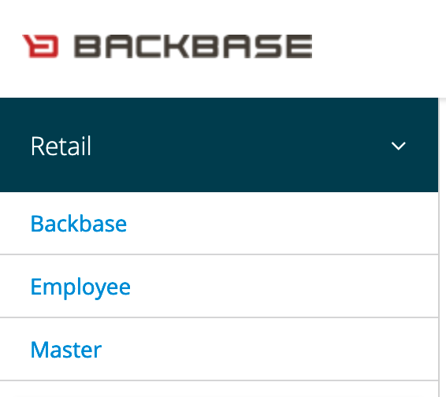
    
      
      
    
*   Click on User Federation  
      
    
    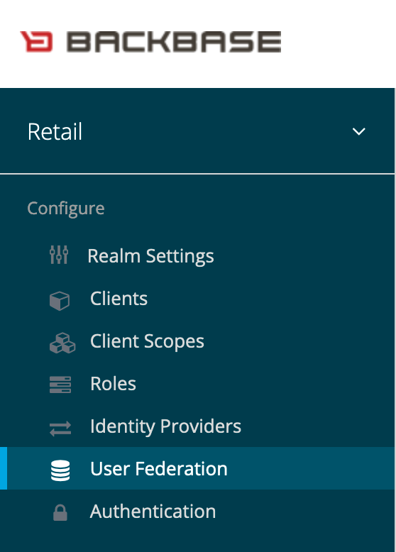
    
      
      
    
*   click on add provider and select LDAP
    
    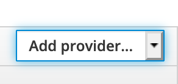
    
      
      
    
*   Enter the LDAP configuration details, refer to your documentation or person in charge of managing the LDAP server to get the proper values.
    

> The LDAP adapter can be configured for bidirectional communication using the WRITE edit mode, meaning that whatever change done in the identity console will get propagated to the LDAP structure as long as the structure accepts the new property. on READ ONLY and UNSYNCED configuration, custom roles, groups and attributes can still be added, and have them saved them locally instead of propagating them to the LDAP. the difference between READ ONLY and UNSYNCED is that READ ONLY does not allow for editing of the imported values.

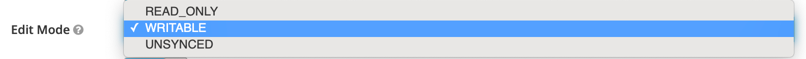

The **test connection** button will NOT validate that the LDAP port is accessible. it will only validate that the LDAP server can be reached, in order to fully test the configuration, click the **test authentication** button

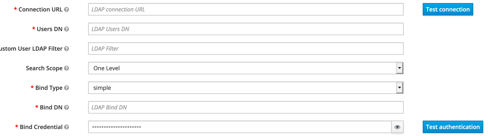

The Identity console server might need to be configured to add the LDAP server credentials and certs to its truststore repository. if you are deploying a dev/testing environment this might not be necessary, if this is the case, make sure to disable the use of the Trust Store SPI for the connection .

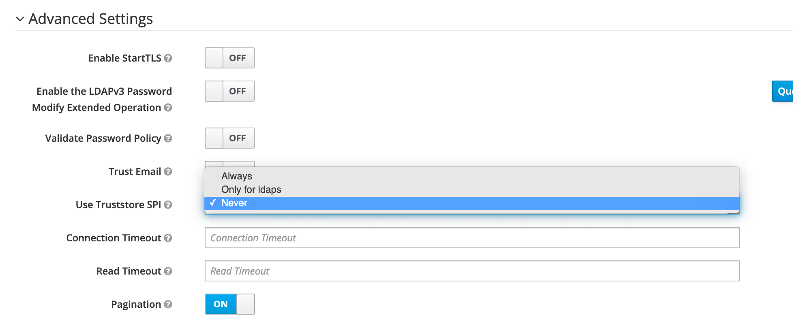

*   Save the configuration and click on Synchronize all users  
      
    
    
    
    If the settings are correct you will get a success message with a quick report on the status of the sync.  
      
    
    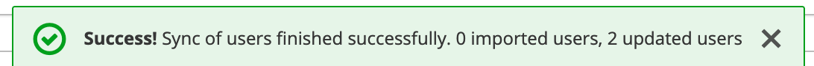
    

----------

### checking the newly configured LDAP integration

you can check the status of the realm by going back to the user federation menu and clicking on the newly created provider.

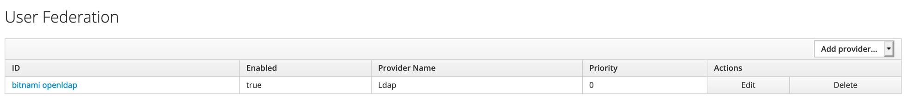

> Multiple LDAP federated providers can co-exist in the same realm

to verify the successful import of users you can check the user list of the realm.

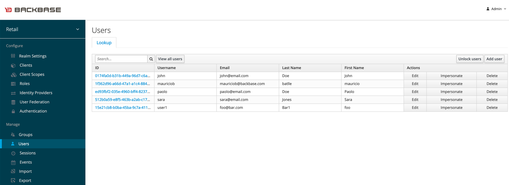

all the imported users will have a Federation link to the provider that contains them in the details tab  
  

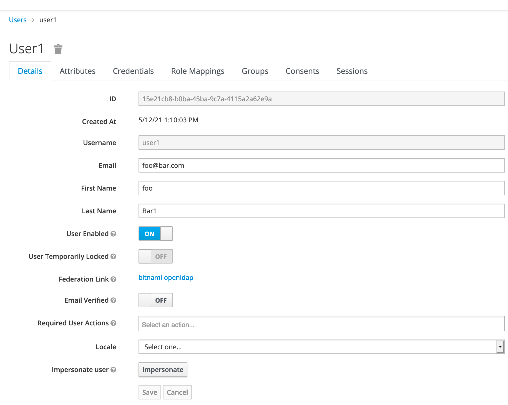

## Mapping attributes

Attributes such as custom values, groups and roles can be mapped from the LDAP storage in order to have them available for usage with the Backbase deployment.

In order to add a new mapping to a LDAP integration follow these steps:

*   click on user federation and select the LDAP integration to modify  
      
    
    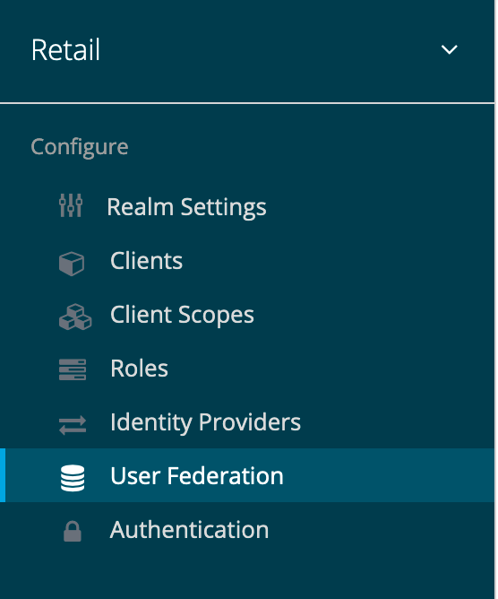
    
      
      
    
*   click on the mappers tab  
      
    
    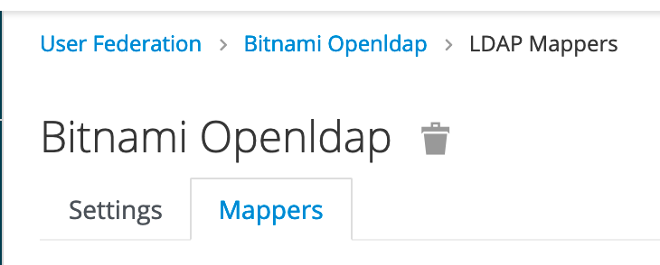
    
*   Enter a name and select a mapper type
    

> In this guide we will focus on the user-attribute-dap-mapper type

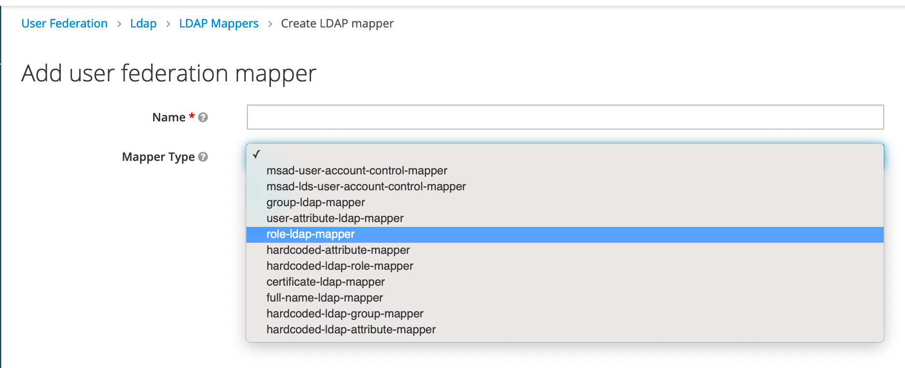

*   enter the LDAP attribute to map to and the name that will be used to represent it on the identity console  
      
    
    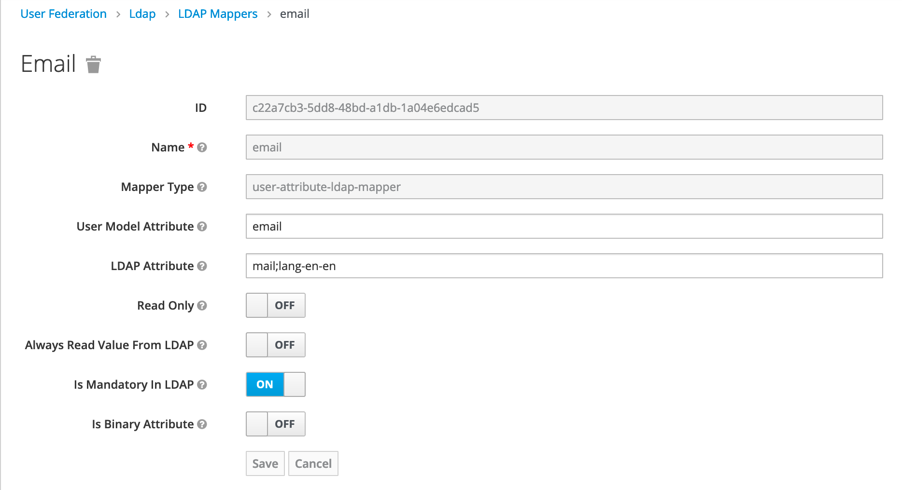
    

Always make sure that you have the LDAP details of the attribute right. if an attribute is read only in the LDAP server or required when making a query, **having the wrong settings in the mapper will break the user import process**

----------

## Additional Resources  
  

*   [https://wjw465150.gitbooks.io/keycloak-documentation/content/server\_admin/topics/user-federation/ldap.html](https://wjw465150.gitbooks.io/keycloak-documentation/content/server_admin/topics/user-federation/ldap.html)
    
*   [Server Administration Guide](https://www.keycloak.org/docs/latest/server_admin/#_user-storage-federation)