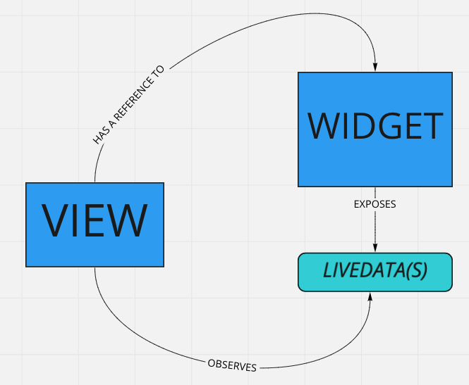

# [Android] How to: Migrate an existing Widget into a Journey
*   1 [Introduction](#Introduction)
*   2 [Pre-requisites](#Pre-requisites)
*   3 [Migration](#Migration)
*   4 [How to present the Widget](#How-to-present-the-Widget)

# Introduction

In the world of Widget Collection, the MSDK is responsible for rendering the Widget. The consequence is that the UI layer (NativeView) is tightly coupled with the Business logic layer (Widget): these two elements have a reference to each other.  
As we move away from the MSDK usage and we start using the Android-default way of building screens, we need to understand that it’s not possible for the widget to have a reference of the view as it is rendered by the System/FragmentManager instead. Because of this, we have to introduce a new paradigm that is based on [Jetpack Viewmodel](https://developer.android.com/jetpack/compose/state "https://developer.android.com/jetpack/compose/state").

The view will have a reference to the widget that will expose [LiveData](https://developer.android.com/topic/libraries/architecture/livedata "https://developer.android.com/topic/libraries/architecture/livedata")s (like a standard ViewModel) that are observed by the View. Whenever new data is posted to the LiveData by the Widget, the View will receive it and update the UI accordingly.

# Pre-requisites

Before starting, make sure to have the following components:

1.  [Koin](https://insert-koin.io/ "https://insert-koin.io/") dependency injection library - if you’re using already an OOTB journey or a productized App, Koin is already included in the list of the dependency  
      
    
    `// Add Maven Central to your repositories if needed repositories { mavenCentral() } // Koin core features implementation "io.insert-koin:koin-core:$koin_version"`
    

# Migration

1.  The Widget’s view (that is extending `NativeView`) will simply extend from Fragment.
    
2.  In the Widget collection world, the View was getting the reference of the Widget through the method `init` called by the MSDK. This won’t happen anymore therefore we use Koin to get the instance of the Widget. `CryptoWidgetContract` is the interface that the Widget implements
    
    `//CryptoPriceWidgetView.kt class CryptoPriceWidgetView : Fragment(R.layout.crypto_price_widget) { val contract: CryptoWidgetContract by inject() ... }`
    
3.  Instruct Koin: add the Widget to Koin’s dependencies, a new instance will be created and returned when you inject the contract the widget is implementing
    
    `factory<CryptoWidgetContract> { CryptoWidget() }`
    
    If you are using a productize app, you can add the dependency overriding the `additionalApplicationDependencies` property
    
4.  `CryptoWidgetContract` will need to expose the LiveData_s_ that represent all the data that the Widget has to communicate to the View
    
    `interface CryptoWidgetContract { val btcPrice: LiveData<String> fun getBtcPrice() ... }`
    
5.  Whenever the Widget needs to update the View, it will post a value to the LiveData
    
    `class CryptoWidget() : CryptoWidgetContract { private val _btcPrice = MutableLiveData<String>() override val btcPrice: LiveData<String> get() = _btcPrice override fun getBtcPrice() { //get the data _btcPrice.value = retrivedBitcoinPrice } }`
    
6.  In order to listen for the changes from the Widget, the View needs to observe the LiveData and then update the UI
    
    `//CryptoPriceWidgetView.kt override fun onViewCreated(view: View, savedInstanceState: Bundle?) { super.onViewCreated(view, savedInstanceState) contract.btcPrice.observe(viewLifecycleOwner) { view.findViewById<TextView>(R.id.time).text = it } ... }`
    
7.  Navigation: when using the Widget collection, to display a page, you would use
    
    `bbInstance.publishEvent("accountClicked", pageID, payload);`
    
    This is connected to a `NavigationEventListener` that would listen for these events and show the corresponding CXP page.  
    This is not valid anymore. Remove both the navigation events and the `NavigationEventListener`. As our Widget’views are now Fragment_s_, we can use the [Navigation Component from Jetpack](https://developer.android.com/guide/navigation "https://developer.android.com/guide/navigation") to understand how to present them.
    

# How to present the Widget

Create a [navigation graph](https://developer.android.com/guide/navigation/navigation-getting-started#nav-editor "https://developer.android.com/guide/navigation/navigation-getting-started#nav-editor") and add all the Fragments that represent the Widget’s Views. Handle the navigation of multiple Widget’s View as you would normally navigate between Fragments.

`<!-- crypto_navigation.xml --> <navigation android:id="@+id/crypto_widget" app:startDestination="@id/cryptoPriceWidgetView"> <fragment android:id="@+id/cryptoPriceWidgetView" android:name="com.backbase.cse.retailapp.crypto.CryptoPriceWidgetView" > <action android:id="@+id/action_cryptoPriceWidgetView_to_cryptoExchangesWidgetView" app:destination="@id/cryptoExchangesWidgetView" /> </fragment> <fragment android:id="@+id/cryptoExchangesWidgetView" android:name="com.backbase.cse.retailapp.crypto.CryptoExchangesWidgetView" /> </navigation>`

Then link this navigation graph to an element like BottomNavigation item, More Menu item, etc  
Example of integration in a Productized App’s BottomNavigation:

`override fun createApplicationConfiguration() = UsApplicationConfiguration { journeyConfigurations = UsJourneyConfigurations { bottomMenuConfigurationDefinition = { BottomMenuConfiguration { items = listOf( BottomMenuItem.Builder() .apply { title = DeferredText.Resource(R.string.usApp_mainMenu_bitcoin) icon = DeferredDrawable.Resource(R.drawable.us_app_ic_menu_pockets) navigationResId = R.navigation.crypto_navigation }.build(), ) } }`

Once the navigation graph has been loaded and Fragment set as `startDestination` presented, you can navigate between the Fragments using the destination actions `findNavController().navigate(R.id.action_cryptoPriceWidgetView_to_cryptoExchangesWidgetView)`