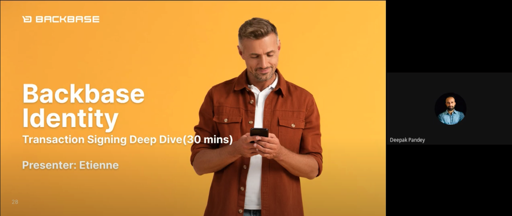

# [Android] How to: Build Custom Journey from existing ClientApi
# Introduction

In the Journey architecture, it is important to distinguish each part of a journey into multiple layers to achieve a logical separation of concerns. In this exercise, we will demonstrate how to create a custom journey by building your own view controller and view model while retrieving model data using an existing ClientApi.

For our purposes, we will demonstrate how to use the User Profile Manager client. For more details on this API client, refer to this [documentation page](https://developer.backbase.com/api/specs/user-profile-manager/user-profile-manager-client-api/2.0.5/ "https://developer.backbase.com/api/specs/user-profile-manager/user-profile-manager-client-api/2.0.5/").

To find out which API endpoint is needed for a certain use case, checkout the [API portal](https://developer.backbase.com/api/?types=service-false_integration-false_client-true&release=2022.03 "https://developer.backbase.com/api/?types=service-false_integration-false_client-true&release=2022.03") where it’s possible to search and see more details about an endpoint.

### Understanding the User Profile Manager

You may notice there are two distinct API clients, User Manager, and User Profile Manager. It is important to know that the User Profile Manager was designed specifically for bank employees and not end-users, hence why it is not integrated into the Retail Banking mobile apps out of the box.

To understand these differences further, refer to this workshop on Backbase Identity:

[




](https://drive.google.com/file/d/1wRRck7xGYmZ4Dfa7O2sxxqi0LZc-HReB/view?usp=sharing)

Backbase Identity Workshop

# Prerequisites

We are gonna start creating a new Gradle module inside our project (called `userprofile`) and adding the needed dependencies to its `build.gradle`:

```
implementation "com.backbase.android.clients:gen-usermanager-client-2:1.0.0"
implementation "com.backbase.android.sdk:backbase:8.2.0"
```

# Setting up the `UserProfileManagementApi`

First, create a Koin factory definition that will provide the instance of the `UserProfileManagementApi` .  
We can do that by overriding the `UsApplication` or `UniversalApplication` 's `additionalApplicationDependencies` property:

```
override val additionalApplicationDependencies = module {
       factory {
            UserProfileManagementApi(
                context = get<Application>(),
                moshi = get(),
                parser = get(),
                serverUri = URI.create("${apiRoot()}/user-manager"),
                provider = get(),
                backbase = get(),
            )
        }
}
```

# Building the use case

The use case acts as the connecting piece between the API client and the view model. In other words, the use case calls the API clients to supply the relevant data to the view model, which solely interacts with the view.

For this example, we will build a simple function that retrieves and returns the user profile from the API. This code will be part of the `userprofile` module.

```
interface UserProfileUseCase {
    suspend fun getUserProfile(): UserProfile?
}
```

Using this protocol, create a class that implements it. The class will make use of the `UserProfileManagmentApi` that we have declared before.

```
class UserProfileUseCaseImpl(private val userManagementApi: UserProfileManagementApi) : UserProfileUseCase {
    override suspend fun getUserProfile(): UserProfile? {

        return when (val response = userManagementApi.getOwnUserProfile().parseExecute()) {
            is CallResult.Success -> response.data
            is CallResult.Error -> null
            is CallResult.None -> null
        }
    }
}
```

We now need to bind the interface to the implementation in `UsApplication` or `UniversalApplication`, same place where we declare `additionalApplicationDependencies` :

```
factory { UserProfileUseCaseImpl(get()) } bind UserProfileUseCase::class
```

# Building the journey

As with other journeys, you will need to build your own view (Fragment) and controller (ViewController), which will retrieve data from the UseCase. Following the convention set forth in the out-of-the-box journeys, this MVVM architecture uses LiveData to bind the views with their corresponding model data.

### Implementing the view model

The view model will contain a reference to our `UserProfileUseCase`. Using this use case, the view model will receive the `UserProfile` object if the call is successful. Whenever this object is received, the view model will create an observable DTO of the relevant data we wish to display and notify any view that has subscribed to it.

```
class UserAccountViewModel : ViewModel(), KoinComponent {

    private val _userProfile = MutableLiveData<UserProfile>()
    val userProfile: LiveData<UserProfile> get() = _userProfile

    private val userProfileUseCase: UserProfileUseCase by inject()

    fun getUserProfile() {
        viewModelScope.launch(Dispatchers.IO) {
            userProfileUseCase.getUserProfile()?.let {
                _userProfile.postValue(it)
            }
        }
    }
}
```

### Implementing the View

The view needs to have a reference to the ViewModel and it will subscribe to its exposing LiveData to fetch the data retrieved by the `UserProfileManagementApi`

```
class AccountDetailFragment : Fragment(R.layout.user_profile_screen) {
    private val viewModel: UserAccountViewModel by viewModel()

    override fun onViewCreated(view: View, savedInstanceState: Bundle?) {
        super.onViewCreated(view, savedInstanceState)

        viewModel.getUserProfile()
        viewModel.userProfile.observe(viewLifecycleOwner) {
            view.findViewById<TextView>(R.id.detail).text =
                """
                    FullName     : ${it.fullName}
                    Phone Address: ${it.phoneMinusAddresses?.first()?.number ?: "N/A"}
                    Electronic Address: ${it.electronicMinusAddresses?.first()?.address ?: "N/A"}
                    Postal Address: ${it.postalMinusAddresses?.first()?.addressLine ?: "N/A"}
                """.trimIndent()
        }
    }
}
```

# Use the custom journey

Now that we have created the journey, we need to add it to our app’s module dependencies and use it in any Navigation Graph inside the app itself.

```
implementation project(path: ':userprofile')
```