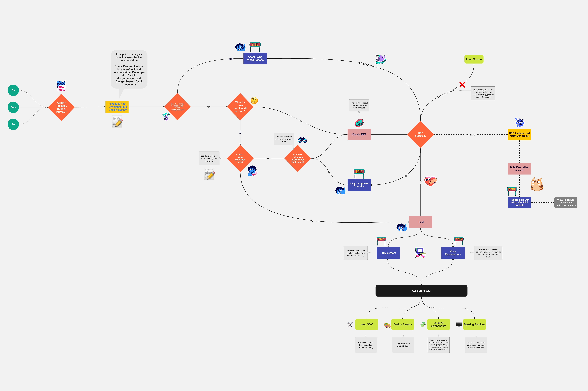
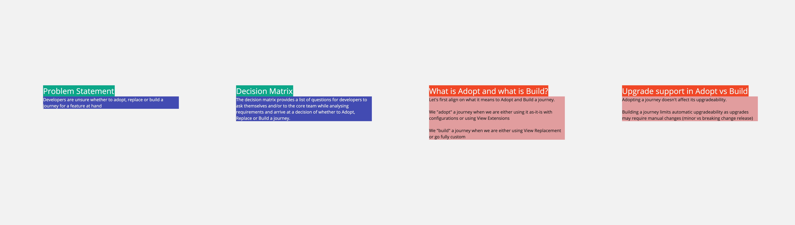

# Journeys - Adopt / Replace / Build: How to make a choice?

## Version

`2022.08-LTS` `2023.02-LTS` `2023.03`

Please reach out to the author or [#cs-ams-frontend](https://backbase.slack.com/archives/C01DD953JA3) channel if you have any questions about the content’s application on a different version.

## Scope

This information is applicable for web journeys which are a part of:

1. Digital Banking
2. Digital Assist
3. Digital Sales
4. Self Enrolment (Identity)

## Objective

It is not unknown that most of our journeys are built to be catered for the US market. Thus, sometimes the default behaviour of a journey doesn’t match with the requirements of a non-US customer. In such scenarios we are faced with the question whether we can still use a journey for that implementation. And the answer to this question falls between the spectrum of Adopt, Replace or Build a journey.

Developers (but also core team members) who are new to Backbase struggle to find the right answer for this question. This decision matrix is intended to support them to get to that desired state by asking the right questions thus ensuring a prudent decision is made based on detailed analysis.

## Decision Matrix

The decision matrix can be found on the Miro board - [https://miro.com/app/board/uXjVOiqxwjI=/](https://miro.com/app/board/uXjVOiqxwjI=/) 

> If you have any queries or suggestions for improvement, please leave a comment on this page or on the miro board itself. 

## Reviewers:

- [x] [@Robinson Zimmermann](https://backbase.atlassian.net/wiki/people/557058:3a4e928f-d3c0-4caa-9d58-e5b317c80f9a)
- [x] [@Petar Blazhevski](https://backbase.atlassian.net/wiki/people/5eeb444ce145af0ab4989bd3) 
- [x] [@Arda Cesmecioglu](https://backbase.atlassian.net/wiki/people/605b400d8efc9b00704c4c67) 
- [x] [@Kirankumar Sripati](https://backbase.atlassian.net/wiki/people/6128f21f46c81500703e5e7c) 
- [x] [@Nishad Ambekar](https://backbase.atlassian.net/wiki/people/6126211ad7cac6006969718b) 
- [ ] [@Alex Wolanski](https://backbase.atlassian.net/wiki/people/5fbcc3bc9592df0076d616b5) 
