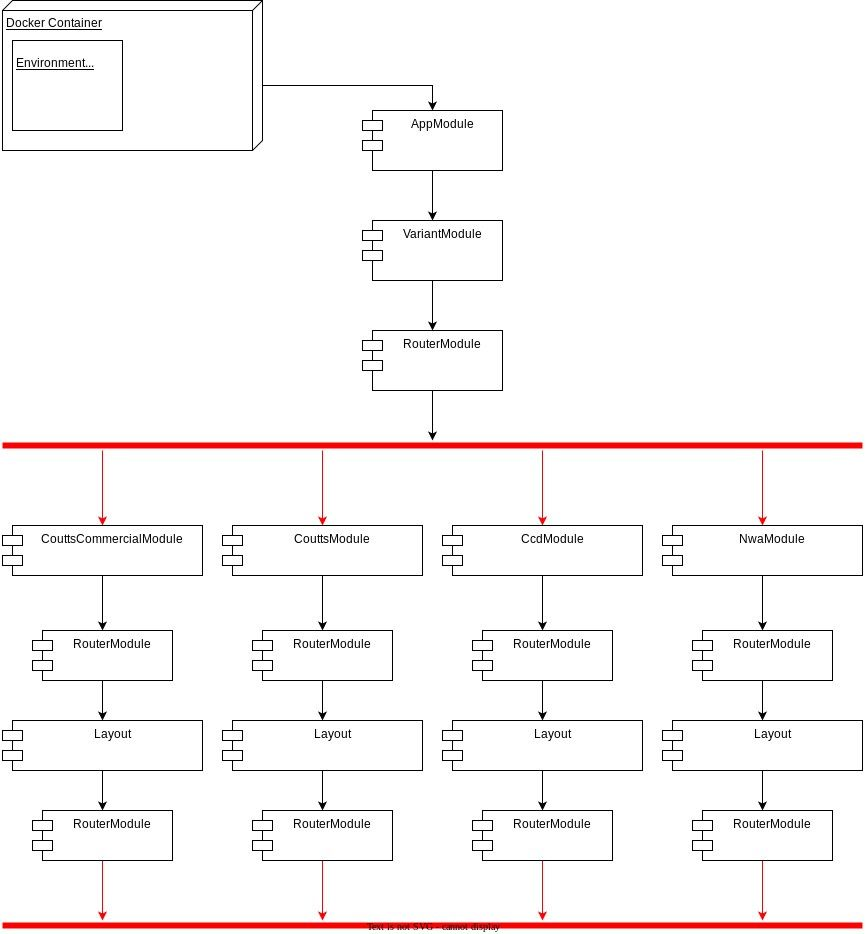

# Frontend: Angular App Multi-Branding
WORK IN PROGRESS

As of today, the frontend architecture doesn’t support a multi-tenancy-like structure, where a single pod serves different ends, however, we can make use of the concept and have one single application that can be configured with different flavours and build as a single image.

The strategy chosen for the frontend applications is having functionally independent applications (web-app, consent-app, employee-web-app), which are built and deployed independently, resulting in one image each. On the other side, each of those apps/images need to get deployed with a separate helm configuration to each tenant.

Since the images have their own helm, that allows us to set different configuration and also identifiers that are resolved in the container itself, allowing us to route the application in different directions based on environment variables. Following this idea, two environment variables we introduced to facilitate the implementation on the FE.

*   `TENANT`: mainly drives the global theming and features that are tenant driven;
    
*   `VARIANT`: an extension of tenant so a tenant can also have different flavours, mainly due to commercial. This is the variable that drives the module to be lazy loaded on the client and will be the entry point for shared or specific routes and journey configurations.
    

## App setup

In the apps, the branding switch is handled with modules, which we call as “variants” and orchestrated with lazy modules by a variant module.

Environment variables are injected through `environment.prod.ts`:

 ```
 export const environment: Environment = {
   ...
   variant: '${VARIANT}' as Variant,
   tenant: '${TENANT}' as Tenant,
   ...
 }
```

> In dev environment file we import variables from a file that is replaced according to the chosen profile. So if we serve the app locally with `--configuration coutts`, the file replacement will set variant and tenant to `coutts`.

The variant module then gets this value and configures the route that injects the right module dynamically:

 ```typescript
 @NgModule({
   declarations: [VariantComponent],
   exports: [VariantComponent],
   imports: [
     RouterModule.forRoot([]),
   ],
 })
 export class VariantModule {
   static forRoot(variant: string): ModuleWithProviders<VariantModule> {
     return {
       ngModule: VariantModule,
       providers: [
         provideRoutes([
           {
             path: '',
             loadChildren: () => {
               switch (variant) {
                 case 'ccd':
                   return import('./ccd/ccd.module').then((m) => m.CcdModule);
                 case 'nwa':
                   return import('./nwa/nwa.module').then((m) => m.NwaModule);
                 case 'coutts-commercial':
                   return import('./coutts-commercial/coutts-commercial.module').then((m) => m.CouttsCommercialModule);
                 default:
                   return import('./coutts/coutts.module').then((m) => m.CouttsModule);
               }
             },
           },
         ]),
       ],
     };
   }
 }
 
```
 

While the variant modules will provide shared and specific providers:

 ```typescript
 @NgModule({
   providers: [
     provideRoutes([
       {
         path: '',
         component: RbsLayoutContainerComponent,
         canActivate: guards,
         children: [...defaultRoutes],
       },
     ]),
     VariantConfigurationProvider,
 
     ...providers,
   ],
 })
 export class NwaModule {
   constructor(title: Title, @Inject(VARIANT_CONFIGURATION) private variantConfig: VariantConfiguration) {
     title.setTitle(this.variantConfig.title);
   }
 }
```



## Loading CSS

CSS was one of the main concerns as we cannot use Angular’s default style injection with a single build. In order to achieve the goal, the first step was to configure Angular to include the styles in its compilation, but disabling the injection. For that we’re using the lazy styles in our `angular.json`:

 ```
 "styles": [
   {
     "bundleName": "coutts",
     "inject": false,
     "input": "themes/backbase-theme-preset-template/scss/main-coutts.scss"
   },
   {
     "bundleName": "ccd",
     "inject": false,
     "input": "themes/backbase-theme-preset-template/scss/main-natwestplus.scss"
   },
   {
     "bundleName": "nwa",
     "inject": false,
     "input": "themes/backbase-theme-preset-template/scss/main-natwestplus.scss"
   }
 ]
```

> Where `"inject": false` prevents angular to include the compiled file in index.html automatically, and `bundleName` is the tenant key.

The second step was deciding which approach we would use to inject the CSS dynamically. The standard approach is injecting it in execution time, so developers can introduce any logic to it to select the right file

 ```
 import { DOCUMENT } from '@angular/common';
 ...
 export class AppComponent {
   title = 'dyncss';
 
   constructor(@Inject(DOCUMENT) private document: Document) {}
 
   loadStyle(styleName: string) {
     const head = this.document.getElementsByTagName('head')[0];
 
     let themeLink = this.document.getElementById(
       'client-theme'
     ) as HTMLLinkElement;
     if (themeLink) {
       themeLink.href = styleName;
     } else {
       const style = this.document.createElement('link');
       style.id = 'client-theme';
       style.rel = 'stylesheet';
       style.href = `${styleName}`;
 
       head.appendChild(style);
     }
   }
 }
 
```
 

This approach should be good enough, although some points need to be considered, such as the possibility of rendering the app without styles applied, or having to hold the app initialisation until the CSS is injected. Fortunately, web-base resolves environment variables, and replaces the string templates, when the container starts running.

Knowing that the CSS bundle name is a direct reference to the tenant name, we can have the CSS file injected as a template in the index.html file, resulting in the following:

 ```
 <!DOCTYPE html>
 <html lang="en">
   <head>
     <meta charset="utf-8" />
     <title>WebApp</title>
     <base href="/" />
     <meta name="viewport" content="width=device-width, initial-scale=1" />
     <link rel="icon" type="image/x-icon" href="favicon.ico" />
     <link rel="stylesheet" href="${TENANT}.css" />
   </head>
   <body>
     <app-root></app-root>
   </body>
 </html>
```

This will set up the index.html according to each deployment, or each tenant we’re running the container.

Still a problem we could have with any approach to lazy load CSS is client-side caching, considering that the bundle has a readable name, rather than a unique ID like other Angular static resources, so the browser may create a disk cache that could keep the styles for some time after deployment. To prevent this issue, we introduced the build number to the link’s href:

 ```
 <link rel="stylesheet" href="${TENANT}.css?v=${BUILD_NUMBER}" />
```

### Loading CSS locally

The lazy loading approach is a good method for production build, but would't be very effective for the local dev server. The recommendation, then, is to create different configuration for each tenant in angular.json.

 ```
 "configurations": {
   "production": {
     "styles": [
       {
         "bundleName": "coutts",
         "inject": false,
         "input": "themes/backbase-theme-preset-template/scss/main-coutts.scss"
       },
       ...
   "coutts": {
     "styles": ["themes/backbase-theme-preset-template/scss/main-coutts.scss"]
     ...
```