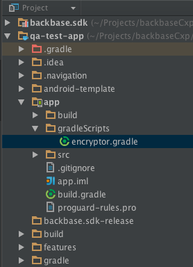

# Recipe - Encrypted configuration
# The problem

Implementing the [MSDK encrypted configuration](https://community.backbase.com/documentation/mobile-sdk/latest/encrypted_config "https://community.backbase.com/documentation/mobile-sdk/latest/encrypted_config") feature can lead to some unnecessary extra time due to the lack of a guide.

# The solution

### **Prerequisites**

1\. Installing the [Mobile CLI](https://community.backbase.com/documentation/mobile-sdk/latest/mobile_cli "https://community.backbase.com/documentation/mobile-sdk/latest/mobile_cli")

**Uses Python 2.7**

2\. Installing [pycrypto](https://pypi.org/project/pycrypto/ "https://pypi.org/project/pycrypto/")

Using pip

`python -m pip install pycrypto`

# Android

*   Create file `package.json` in your project’s root folder and add
    

 ```json
 {
   "dependencies": {
     "@bb-cli/bb-mobile": "2.0.1-pr.9"
   }
 }
```

*   Install BB-Mobile CLI in your project’s path, by executing terminal command `npm install` .
    

> To ensure the installation went well, execute terminal command `ls ./node_modules/.bin`.
> 
> Output should be listed as below
> 
> `bb-config bb-mobile markdown-it resolve semver shjs`

> Test if the config files encryption process works, by executing terminal command :
> 
> `./node_modules/.bin/bb-mobile encrypt android configuration_Path + "/" + configFileName -d ..`
> 
> 1.  _**configuration\_Path**_ : Path of your project’s folder, which contains the config files.
>     
> 2.  _**configFileName**_ : Name of the config file.
>     
> 
> For example :
> 
> `./node_modules/.bin/bb-mobile encrypt android ./app/src/main/assets/backbase/config.json -d ..`

*   Create a folder in your project, for example _gradleScripts_ and add file _encryptor.gradle_ to it.
    



*   Copy the following gradle tasks to the recently created _encryptor.gradle_ file
    

 ```actionscript
 rootProject.ext.configurationPath = "Path_of_the_folder_containing_the_config_files"
 rootProject.ext.bbMobilePath = "../node_modules/.bin/bb-mobile"
 
 rootProject.ext.configFilesList = List_of_config_files_to_be_encrypted
 
 ext {
     encryptConfigurationFileTask = this.&encryptConfigurationFileTask
     restoreConfigurationFileTask = this.&restoreConfigurationFileTask
 }
 
 def encryptConfigurationFileTask() {
     return tasks.create("encryptConfigurationFile") {
         configFilesList.forEach { configFileName ->
             doLast {
                 try {
                     println("Creating configuration backup")
                     copy {
                         from configurationPath + "/" + configFileName
                         into "."
                         rename(configFileName, configFileName + "_backup")
                     }
                     exec {
                         commandLine bbMobilePath, "encrypt", "android", configurationPath + "/" + configFileName, "-d", "../"
                     }
                     println("Configuration file : " + configFileName + " encrypted")
                 } catch (Exception e) {
                     e.printStackTrace()
                 }
             }
         }
     }
 }
 
 
 def restoreConfigurationFileTask() {
     return tasks.create("restoreConfigurationFile") {
         configFilesList.forEach { configFileName ->
             doLast {
                 println("Restoring : " + configFileName + " to plain text")
                 copy {
                     from configFileName + "_backup"
                     into configurationPath
                     rename(configFileName + "_backup", configFileName)
                 }
                 delete(configFileName + "_backup")
             }
         }
     }
 }
 
```
 

*   To encrypt the config files before APK generation of your Product flavour’s release build, and restoring them back after APK file is generated, add the following to your app’s `build.gradle` -
    

 ```
 afterEvaluate { project ->
     def encryptConfigurationFileTask = encryptConfigurationFileTask()
     def restoreConfigurationFileTask = restoreConfigurationFileTask()
     tasks.named("assemble_YOUR_PRODUCT_FLAVOUR_release").get().dependsOn(encryptConfigurationFileTask).finalizedBy(restoreConfigurationFileTask)
 }
```

### **Using CI/CD**

When deploying your app using CI/CD, you could add those dependencies using as part of your build script.

*   **bb-cli** can be added via **package.json** file, and run `npm install` to add the dependency.
    
*   **pycrypto** can be added via Fastlane.
    

### **Testing**

In order to test if the config file was encrypted on the release build’s APK, you should inspect the contents of the .apk file.

> 1.  Extract the generated APK file from `app/build/outputs/apk` folder.
>     
> 2.  Rename APK file’s extension from `.apk` to `.zip`
>     
> 3.  Check if config files were encrypted from the recently created zip.
>     

Test if the config files are decrypted from the APK during runtime, and the app executes as expected.

Incase if decryption failed, Backbase SDK’s initialisation fails with InvalidConfigException.

# iOS

As it’s stated on the Community documentation, first, on your target’s build phases, you need to create a run script phase and place it after the copy bundle resources phase. The script should look like this:

 ```
 bb-mobile encrypt ios "path-to-the-build-folder-where-the-config-file-is"
```

This path is NOT the path to where the config is located on your project.

You can find this path by [inspecting the contents of the ipa file](https://stackoverflow.com/questions/52422675/how-to-extract-contents-from-a-ipa-file-2018 "https://stackoverflow.com/questions/52422675/how-to-extract-contents-from-a-ipa-file-2018") and checking where the config file is located. That should be the path you will be using.

Usually the path to the root folder of your ipa file is found using:

`${CONFIGURATION_BUILD_DIR}/${CONTENTS_FOLDER_PATH}`

For example, if you find that your config file is on your ipa root folder, your script could be:

`bb-mobile encrypt ios "${CONFIGURATION_BUILD_DIR}/${CONTENTS_FOLDER_PATH}/config.json"`

If you need to encrypt multiple config files, you could create a shell script with all the commands to encrypt all the files. For example:

Then on your build phases script your should call this script, for example:

 ```
 "${SRCROOT}/encrypt-config.sh"
```

Also, you can toggle the option: **run script for install builds only**. And add it to the input files.

### **Using CI/CD**

When deploying your app using CI/CD, you could add those dependencies using as part of your build script.

*   **bb-cli** can be added via a **package.json** file, and run `npm install` to add the dependency.
    
     ```
     {
       "dependencies": {
         "@bb-cli/bb-mobile": "2.0.1-pr.9"
       }
     }
    ```
    
*   **pycrypto** can be added via Fastlane.
    

### **Testing**

In order to test if the config file was encrypted on the release build, you should inspect the contents of the ipa file.

[**Exploring the contents of an ipa file**](https://stackoverflow.com/questions/52422675/how-to-extract-contents-from-a-ipa-file-2018 "https://stackoverflow.com/questions/52422675/how-to-extract-contents-from-a-ipa-file-2018")

Chage the .ipa to a .zip, then find the payload folder, then right click it and choose "Show Package Contents" then you are in the app contents.

There you should look for the config file and validate if it is encrypted.