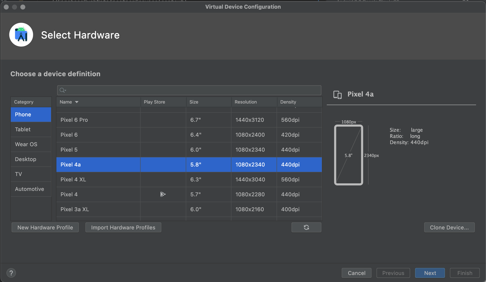
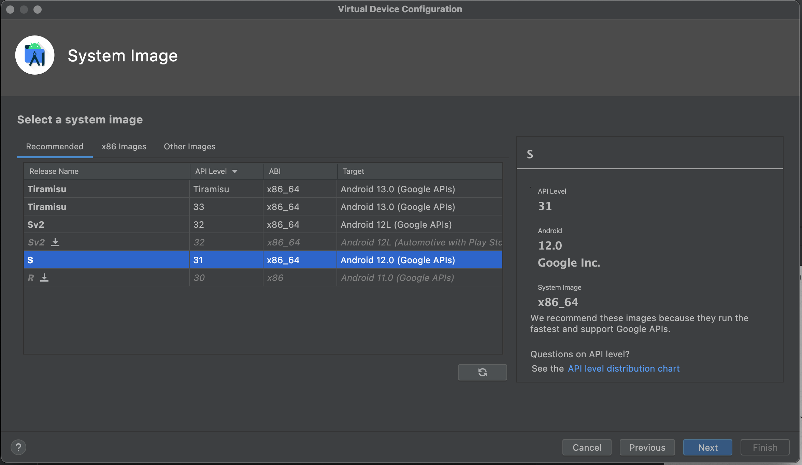
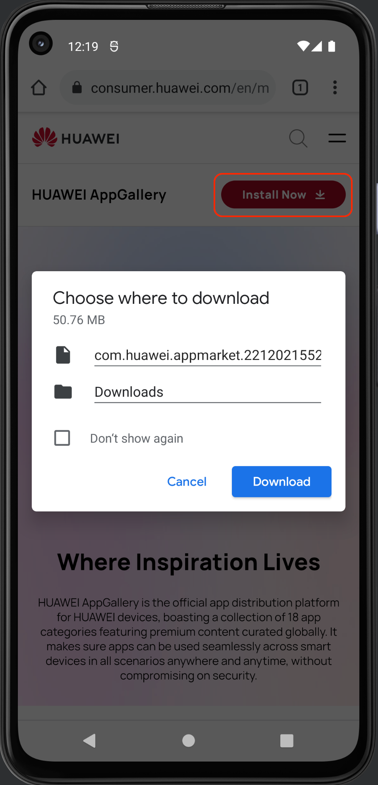
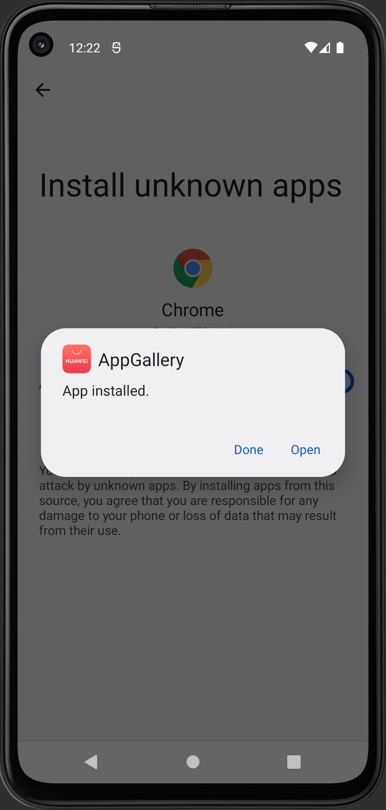
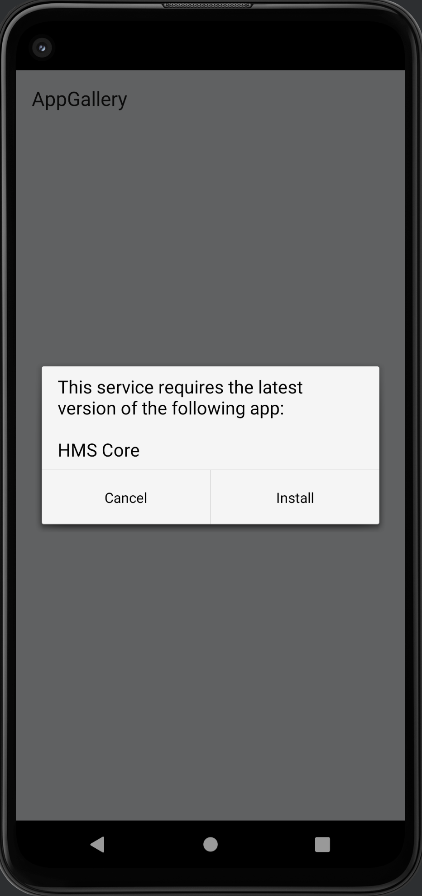
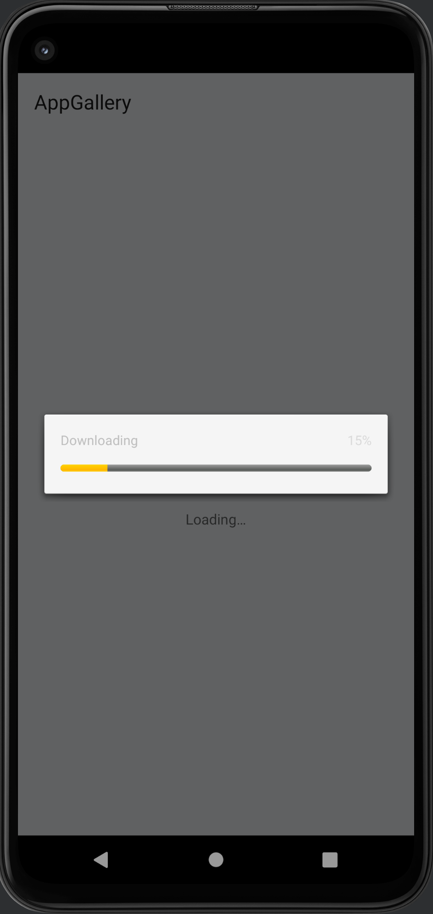
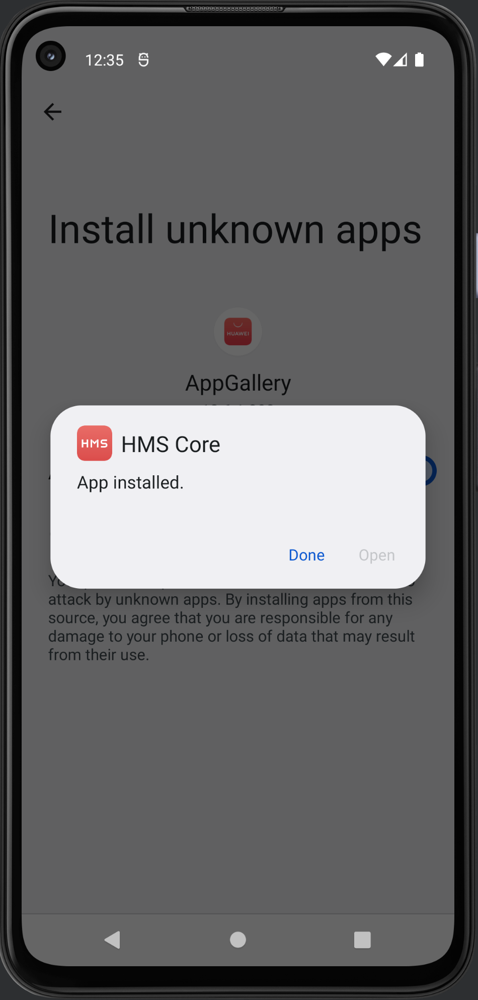
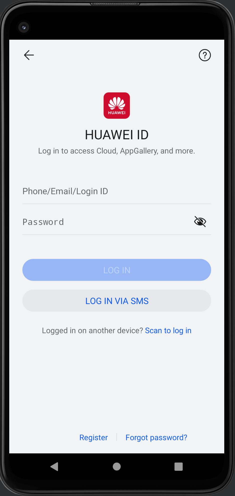
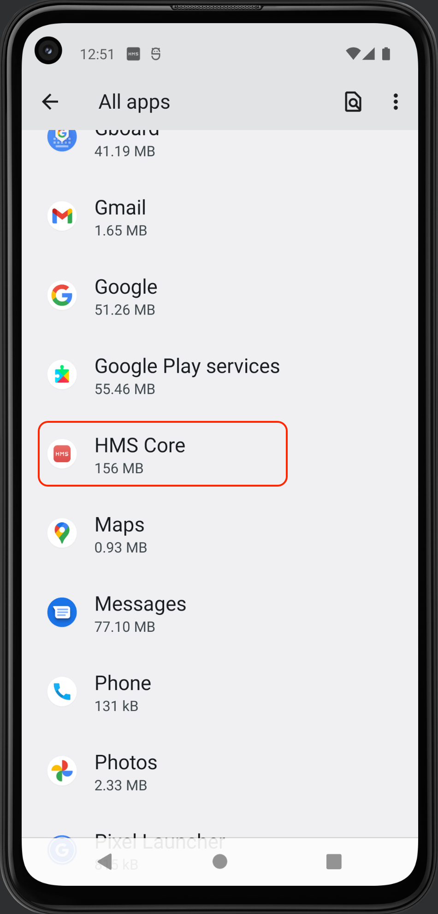

# How to install HMS Core in the Android Studio emulator
If you want to test your HMS implementation and you do not have a Huawei device, it is easy to mock that and test the services in the Android Studio emulator.

Please follow the instructions below:

1.  Create a new device with only Google APIs, no Play Store. For this example, a Pixel 4a with API 31 is being used.
    
    
    
    Choose a device without Play Store.
    
    
    
    Choose a version of Android with Google APIs.
    
2.  Run your new device and install the Huawei AppGallery APK from [http://consumer.huawei.com/en/mobileservices/appgallery/](http://consumer.huawei.com/en/mobileservices/appgallery/ "http://consumer.huawei.com/en/mobileservices/appgallery/") or you can google it.  
      
    
    
    
    Download the AppGallery APK.
    
    
    
    Allow installing unknown apps in Chrome browser and install the app.  
      
    
3.  Open the AppGallery, you will be prompted to install HMS Core. Install it.  
      
    
    
    
    Install HMS Core.
    
    
    
    Download the HMS Core.
    
4.  Once the HMS Core has been downloaded, you will need to allow installing unknown apps from AppGallery to install it.  
      
    
    
    
    Allow installing unknown apps in AppGallery and install the app.
    
5.  Press “Done”, then press the _back_ button, you will see the AppGallery login screen.  
      
    
    
    
    AppGallery login screen.
    
6.  That is it. Now you can close the app to verify that the HMS Core app is installed.  
      
    
    
    
    Verify that the HMS Core app is installed.
    

With these steps you can work and run the Huawei Mobile Services.