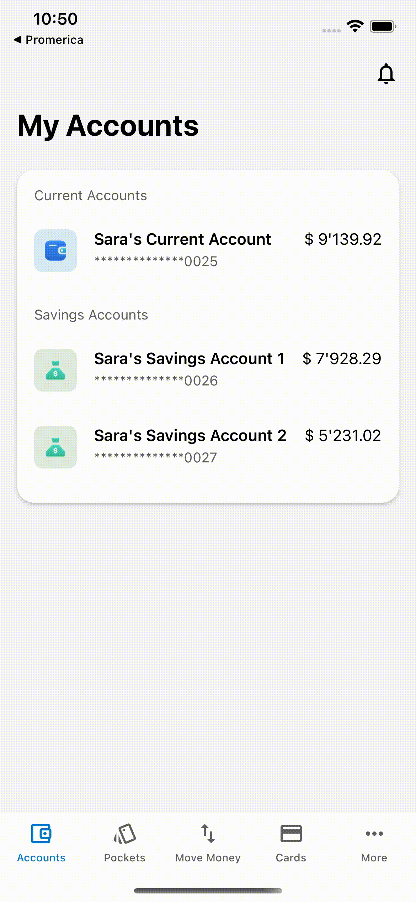

# Tap to Reveal - Reveal styling blocks of UI elements
#### Discussion

Quite often we need to know what are the styling blocks that are applied to a given UI element, in fact we do it several times for each task. Over the progress of a project we do it for several journeys. One might expect that a developer who is used to do this work constantly would be able to tell that by heart but unfortunately this isn’t the case. Be it the fact that are hundreds of styling properties, overly similar naming for those properties or simply that a developer only needs to find the correct styling property once, this is just a skill that we don’t retain. We do get better at finding them easier as the time goes on but this is just as far as it goes.

#### The tool

Tool in action

Long press at a point of the screen to find out which are the UI elements from the SDK and what are the styling blocks that are applied to it. Some of them have multiple blocks applied at once and the developer needs to know which one of them it’s the best to update too.

#### Tech behind it

This one feature relies on the precompiling auto generated code. The SDK’s interface is read and code output is generated following a template. Essentially we’re running down the map of types and its children recursively and generating snippets of code every time we find a styling block.

Once a styling block is found then we update its value to something like this pseudo-code:

`appConfig.journey.labelStyling = appConfig.journey.labelStyling <> { view in view.accessibilityLabel = "SYMBIOSIS:appConfig.journey.labelStyling" }`

By doing so we preserve all of the original behaviour and styling but we add a custom `acessibilityLabel` to the element which we’re going to use as an identifier. Once the user long-presses anywhere in the screen we iterate between all views that are in that specific point, whatever view contains the prefix `SYMBIOSIS:` we assume it’s part of this feature. Further information is then pulled and we combine the results in to a view which is presented to the user.