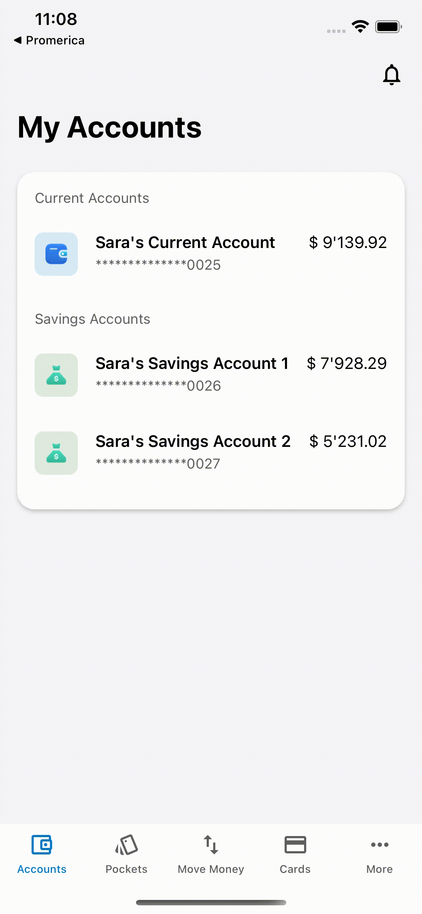

# Tap to Reveal - Reveal translations keys of elements
#### Discussion

Developers are pretty familiar to dig for translations keys while working on tasks or simply answering questions. Everyone has their own way to find such information, none being really that speedy. Some search for the text directly in the strings resources and validates that it is indeed the one by running the application and checking for the changed value. That takes time even if you get perfectly right in the first try.

#### The tool

Tool in action

Long press at a point of the screen to find out which of the UI elements from the

SDK in that point have internationalizing and what’s the translation key associated to it. Some have variables inside for rich internationalizing.

#### Tech behind it

This one feature relies on the precompiling auto generated code. The SDK’s interface is read and code output is generated following a template. Essentially we’re running down the map of types and its children recursively and generating snippets of code every time we find a translation key.

Once a translation key is found then we update its value to something like this pseudo-code:

`appConfig.journey.strings.labelKey = { let uniqueNumber = getUniqueIdentifierNumber() let original = appConfig.journey.strings.labelKey let updatedKey = String(repeating: "\u{200b}", count: uniqueNumber) + original return .init(value: updatedKey) }()`

The trick here to basically replace all of the projects translation key values to a copy of itself but with a given numbers of the same character in it, in a way that each translation has a unique amount of that character which is the zero width space, visually making no difference at all to the project.

Upon the user long press on top of any textual element and it detects the presence of such character then it checks against a table of identifiers to figure out what was the associated translation key.