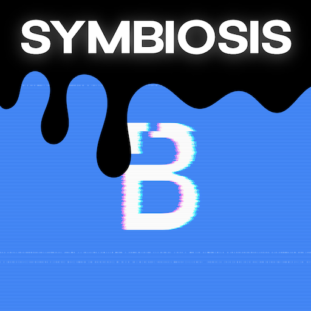

# Symbiosis - Use Cases

### What is Symbiosis?

Symbiosis is an app that helps people to increase their productivity and save time by helping them to understand how Backbase SDKs work interactively while using the Universal Retail app. For internal usage only.

> To understand more of how Symbiosis work under the hood, check out the workshop done by @Samuel Cortez during the 2023 Engineering Summit.
> 
> [CS Engg Summit - iOS sessions (2023-03-02 18\_43 GMT+5\_30).mp4](https://drive.google.com/file/d/1v-OSRLWNdyTG090F59Eyl-zMIBURHTxo/view?usp=sharing)

### Where can I download it?

[Symbiosis - Versions](../symbiosis-versions/symbiosis-versions.md)

### Main features

*   [SDK Navigator - Dive through the SDK interactively](../symbiosis-features/sdk-navigator/sdk-navigator-dive-through-the-sdk-interactively.md)
    
*   [Tap to Reveal - Reveal translations keys of elements](../symbiosis-features/tap-to-reveal-translation-keys/tap-to-reveal-reveal-translations-keys-of-elements.md)
    
*   [Tap to Reveal - Reveal styling blocks of UI elements](../symbiosis-features/tap-to-reveal-styling-blocks/tap-to-reveal-reveal-styling-blocks-of-ui-elements.md)

### 🚀 Use cases

On this page you can find how you can use Symbiosis for real life use cases. Please, check the pages bellow. They are role-base, so keep this in mind.

*   [Symbiosis - Use Cases for Developers](./use-cases-for-developers/symbiosis-use-cases-for-developers.md)
    
*   [Symbiosis - Use Cases for BAs and UX Designers](./use-cases-for-ba-and-ux/symbiosis-use-cases-for-b-as-and-ux-designers.md)
    

### Is this it for now?

Yes. Development of new features and expansion to other products is in the plans.

### What’s next in the road map?

*   Release with new host version (Retail App)
    
*   Make Symbiosis a framework
    
*   Add it to the Wealth and Business apps
    

### FAQs

[Symbiosis - FAQs](../symbiosis-faq/symbiosis-faq.md)

### Support

Check out our support channel on Slack [#s-symbiosis](https://join.slack.com/share/enQtNTI1NDcwMzMwMDYxMC1jZTM3YmEwODE0MTNlYTE2YTdiNzUxODE4NTRjYzRlMmQyOGZkN2Y2MjUyNDE2MzliOWJmOTZmZWRlZDE5MjYw "https://join.slack.com/share/enQtNTI1NDcwMzMwMDYxMC1jZTM3YmEwODE0MTNlYTE2YTdiNzUxODE4NTRjYzRlMmQyOGZkN2Y2MjUyNDE2MzliOWJmOTZmZWRlZDE5MjYw").