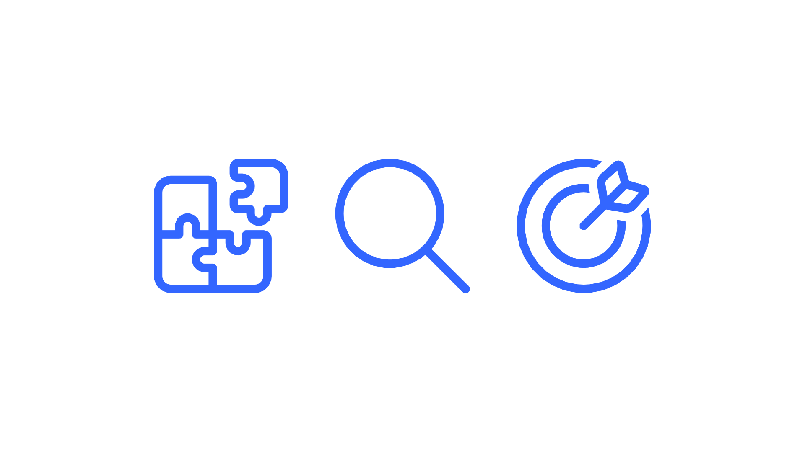

# Symbiosis - Use Cases for BAs and UX Designers
**Version 1.0.0**

----------

<video width="320" height="640" controls>
  <source src="video_1280.mp4" type="video/mp4">
</video>

Example in action.

#### Understand the details of a Journey’s configuration

Sometimes you just need a quick check of what are the Journeys configuration on a certain screen. Normally, you would go through the documentation on [backbase.io](http://backbase.io "http://backbase.io") until finding out an indication of what you’re looking for, or you would message on the support Slack channel for a developer’s help. Now you have a way to dive through the Journey just like a developer can.

For example:

*   You’re researching the Authentication Journey while taking in consideration the client’s requirements.
    
*   It has been pointed out that changing the PIN length is required
    
*   Tap at the floating [**SDK Navigator**](/wiki/spaces/ES/pages/3910238227 "/wiki/spaces/ES/pages/3910238227") button (tip: you can drag to anywhere on the screen)
    
*   You’re going to see the the root path of the SDK configuration and the Design System.
    
*   Since we’re talking about the Authentication Journey let’s navigate to there.
    
*   Press `Configuration` then `Authentication`
    
*   We’re now seeing all of the configuration for the Authentication Journey
    
*   We’re investigating the PIN and such element only exists in the `Passcode` screen, so let’s navigate there. Press `Passcode`. (note: sometimes you might not immediately know where to look but you can understand it by playing it around)
    
*   Navigate deeper.
    
*   We’re on the `Passcode` screen configuration
    
*   You can see all of the options for the screen and also that `length` is an option as well. Therefore, a property that you’re able to customize it.
    
*   Additionally you see other options and configurations that can assist you while you assess the different requirements that your client may have.
    

----------

<video width="320" height="640" controls>
  <source src="video_1280-2.mp4" type="video/mp4">
</video>

Example in action.

#### Finding out what can and cannot be configured in a Journey

When working with a client, it’s very common to have requirements thrown at you. _How do you make sense of them when it comes to our Journeys? Is this simply configuration? Is this an extension? Do we need build it?_ Here, Symbiosis will help you to find that out on your own with some easy simple steps.

*   Let’s imagine your team is discussing about the **Accounts and Transactions** journey, more specifically, the **Account Details** screen.
    
*   You’re discussing whether the action button for the section can be customised.
    
*   Get the Symbiosis app and navigate to this screen, identify the element and [**tap to reveal**](/wiki/spaces/ES/pages/3909943349 "/wiki/spaces/ES/pages/3909943349") (long press) at the element (check the video on the right).
    
*   You’ll see the result list, tap at the element we’re talking about.
    
*   You see that the only styling points are from the Design System and not a dedicated one, hence the **customisation options for such element are limited**.
    
*   Your conclusion then is that such element can only be customised in a general sense, having the same styling that every other button such as `linkButton` does.
    
*   Because of your findings the UX, once designed, is going to be feasible from the very start.
    

----------