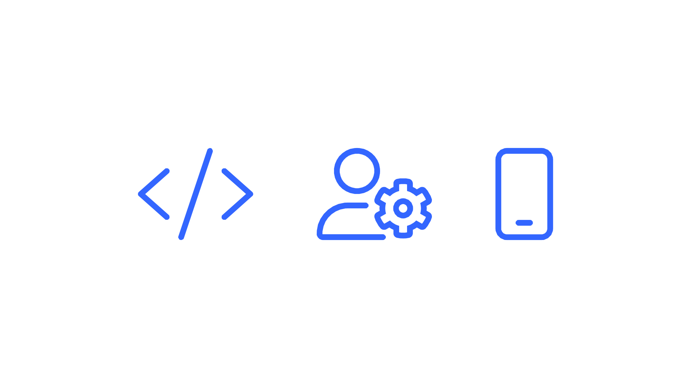
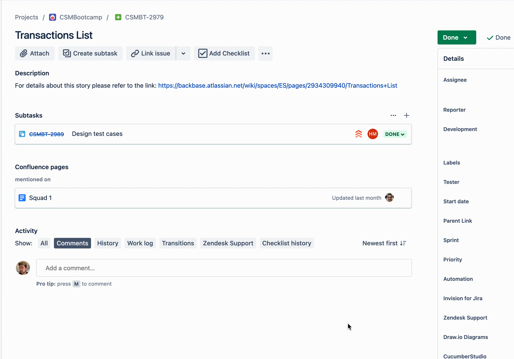

# Symbiosis - Use Cases for Developers
**Version 1.0.0**

----------

Example in action.

#### Developing a new user story or fixing bug

*   First, check the requirements of the User Story.
    
*   Identify the requirements and visual differences between Figma (or similar platform) and current state of the app.
    
*   Identify the Journey’s exposed configuration.
    
    *   Launch Symbiosis, navigate to the target screen, [**tap to reveal**](/wiki/spaces/ES/pages/3909943349 "/wiki/spaces/ES/pages/3909943349") (long press) at the elements that need work and find out their styling access point.
        

----------

#### Identifying the best way to implement a configuration

Example in action.

Sometimes a certain element is updated through different access points. Which one is the best depends on what you’ll need to do, knowing all of them empowers you to take the right choice.

*   Identify the element.
    
*   Understand the work needed, is it: formatting, styling, business logic?
    
*   Navigate to the screen that contains the element
    
*   [**Tap to reveal**](/wiki/spaces/ES/pages/3909943349 "/wiki/spaces/ES/pages/3909943349") (long press) at the element
    
*   Choose the matching element from the result list
    
*   If the element has different styling points make use of the inline documentation and the context itself to understand which one fits best to your use.
    

----------

#### Figuring out the correct translation key

Example in action.

A very common daily task is updating a app’s translations. How can Symbiosis help you to find translations and its keys easier?

*   Identify the element.
    
*   Navigate to the screen that contains the element
    
*   [**Tap to reveal**](/wiki/spaces/ES/pages/3909354015 "/wiki/spaces/ES/pages/3909354015") (long press) at the element
    
*   Choose the matching element from the result list
    
*   Discover the exact translation key for the given element
    
*   Replace the resource as you wish
    

----------