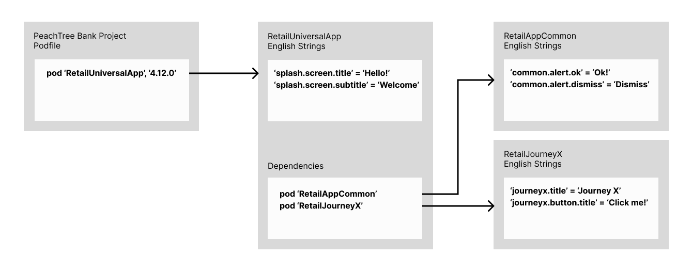

# Mobile - SAPI Extractor
> Current solution is an entire script, used as: `sx`  
> Proposed solution is to move it to a command of the `sapi` tool: `sapi x`

*   1 [How it works](#How-it-works)
*   2 [Example](#Example)
*   3 [Output](#Output)
*   4 [Scope](#Scope)

This command automatically fetches all the strings files in a project’s Backbase dependencies for the given language - or use the default language, if so specified - in order to generate one master `.strings` file. This file can be easily converted to `.csv`, translated and used by the likes of [Babelish](https://github.com/netbe/Babelish "https://github.com/netbe/Babelish") to generate your project's strings files on the go.

## How it works

1.  Looks for the list of dependencies in the mobile project;
    
2.  For every dependency, verify that it’s a Backbase dependency;
    
3.  For every Backbase dependency, fetch it from repo and extract its strings;
    
4.  Check this dependency’s list of dependencies and repeat from step 2;
    
5.  Stop until all strings from all Backbase dependencies have been extracted;
    
6.  Generate one file with all the strings, so that projects can now use this to update values and translate in different languages.
    

## Example

Given the hypothetical scenario where our _**PeachTree Bank project**_ contains only the _**RetailUniversalApp**_ as Backbase dependency and that app has a dependency on both the _**RetailAppCommon**_ and _**RetailJourneyX**_, our extractor command should be able to extract all their strings into one file that we can then update and use in our project.

Hypothetical dependencies between Backbase products

## Output

The output of `sapi x -p Podfile -l en` would be a `.strings` file whose content is:  
  

`// RetailUniversalApp-4.12.0 "splash.screen.title" = "Hello!"; "splash.screen.subtitle" = "Welcome"; // RetailAppCommoon-1.2.0 "common.alert.ok" = "Ok!" "common.alert.dismiss" = "Dismiss"; // RetailJourneyX-3.12.0 "journeyx.title" = "Journey X"; "journeyx.button.title" = "Click me!";`

## Scope

|     |     |
| --- | --- |
| **Must have:** | * Feature parity, work for iOS and Android.      * Be able to fetch all .xml and .strings found in Backbase dependencies on [https://repo.backbase.com](https://repo.backbase.com) .      * Generate one single output file. |
| **Nice to have:** | * Ability to generate output directly as `.csv`, ready to be translated |
| **Not in scope:** |     |