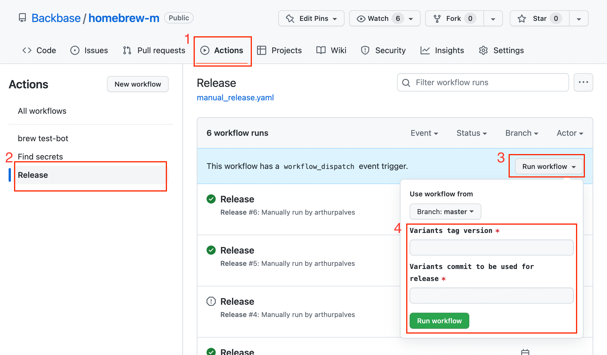

# Mobile - Releasing Variants
> This page refers to the process one must follow to release a new version of [Variants](/wiki/spaces/ES/pages/3912728704 "/wiki/spaces/ES/pages/3912728704").

# Background

A successful Variants release needs coordination from two repositories. One of the tool itself and the Homebrew tap for Backbase’s mobile tooling. Variants is successfully released when

1.  A Variants GitHub release exists, named and tagged as the desired version.
    
2.  Formulae have been created/updated in our Homebrew tap’s main branch.
    
3.  A Tap GitHub release exists, containing four Homebrew bottles.
    

**Luckily, the process has been automated to a good extent and can be easily achieved by following the steps below.**

# Repositories

Follow the steps below, in their appropriate repositories.

### Backbase/Variants

[GitHub - Backbase/variants: A command-line tool to setup deployment variants for iOS and Android, alongside a working CI/CD setup.](https://github.com/Backbase/variants)

In the Variants repository on Github, ensure the following:

*   All work for the upcoming release has been performed accordingly.
    
*   All desired feature branches have been merged into `develop`.
    
*   Version bump to `X.Y.Z` has been performed and merged into `develop` . (Perform version bump in file [Sources/Variants/main.swift](https://github.com/Backbase/variants/blob/develop/Sources/Variants/main.swift "https://github.com/Backbase/variants/blob/develop/Sources/Variants/main.swift")).
    
*   A `release X.Y.Z` PR from `develop` to `main` has been approved and merged.
    
*   **Copy the HASH from the last commit on branch main**.
    

### Backbase/homebrew-m

[GitHub - Backbase/homebrew-m](https://github.com/Backbase/homebrew-m)

> This repository holds the Homebrew formulae for Variants and possibly - in the future - other Backbase mobile tools.

> Aside from holding the formulae, this repository provides all the necessary automation steps to trigger a full release. It will make use of [Bottler](https://github.com/Backbase/bottler "https://github.com/Backbase/bottler") to generate 4 new homebrew bottles for each release:  
> 2 loosely versioned, for x86\_64 and arm64:
> 
> *   variants-x.y.z.monterey.bottle.tar.gz
>     
> *   variants-x.y.z.arm64\_monterey.bottle.tar.gz
>     
> 
> 2 explicitly versioned, for x86\_64 and arm64
> 
> *   variants@x.y.z-x.y.z.monterey.bottle.tar.gz
>     
> *   variants@x.y.z-x.y.z.arm64\_monterey.bottle.tar.gz
>     

> This repository will contain explicit formulae for all previous releases, and maintain the current/latest release with a general/loosely versioned formula. Given the latest version is `1.1.3`, it contains:
> 
> *   variants.rb -> points to release 1.1.3
>     
> *   variants@1.1.2.rb
>     
> *   variants@1.1.1.rb
>     
> *   variants@1.1.0.rb
>     
> *   …
>     
> 
> Upon release of version `1.1.4`, a new formula is created for `variants@1.1.3` and `variants.rb` is updated to point to `1.1.4`:
> 
> *   variants.rb -> points to release 1.1.4
>     
> *   variants@1.1.3.rb
>     
> *   variants@1.1.2.rb
>     
> *   variants@1.1.1.rb
>     
> *   variants@1.1.0.rb
>     
> *   …
>     

  
With the **commit hash** and the **desired version number**, we can trigger a release that will automatically perform all the necessary steps to release:

1.  Go to `Actions`.
    
2.  On the left side, select the `Release` action.
    
3.  Click `Run workflow`.
    
4.  Insert the commit hash you copied from Variants' main branch AND the desired version number to be released.
    

