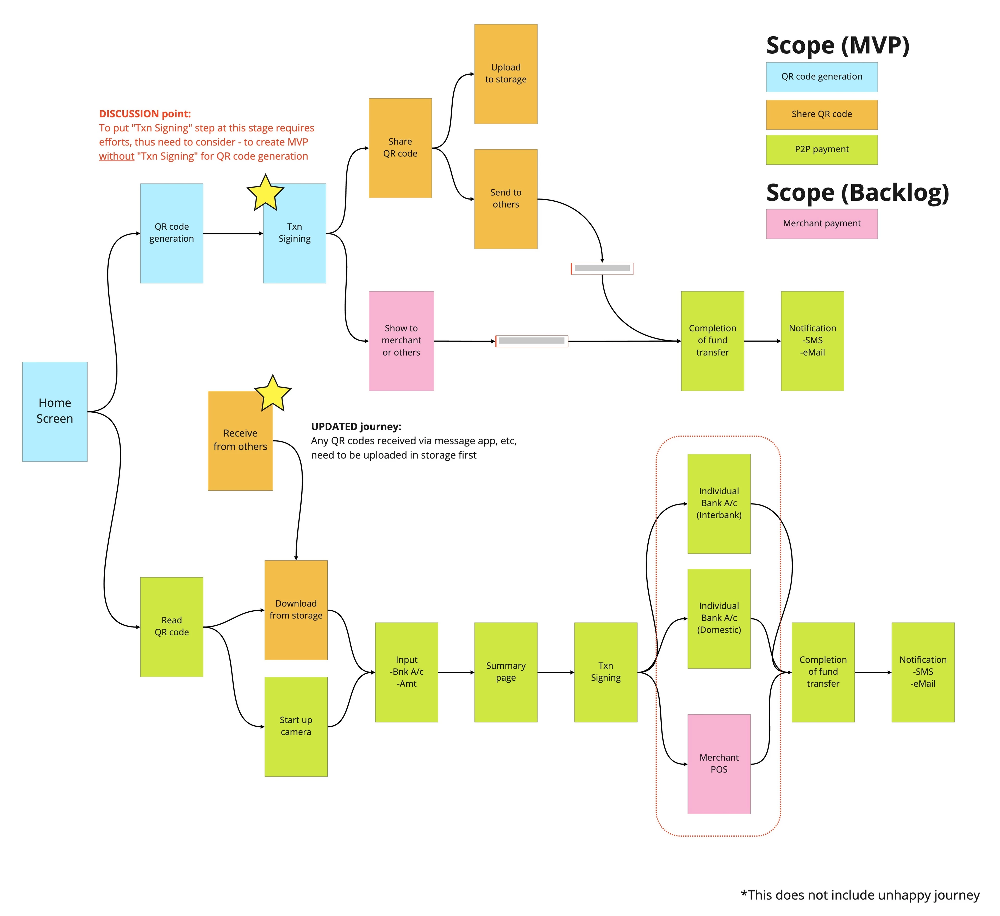

# QR Journeys
This page explains basic requirements on QR code payment, which can be seen across countries in APAC region.

**User Story**

As an User, I want to have a QR code payment feature in my bank application so that I can pay by using QR code.

**Capability | Business Function**

QR code payment

**Scope**

*   Generate QR code (MVP)
    
*   Share QR code (MVP)
    
*   P2P Pay by QR code (MVP)
    
*   Pay by QR code at merchant (Backlog)
    

**User Flow**

_**NOTE:** As for the area circled in red, this is actually back-end process, which would be branched based on the QR contents and type of payment GW. From users' point of view, this part cannot be seen while transacting the payment in mobile app._

**Business Requirements(Use Case)**

*   Actor
    
    *   User A who generates or share QR code 
        
    *   User B who receives the QR code from A
        
    *   User C who generates the QR code and show/share it to User A
        
    *   Merchant D who transacts QR payment for purchasing by User A  
          
        
*   Prerequisites
    
    *   All actors have QR code generator or reader
        

*   Scenarios
    

1-Generate QR code

*   User A taps an icon to generate QR code
    
*   User A does transaction singing to authorize QR code generation
    
*   User A sees the generated QR code in a screen
    

2-Share | upload QR code

2-1. Share QR code

*   User A taps a button to share or upload at the generated QR code screen
    
*   User A sees icons of SMS, eMail, gallery, etc., so as to select with which way to share or upload the generated QR code
    
*   User A selects one of above and taps its icon
    
*   User A shares the generated QR code to User B
    
*   User B receives the QR code and transact it
    
*   User A received a completion of payment via SMS or eMail
    

2-2. Upload QR code

*   User A taps a button to share or upload at the generated QR code screen
    
*   User A sees icons of SMS, eMail, gallery, etc., so as to select with which way to share or upload the generated QR code
    
*   User A selects one of above and taps its icon
    
*   User A uploads the generated QR code to a storage 
    

3-P2P Pay by QR code

3-1. Read QR code shown by User C

*   User A taps a button to read QR code
    
*   User A scans the QR code shown by User C
    
*   User A inputs payment amount after scanning the QR code
    
*   User A does transaction signing to pay
    
*   User A receives a completion of payment via SMS or eMail
    

3-2. Read QR code from the storage

*   User A taps a button to read QR code
    
*   User A taps a button to import QR code from the storage
    
*   User A inputs payment amount after scanning the QR code
    
*   User A does transaction signing to pay
    
*   User A receives a completion of payment via SMS or eMail
    

4-Pay by QR code at merchant

4-1. Generate QR code and show it to the merchant to pay

*   User A taps an icon to generate QR code
    
*   User A does transaction singing to authorize QR code generation
    
*   User A shows the generated QR code to the merchant
    
*   Merchant D scans the QR code and transacts it
    
*   User A receives a completion of payment via SMS or eMail
    

4-2. Read QR shown by the merchant and pay

*   Merchant D shows a QR code to User A
    
*   User A taps a button to read QR code
    
*   User A scans the QR code shown by Merchant D
    
*   User A inputs payment amount after scanning the QR code
    
*   User A does transaction signing to pay
    
*   User A receives a completion of payment via SMS or eMail