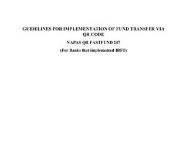
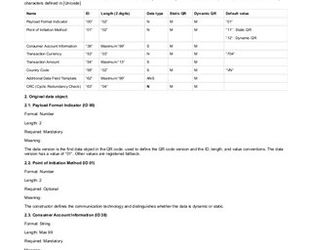

# QR Resources
### Ubank NAPAS docs

*   

    [202108 - Guidelines for implementing NAPAS QR FAST FUND 247\_IBFT\_ENG.pdf](./qr-resources-0.pdf)
    
*   
    
    [Techspec QR NAPAS - Part IV - QR Code Format\_v1.5.2\_EN (1).pdf](./qr-resources-1.pdf)
    
*   
    
    [Tài liệu hướng dẫn áp dụng Nhận diện thương hiệu Napas\_English verson.pdf](./qr-resources-2.pdf)
    
*   
    
    [UBANK-NapasQRpayment-250122-0350.pdf](./qr-resources-3.pdf)
    

### QR implementations

#### Ubank

[https://github.com/baas-devops-ub/ubank-payment-dis/blob/develop/src/main/java/vn/vpbank/ubank/controller/QRCodePaymentController.java](https://github.com/baas-devops-ub/ubank-payment-dis/blob/develop/src/main/java/vn/vpbank/ubank/controller/QRCodePaymentController.java "https://github.com/baas-devops-ub/ubank-payment-dis/blob/develop/src/main/java/vn/vpbank/ubank/controller/QRCodePaymentController.java")

#### BDO

[https://github.com/backbase-alm-bdo/bdo-custom-qr-generator/blob/develop/bdo-custom-qr-service/src/main/java/com/backbase/bdo/qr/generator/rest/QRController.java](https://github.com/backbase-alm-bdo/bdo-custom-qr-generator/blob/develop/bdo-custom-qr-service/src/main/java/com/backbase/bdo/qr/generator/rest/QRController.java "https://github.com/backbase-alm-bdo/bdo-custom-qr-generator/blob/develop/bdo-custom-qr-service/src/main/java/com/backbase/bdo/qr/generator/rest/QRController.java")