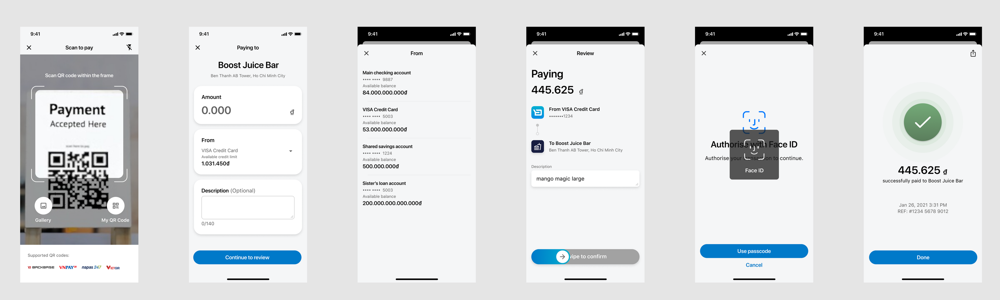
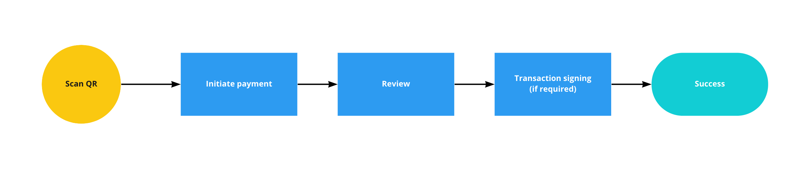
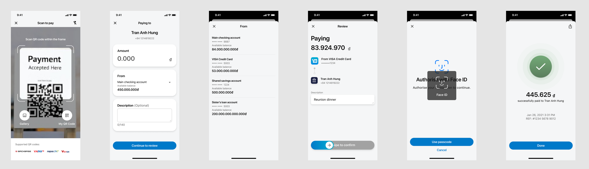

# UX - QR Payments
UX Ready

##  Requirements

QR payment is a primary mode of payment for customers in APAC when they transact at shops/stalls with merchants. They also use it for peer-to-peer transfers to collect payments.

Key flows:

*   1 [In-store Payments](#In-store-Payments)
*   2 [P2P Payments](#P2P-Payments)
*   3 [My Personal QR](#My-Personal-QR)
*   4 [Upload QR from Gallery](#Upload-QR-from-Gallery)

##  Designs - Main Flows

### In-store Payments

As a customer,

I want to **go cashless while paying in-store**,

so that I can **move fast and travel light**.

For the initial scope, QR payments to merchants will not be considered due to complexities with execution. Merchants need a way to validate the payments have been received.

### P2P Payments

As a customer,

I want to **make a quick transfer without having to find the right payment info**,

so that I can **pay them back quickly and easily**.

Prototype [https://www.figma.com/proto/L3WF3edAZXHf5EsOjojXXj/QR-Scan-%26-Pay?page-id=59%3A23212&node-id=54%3A11991&viewport=351%2C48%2C0.22&scaling=min-zoom&starting-point-node-id=54%3A11991](https://www.figma.com/proto/L3WF3edAZXHf5EsOjojXXj/QR-Scan-%26-Pay?page-id=59%3A23212&node-id=54%3A11991&viewport=351%2C48%2C0.22&scaling=min-zoom&starting-point-node-id=54%3A11991)

### My Personal QR

As a customer,

I want to **share my payment details with someone else**,

so that I can **collect payments to my account**.

Prototype [https://www.figma.com/proto/L3WF3edAZXHf5EsOjojXXj/QR-Scan-%26-Pay?page-id=59%3A23216&node-id=66%3A14589&viewport=351%2C48%2C0.19&scaling=min-zoom&starting-point-node-id=66%3A14589](https://www.figma.com/proto/L3WF3edAZXHf5EsOjojXXj/QR-Scan-%26-Pay?page-id=59%3A23216&node-id=66%3A14589&viewport=351%2C48%2C0.19&scaling=min-zoom&starting-point-node-id=66%3A14589)

### Upload QR from Gallery

As a customer,

I want to **make a payment to someone else easily**,

so that I can **avoid making the wrong payments**.

Prototype [https://www.figma.com/proto/L3WF3edAZXHf5EsOjojXXj/QR-Scan-%26-Pay?page-id=79%3A15291&node-id=79%3A15535&viewport=351%2C48%2C0.17&scaling=min-zoom&starting-point-node-id=79%3A15535](https://www.figma.com/proto/L3WF3edAZXHf5EsOjojXXj/QR-Scan-%26-Pay?page-id=79%3A15291&node-id=79%3A15535&viewport=351%2C48%2C0.17&scaling=min-zoom&starting-point-node-id=79%3A15535)

##  Key design details

Additional details you may not have noticed!

|     |     |     |
| --- | --- | --- |
| **Screen/Component** | **Image** | **Details** |
| QR Scan |     | * Supported QR codes to indicate which ones are available for usage      * Turn-on flash is useful when the place is too dark for them to scan the QR |
| Transaction success |     | * Amount and transaction details prominently displayed. Users may need to present information when transacting with merchants in store      * Ability to share transaction image to relevant parties to show that they have made the transfer |
| My QR Code |     | * These fields are available on the generated QR (TBA)          * Amount              * Description              * Account to deposit to          * Ability to share QR |
| Amount field |     | Custom keyboard to display ‘000’ to input amount easily.  1 USD **≈** 22,672 VND |
| Swipe to pay component |     | New component  * Common component used in various countries in APAC. Users are familiar with them      * A swipe action is a more deliberate action, compared to a single button tap. Due to the large no. of fraud cases in this region, a swipe action is preferred as users cannot report incorrect transactions due to “accidental taps”. |